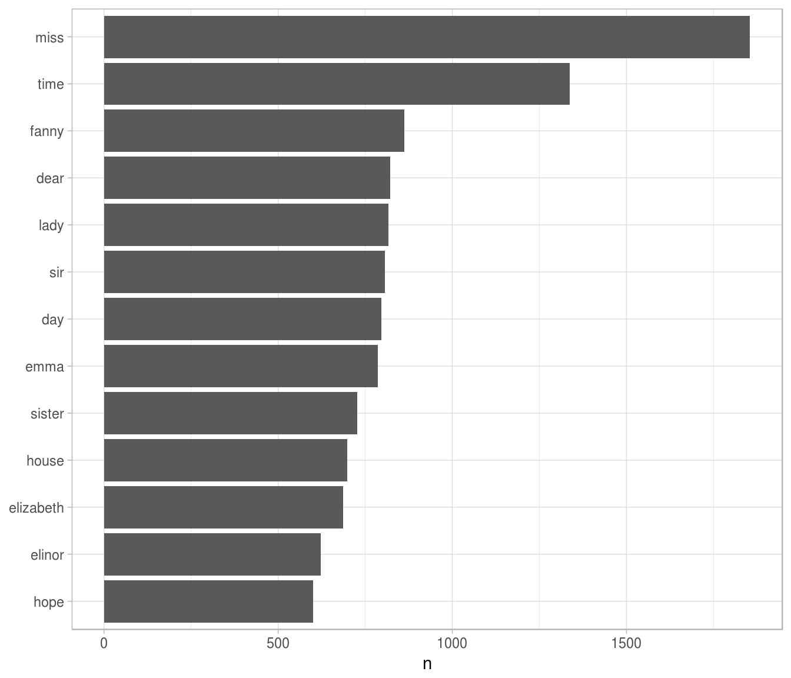
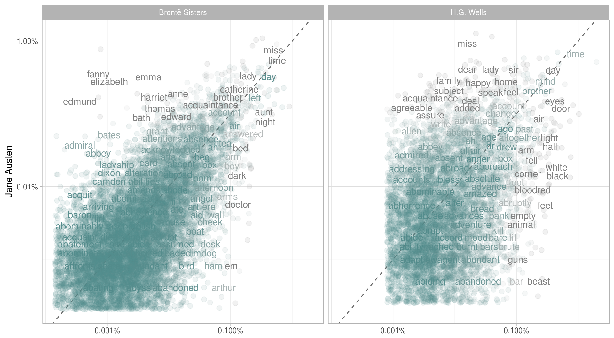

# The tidy text format {#tidytext}


We define the tidy text format as being a table with **one-term-per-row.** Structuring text data in this way means that it conforms to tidy data principles and can be manipulated with a set of consistent tools. This is worth contrasting with the ways text is often stored in text mining approaches.

* **Raw string**: Text can, of course, be stored as raw strings within R, and often text data is first read into memory in this form.
* **Corpus**: These types of objects typically annotate the raw string content with additional metadata and details.
* **Document-term matrix**: This is a sparse matrix describing a collection (i.e., a corpus) of documents with one row for each document and one column for each term. The value in the matrix is typically word count or tf-idf (see [Chapter 4](#tfidf)).

Let's hold off on exploring structures like a document-term matrix until [Chapter 6](#dtm), and get down to the basics of converting text to a tidy format.

## The `unnest_tokens` function

Emily Dickinson wrote some lovely text in her time.


```r
text <- c("Because I could not stop for Death -",
          "He kindly stopped for me -",
          "The Carriage held but just Ourselves -",
          "and Immortality")

text
```

```
## [1] "Because I could not stop for Death -"   "He kindly stopped for me -"            
## [3] "The Carriage held but just Ourselves -" "and Immortality"
```

This is a typical character vector that we might want to analyze. In order to turn it into a tidy text dataset, we first need to put it into a data frame.


```r
library(dplyr)
text_df <- data_frame(line = 1:4, text = text)

text_df
```

```
## # A tibble: 4 x 2
##    line                                   text
##   <int>                                  <chr>
## 1     1   Because I could not stop for Death -
## 2     2             He kindly stopped for me -
## 3     3 The Carriage held but just Ourselves -
## 4     4                        and Immortality
```

Notice that this data frame isn't yet compatible with tidy tools. We can't filter out words or count which occur most frequently, since each row is made up of multiple combined tokens. We need to turn this into **one-token-per-document-per-row**.

To do this, we use tidytext's `unnest_tokens` function.


```r
library(tidytext)
text_df %>%
  unnest_tokens(word, text)
```

```
## # A tibble: 20 x 2
##     line    word
##    <int>   <chr>
## 1      1 because
## 2      1       i
## 3      1   could
## 4      1     not
## 5      1    stop
## 6      1     for
## 7      1   death
## 8      2      he
## 9      2  kindly
## 10     2 stopped
## # ... with 10 more rows
```

We've now split each row so that there's one token (word) in each row of the new data frame. Also notice:

* Other columns, such as the line number each word came from, are retained.
* Punctuation has been stripped.
* By default, `unnest_tokens` converts the tokens to lowercase, which makes them easier to compare or combine with other datasets. (Use the `to_lower = FALSE` argument to turn off this behavior).

Having the text data in this format lets us manipulate, process, and visualize the text using the standard set of tidy tools, namely dplyr, tidyr, ggplot2, and broom.

## Tidying the works of Jane Austen

Let's use the text of Jane Austen's 6 completed, published novels from the [janeaustenr](https://cran.r-project.org/package=janeaustenr) package, and transform them into a tidy format. The janeaustenr package provides these texts in a one-row-per-line format. Let’s start with that, annotate a `linenumber` quantity to keep track of lines in the original format, and use a regex to find where all the chapters are.


```r
library(janeaustenr)
library(dplyr)
library(stringr)

original_books <- austen_books() %>%
  group_by(book) %>%
  mutate(linenumber = row_number(),
         chapter = cumsum(str_detect(text, regex("^chapter [\\divxlc]",
                                                 ignore_case = TRUE)))) %>%
  ungroup()

original_books
```

```
## # A tibble: 73,422 x 4
##                     text                book linenumber chapter
##                    <chr>              <fctr>      <int>   <int>
## 1  SENSE AND SENSIBILITY Sense & Sensibility          1       0
## 2                        Sense & Sensibility          2       0
## 3         by Jane Austen Sense & Sensibility          3       0
## 4                        Sense & Sensibility          4       0
## 5                 (1811) Sense & Sensibility          5       0
## 6                        Sense & Sensibility          6       0
## 7                        Sense & Sensibility          7       0
## 8                        Sense & Sensibility          8       0
## 9                        Sense & Sensibility          9       0
## 10             CHAPTER 1 Sense & Sensibility         10       1
## # ... with 73,412 more rows
```

To work with this as a tidy dataset, we need to restructure it as **one-token-per-row** format. The `unnest_tokens` function is a way to convert a dataframe with a text column to be one-token-per-row.


```r
library(tidytext)
tidy_books <- original_books %>%
  unnest_tokens(word, text)

tidy_books
```

```
## # A tibble: 725,054 x 4
##                   book linenumber chapter        word
##                 <fctr>      <int>   <int>       <chr>
## 1  Sense & Sensibility          1       0       sense
## 2  Sense & Sensibility          1       0         and
## 3  Sense & Sensibility          1       0 sensibility
## 4  Sense & Sensibility          3       0          by
## 5  Sense & Sensibility          3       0        jane
## 6  Sense & Sensibility          3       0      austen
## 7  Sense & Sensibility          5       0        1811
## 8  Sense & Sensibility         10       1     chapter
## 9  Sense & Sensibility         10       1           1
## 10 Sense & Sensibility         13       1         the
## # ... with 725,044 more rows
```

This function uses the [tokenizers package](https://github.com/lmullen/tokenizers) to separate each line into words. The default tokenizing is for words, but other options include characters, n-grams, sentences, lines, paragraphs, or separation around a regex pattern.

Now that the data is in one-word-per-row format, we can manipulate it with tidy tools like dplyr. We can remove stop words (kept in the tidytext dataset `stop_words`) with an `anti_join`.


```r
data(stop_words)

tidy_books <- tidy_books %>%
  anti_join(stop_words)
```

We can also use `count` to find the most common words in all the books as a whole.


```r
tidy_books %>%
  count(word, sort = TRUE) 
```

```
## # A tibble: 13,914 x 2
##      word     n
##     <chr> <int>
## 1    miss  1855
## 2    time  1337
## 3   fanny   862
## 4    dear   822
## 5    lady   817
## 6     sir   806
## 7     day   797
## 8    emma   787
## 9  sister   727
## 10  house   699
## # ... with 13,904 more rows
```

For example, this allows us to visualize the commonly used words using ggplot2.


```r
library(ggplot2)

tidy_books %>%
  count(word, sort = TRUE) %>%
  filter(n > 600) %>%
  mutate(word = reorder(word, n)) %>%
  ggplot(aes(word, n)) +
  geom_bar(stat = "identity") +
  xlab(NULL) +
  coord_flip()
```



We could pipe this straight into ggplot2 because of our consistent use of tidy tools.

## The gutenbergr package

TODO: Now that we've introduced the janeaustenr package, also include a brief intro to the gutenberg package.

## Word frequencies

A common task in text mining is to look at word frequencies, just like we have done above for Jane Austen's novels, and to compare frequencies across different texts. We can do this intuitively and smoothly using tidy data principles. We already have Jane Austen's works; let's get two more sets of texts to compare to. First, let's look at some science fiction and fantasy novels by H.G. Wells, who lived in the late 19th and early 20th centuries. Let's get [*The Time Machine*](https://www.gutenberg.org/ebooks/35), [*The War of the Worlds*](https://www.gutenberg.org/ebooks/36), [*The Invisible Man*](https://www.gutenberg.org/ebooks/5230), and [*The Island of Doctor Moreau*](https://www.gutenberg.org/ebooks/159).


```r
library(gutenbergr)
hgwells <- gutenberg_download(c(35, 36, 5230, 159))
```


```r
tidy_hgwells <- hgwells %>%
  unnest_tokens(word, text) %>%
  anti_join(stop_words)
```

Just for kicks, what are the most common words in these novels of H.G. Wells?


```r
tidy_hgwells %>%
  count(word, sort = TRUE)
```

```
## # A tibble: 11,769 x 2
##      word     n
##     <chr> <int>
## 1    time   454
## 2  people   302
## 3    door   260
## 4   heard   249
## 5   black   232
## 6   stood   229
## 7   white   222
## 8    hand   218
## 9    kemp   213
## 10   eyes   210
## # ... with 11,759 more rows
```

Now let's get some well-known works of the Brontë sisters, whose lives overlapped with Jane Austen's somewhat but who wrote in a rather different style. Let's get [*Jane Eyre*](https://www.gutenberg.org/ebooks/1260), [*Wuthering Heights*](https://www.gutenberg.org/ebooks/768), [*The Tenant of Wildfell Hall*](https://www.gutenberg.org/ebooks/969), [*Villette*](https://www.gutenberg.org/ebooks/9182), and [*Agnes Grey*](https://www.gutenberg.org/ebooks/767).


```r
bronte <- gutenberg_download(c(1260, 768, 969, 9182, 766))
```


```r
tidy_bronte <- bronte %>%
  unnest_tokens(word, text) %>%
  anti_join(stop_words)
```

What are the most common words in these novels of the Brontë sisters?


```r
tidy_bronte %>%
  count(word, sort = TRUE)
```

```
## # A tibble: 25,714 x 2
##      word     n
##     <chr> <int>
## 1    time  1586
## 2    miss  1388
## 3    hand  1239
## 4     day  1136
## 5    eyes  1023
## 6   night  1011
## 7   house   960
## 8    head   957
## 9  looked   949
## 10   aunt   896
## # ... with 25,704 more rows
```

Interesting that "time", "eyes", and "hand" are in the top 10 for both H.G. Wells and the Brontë sisters.

Now, let's calculate the frequency for each word for the works of Jane Austen, the Brontë sisters, and H.G. Wells.


```r
tidy_both <- bind_rows(
  mutate(tidy_bronte, author = "Brontë Sisters"),
  mutate(tidy_hgwells, author = "H.G. Wells"))
frequency <- tidy_both %>%
  mutate(word = str_extract(word, "[a-z]+")) %>%
  count(author, word) %>%
  rename(other = n) %>%
  inner_join(count(tidy_books, word)) %>%
  rename(Austen = n) %>%
  mutate(other = other / sum(other),
         Austen = Austen / sum(Austen)) %>%
  ungroup()
```

We use `str_extract` here because the UTF-8 encoded texts from Project Gutenberg have some examples of words with underscores around them to indicate emphasis (like italics). The tokenizer treated these as words but we don't want to count "\_any\_" separately from "any". Now let's plot.


```r
library(scales)
ggplot(frequency, aes(x = other, y = Austen, color = abs(Austen - other))) +
  geom_abline(color = "red") +
  geom_jitter(alpha = 0.1, size = 2.5, width = 0.4, height = 0.4) +
  geom_text(aes(label = word), check_overlap = TRUE, vjust = 1.5) +
  scale_x_log10(labels = percent_format()) +
  scale_y_log10(labels = percent_format()) +
  scale_color_gradient(limits = c(0, 0.001), low = "darkslategray4", high = "gray75") +
  facet_wrap(~author, ncol = 2) +
  theme(legend.position="none") +
  labs(y = "Jane Austen", x = NULL)
```



Words that are close to the line in these plots have similar frequencies in both sets of texts, for example, in both Austen and Brontë texts ("miss", "time", "lady", "day" at the upper frequency end) or in both Austen and Wells texts ("time", "day", "mind", "brother" at the high frequency end). Words that are far from the line are words that are found more in one set of texts than another. For example, in the Austen-Brontë plot, words like "elizabeth", "emma", "captain", and "bath" (all proper nouns) are found in Austen's texts but not much in the Brontë texts, while words like "arthur", "dark", "dog", and "doctor" are found in the Brontë texts but not the Austen texts. In comparing H.G. Wells with Jane Austen, Wells uses words like "beast", "guns", "brute", and "animal" that Austen does not, while Austen uses words like "family", "friend", "letter", and "agreeable" that Wells does not.

Overall, notice that the words in the Austen-Brontë plot are closer to the zero-slope line than in the Austen-Wells plot and also extend to lower frequencies; Austen and the Brontë sisters use more similar words than Austen and H.G. Wells. Also, we might notice the percent frequencies for individual words are different in one plot when compared to another because of the inner join; not all the words are found in all three sets of texts so the percent frequency is a different quantity.

Let's quantify how similar and different these sets of word frequencies are using a correlation test. How correlated are the word frequencies between Austen and the Brontë sisters, and between Austen and Wells?


```r
cor.test(data = frequency[frequency$author == "Brontë Sisters",],
         ~ other + Austen)
```

```
## 
## 	Pearson's product-moment correlation
## 
## data:  other and Austen
## t = 122.51, df = 10620, p-value < 2.2e-16
## alternative hypothesis: true correlation is not equal to 0
## 95 percent confidence interval:
##  0.7572588 0.7730232
## sample estimates:
##       cor 
## 0.7652557
```

```r
cor.test(data = frequency[frequency$author == "H.G. Wells",], 
         ~ other + Austen)
```

```
## 
## 	Pearson's product-moment correlation
## 
## data:  other and Austen
## t = 36.058, df = 5962, p-value < 2.2e-16
## alternative hypothesis: true correlation is not equal to 0
## 95 percent confidence interval:
##  0.4020611 0.4437385
## sample estimates:
##       cor 
## 0.4231236
```

The relationship between the word frequencies is different between these sets of texts, as it appears in the plots.
