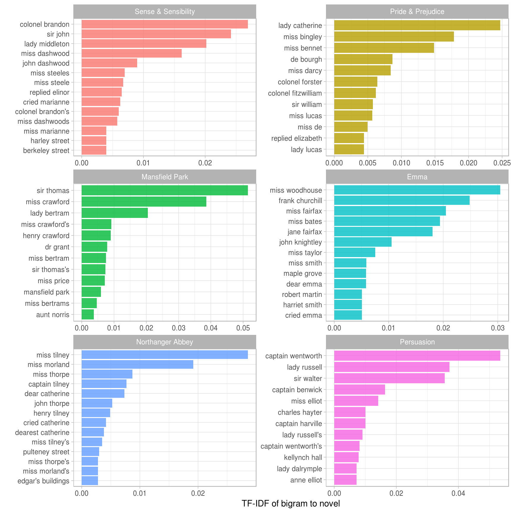
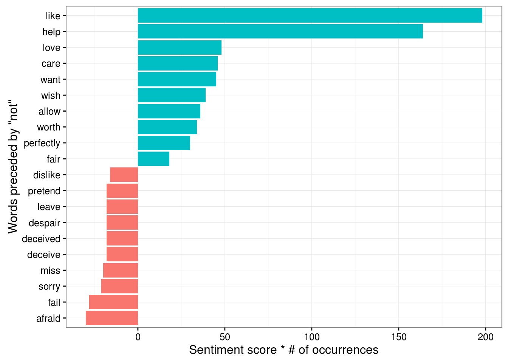
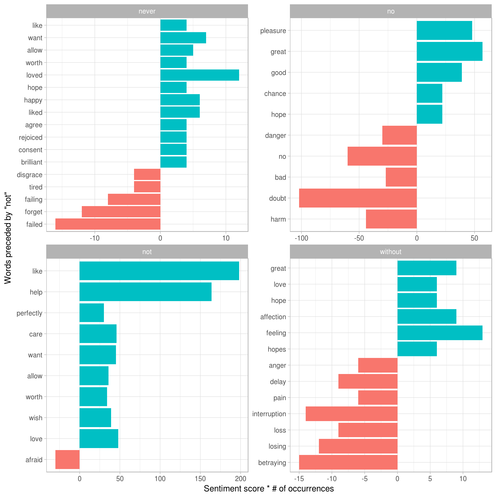
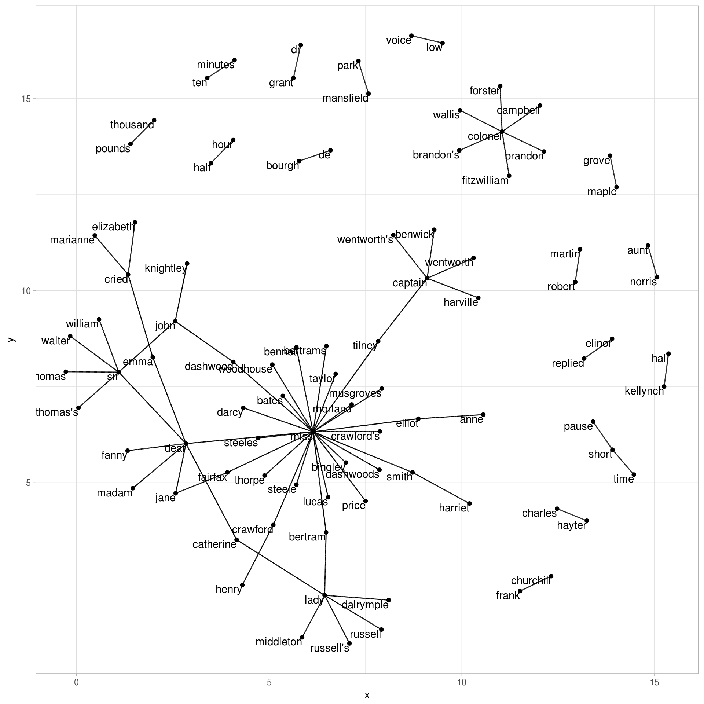
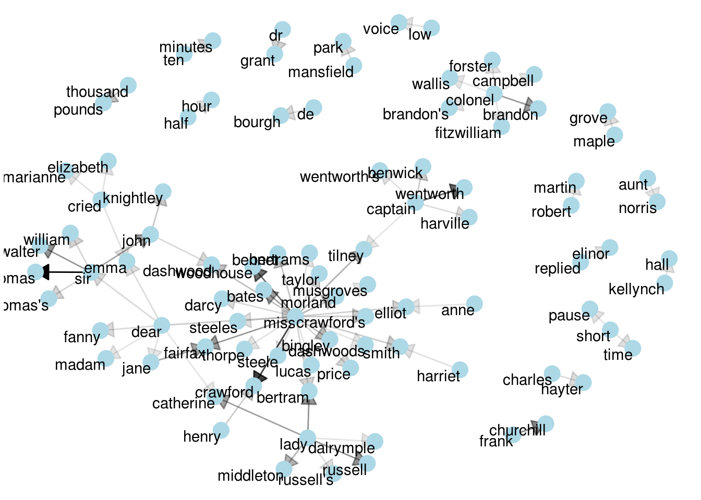
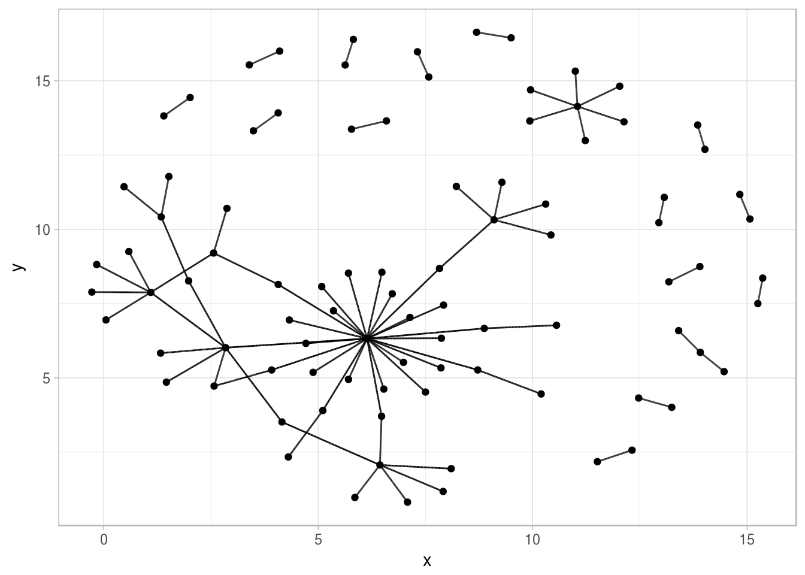
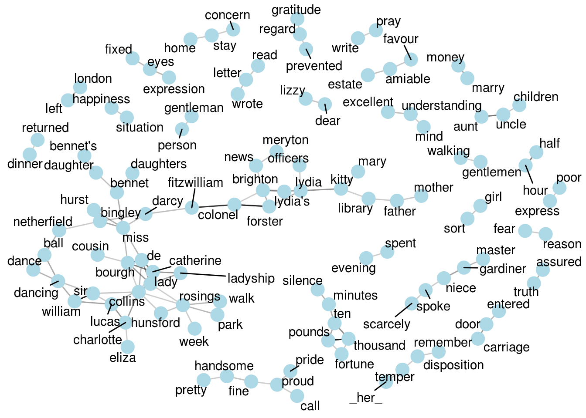

# Relationships between words {#ngrams}


So far we've considered words as individual units, and considered their relationships to sentiments or to documents. However, many interesting text analyses are based on the relationships between words, whether examining which words tend to follow others immediately, or that tend to co-occur within the same documents.

In this chapter, we'll explore some of the methods tidytext offers for calculating and visualizing relationships between words in your text dataset. This includes the `token = "ngrams"` argument, which tokenizes by pairs of adjacent words rather than by individual words. We'll also introduce two new packages: [ggraph](https://github.com/thomasp85/ggraph), which extends ggplot2 to construct network plots, nd [widyr](https://github.com/dgrtwo/widyr) package, which calculates pairwise correlations and distances within a tidy data frame. Together these expand our toolbox for exploring text within the tidy data framework.

## Tokenizing by n-gram

We've been using the `unnest_tokens` function to tokenize by word, or sometimes by sentence or paragraph, which is useful . But we can also use the function to tokenize into consecutive sequences of words, called **n-grams**. By seeing how often word X is followed by word Y, we can then build a model of the relationships between them.

We do this by adding the `token = "ngrams"` option to `unnest_tokens()`, and setting `n` to the number of words we wish to capture in each n-gram. When we set `n` to 2, we are examining pairs of two consecutive words, often called "bigrams":


```r
library(dplyr)
library(tidytext)
library(janeaustenr)

austen_bigrams <- austen_books() %>%
  unnest_tokens(bigram, text, token = "ngrams", n = 2)

austen_bigrams
```

```
## # A tibble: 725,048 × 2
##                   book          bigram
##                 <fctr>           <chr>
## 1  Sense & Sensibility       sense and
## 2  Sense & Sensibility and sensibility
## 3  Sense & Sensibility  sensibility by
## 4  Sense & Sensibility         by jane
## 5  Sense & Sensibility     jane austen
## 6  Sense & Sensibility     austen 1811
## 7  Sense & Sensibility    1811 chapter
## 8  Sense & Sensibility       chapter 1
## 9  Sense & Sensibility           1 the
## 10 Sense & Sensibility      the family
## # ... with 725,038 more rows
```

This data structure is still a variation of the tidy text format. It is structured as one-row-per-token (with extra metadata, such as `book`, still preserved), but each token now represents a bigram. Notice that these bigrams overlap: "sense and" is one token, while "and sensibility" is another.

### Counting and filtering n-grams

Our usual tidy tools apply equally well to n-gram analysis. We can examine the most common bigrams using dplyr's `count()`:


```r
austen_bigrams %>%
  count(bigram, sort = TRUE)
```

```
## # A tibble: 211,237 × 2
##      bigram     n
##       <chr> <int>
## 1    of the  3017
## 2     to be  2787
## 3    in the  2368
## 4    it was  1781
## 5      i am  1545
## 6   she had  1472
## 7    of her  1445
## 8    to the  1387
## 9   she was  1377
## 10 had been  1299
## # ... with 211,227 more rows
```

As one might expect, a lot of the most common bigrams are pairs of common (uninteresting) words, such as `of the` and `to be`: what we call "stop-words" (see Chapter 2). This is a useful time to use tidyr's `separate()`, which splits a column into multiple based on a delimiter. This lets us separate it into two columns, "word1" and "word2", at which we can remove cases where either is a stop-word .


```r
library(tidyr)

bigrams_separated <- austen_bigrams %>%
  separate(bigram, c("word1", "word2"), sep = " ")

bigrams_filtered <- bigrams_separated %>%
  filter(!word1 %in% stop_words$word) %>%
  filter(!word2 %in% stop_words$word)

# New bigram counts:
bigram_counts <- bigrams_filtered %>% 
  count(word1, word2, sort = TRUE)

bigram_counts
```

```
## Source: local data frame [33,421 x 3]
## Groups: word1 [6,711]
## 
##      word1     word2     n
##      <chr>     <chr> <int>
## 1      sir    thomas   287
## 2     miss  crawford   215
## 3  captain wentworth   170
## 4     miss woodhouse   162
## 5    frank churchill   132
## 6     lady   russell   118
## 7     lady   bertram   114
## 8      sir    walter   113
## 9     miss   fairfax   109
## 10 colonel   brandon   108
## # ... with 33,411 more rows
```

We can see that names (whether first and last or with a salutation) are the most common pairs in Jane Austen books.

In other analyses, we may want to work with the recombined words. tidyr's `unite()` function is the inverse of `separate()`, and lets us recombine the columns into one.


```r
bigrams_united <- bigrams_filtered %>%
  unite(bigram, word1, word2, sep = " ")

bigrams_united
```

```
## # A tibble: 44,784 × 2
##                   book                   bigram
## *               <fctr>                    <chr>
## 1  Sense & Sensibility              jane austen
## 2  Sense & Sensibility              austen 1811
## 3  Sense & Sensibility             1811 chapter
## 4  Sense & Sensibility                chapter 1
## 5  Sense & Sensibility             norland park
## 6  Sense & Sensibility surrounding acquaintance
## 7  Sense & Sensibility               late owner
## 8  Sense & Sensibility             advanced age
## 9  Sense & Sensibility       constant companion
## 10 Sense & Sensibility             happened ten
## # ... with 44,774 more rows
```

In other analyses you may be interested in the most common trigrams, which are consecutive sequences of 3 words. We can find this by setting `n = 3`:


```r
austen_books() %>%
  unnest_tokens(trigram, text, token = "ngrams", n = 3) %>%
  separate(trigram, c("word1", "word2", "word3"), sep = " ") %>%
  filter(!word1 %in% stop_words$word,
         !word2 %in% stop_words$word,
         !word3 %in% stop_words$word) %>%
  count(word1, word2, word3, sort = TRUE)
```

```
## Source: local data frame [8,757 x 4]
## Groups: word1, word2 [7,462]
## 
##        word1     word2     word3     n
##        <chr>     <chr>     <chr> <int>
## 1       dear      miss woodhouse    23
## 2       miss        de    bourgh    18
## 3       lady catherine        de    14
## 4  catherine        de    bourgh    13
## 5       poor      miss    taylor    11
## 6        sir    walter    elliot    11
## 7        ten  thousand    pounds    11
## 8       dear       sir    thomas    10
## 9     twenty  thousand    pounds     8
## 10   replied      miss  crawford     7
## # ... with 8,747 more rows
```

### Analyzing bigrams

This one-row-per-bigram format is helpful for exploratory analyses of the text. As a simple example, we might be interested in the most common "streets" mentioned in each book:


```r
bigrams_filtered %>%
  filter(word2 == "street") %>%
  count(book, word1, sort = TRUE)
```

```
## Source: local data frame [34 x 3]
## Groups: book [6]
## 
##                   book       word1     n
##                 <fctr>       <chr> <int>
## 1  Sense & Sensibility    berkeley    16
## 2  Sense & Sensibility      harley    16
## 3     Northanger Abbey    pulteney    14
## 4     Northanger Abbey      milsom    11
## 5       Mansfield Park     wimpole    10
## 6    Pride & Prejudice gracechurch     9
## 7  Sense & Sensibility     conduit     6
## 8  Sense & Sensibility        bond     5
## 9           Persuasion      milsom     5
## 10          Persuasion      rivers     4
## # ... with 24 more rows
```

A bigram can also be treated as a term in a document in the same way that we treated individual words. For example, we can look at the TF-IDF (Chapter 4) of bigrams across Austen novels.


```r
bigram_tf_idf <- bigrams_united %>%
  count(book, bigram) %>%
  bind_tf_idf(bigram, book, n) %>%
  arrange(desc(tf_idf))

bigram_tf_idf
```

```
## Source: local data frame [36,217 x 6]
## Groups: book [6]
## 
##                   book            bigram     n         tf      idf     tf_idf
##                 <fctr>             <chr> <int>      <dbl>    <dbl>      <dbl>
## 1           Persuasion captain wentworth   170 0.02985599 1.791759 0.05349475
## 2       Mansfield Park        sir thomas   287 0.02873160 1.791759 0.05148012
## 3       Mansfield Park     miss crawford   215 0.02152368 1.791759 0.03856525
## 4           Persuasion      lady russell   118 0.02072357 1.791759 0.03713165
## 5           Persuasion        sir walter   113 0.01984545 1.791759 0.03555828
## 6                 Emma    miss woodhouse   162 0.01700966 1.791759 0.03047722
## 7     Northanger Abbey       miss tilney    82 0.01594400 1.791759 0.02856782
## 8  Sense & Sensibility   colonel brandon   108 0.01502086 1.791759 0.02691377
## 9                 Emma   frank churchill   132 0.01385972 1.791759 0.02483329
## 10   Pride & Prejudice    lady catherine   100 0.01380453 1.791759 0.02473439
## # ... with 36,207 more rows
```

These TF-IDF values can be visualized within each book, just as we did for words.



Much as we discovered in [Chapter 4](#tfidf), the units that distinguish each Austen book are almost exclusively names. We also notice some pairings of a common verb and a name, such as "replied elizabeth" in Pride & Prejudice, or "cried emma" in Emma.

There are advantages and disadvantages to examining the TF-IDF of bigrams rather than individual words. Pairs of consecutive words might capture structure that isn't present when one is just counting single words, and may provide context that makes tokens more understandable (for example, "pulteney street", in Northanger Abbey, is more informative than "pulteney"). However, the per-bigram counts are also *sparser*: a typical two-word pair is rarer than either of its component words. Thus, bigrams can be especially useful when you have a very large text dataset.

### Using bigrams to provide context in sentiment analysis

Our sentiment analysis approch in [Chapter 3](sentiment) simply counted the appearance of positive or negative words, according to a reference lexicon. One of the problems with this approach is that a word's context can matter nearly as much as its presence. For example, the words "happy" and "like" will be counted as positive, even in a sentence like "I'm not **happy** and I don't **like** it!"

Now that we have the data organized into bigrams, it's easy to tell how often words are preceded by a word like "not":


```r
bigrams_separated %>%
  filter(word1 == "not") %>%
  count(word1, word2, sort = TRUE)
```

```
## Source: local data frame [1,246 x 3]
## Groups: word1 [1]
## 
##    word1 word2     n
##    <chr> <chr> <int>
## 1    not    be   610
## 2    not    to   355
## 3    not  have   327
## 4    not  know   252
## 5    not     a   189
## 6    not think   176
## 7    not  been   160
## 8    not   the   147
## 9    not    at   129
## 10   not    in   118
## # ... with 1,236 more rows
```

By performing sentiment analysis on the bigram data, we can examine how often sentiment-associated words are preceded by "not" or other negating words. We could use this to ignore or even reverse their contribution to the sentiment score.

Let's use the AFINN lexicon for sentiment analysis, which you may recall gives a numeric sentiment score for each word, with positive or negative numbers indicating the direction of the sentiment.


```r
AFINN <- get_sentiments("afinn")

AFINN
```

```
## # A tibble: 2,476 × 2
##          word score
##         <chr> <int>
## 1     abandon    -2
## 2   abandoned    -2
## 3    abandons    -2
## 4    abducted    -2
## 5   abduction    -2
## 6  abductions    -2
## 7       abhor    -3
## 8    abhorred    -3
## 9   abhorrent    -3
## 10     abhors    -3
## # ... with 2,466 more rows
```

We can then examine the most frequent words that were preceded by "not" and were associated with a sentiment.


```r
not_words <- bigrams_separated %>%
  filter(word1 == "not") %>%
  inner_join(AFINN, by = c(word2 = "word")) %>%
  count(word2, score, sort = TRUE) %>%
  ungroup()

not_words
```

```
## # A tibble: 245 × 3
##      word2 score     n
##      <chr> <int> <int>
## 1     like     2    99
## 2     help     2    82
## 3     want     1    45
## 4     wish     1    39
## 5    allow     1    36
## 6     care     2    23
## 7    sorry    -1    21
## 8    leave    -1    18
## 9  pretend    -1    18
## 10   worth     2    17
## # ... with 235 more rows
```

For example, the most common sentiment-associated word to follow "not" was "like", which would normally have a (positive) score of 2.

It's worth asking which words contributed the most in the "wrong" direction. To compute that, we can multiply their score by the number of times they appear (so that a word with a score of +3 occurring 10 times has as much impact as a word with a sentiment score of +1 occurring 30 times).


```r
not_words %>%
  mutate(contribution = n * score) %>%
  arrange(desc(abs(contribution))) %>%
  head(20) %>%
  mutate(word2 = reorder(word2, contribution)) %>%
  ggplot(aes(word2, n * score, fill = n * score > 0)) +
  geom_bar(stat = "identity", show.legend = FALSE) +
  xlab("Words preceded by \"not\"") +
  ylab("Sentiment score * number of occurrences") +
  coord_flip()
```



The bigrams "not like" and "not help" were overwhelmingly the largest causes of misidentification, making the text seem much more positive than it is. But we can see phrases like "not afraid" and "not fail" sometimes suggest text is more negative than it is.

"Not" isn't the only term that provides some context for the following word. We could pick four common words (or more) that negate the following, and use the same joining and counting approach to examine all of them at once.


```r
negation_words <- c("not", "no", "never", "without")

negated_words <- bigrams_separated %>%
  filter(word1 %in% negation_words) %>%
  inner_join(AFINN, by = c(word2 = "word")) %>%
  count(word1, word2, score, sort = TRUE) %>%
  ungroup()

negated_words
```

```
## # A tibble: 531 × 4
##    word1 word2 score     n
##    <chr> <chr> <int> <int>
## 1     no doubt    -1   102
## 2    not  like     2    99
## 3    not  help     2    82
## 4     no    no    -1    60
## 5    not  want     1    45
## 6    not  wish     1    39
## 7    not allow     1    36
## 8    not  care     2    23
## 9     no  harm    -2    22
## 10   not sorry    -1    21
## # ... with 521 more rows
```

We could then visualize what the most common words to follow each particular negation are.



These are just a few examples of how finding consecutive words can give context to text mining methods.

### Visualizing a network of bigrams with igraph

We may be interested in visualizing all of the relationships among words simultaneously, rather than just the top few at a time. As one common visualization, we can arrange the words into a network, or "graph." Here we'll be referring to a "graph" not in the sense of a visualization, but as a combination of connected nodes. A graph can be constructed from a tidy object since it has three variables:

* **from**: the node an edge is coming from
* **to**: the node an edge is going towards
* **weight** A numeric value associated with each edge

The [igraph](http://igraph.org/) package has many powerful functions for manipulating and analyzing networks. The most typical way to create an igraph object from tidy data is the `graph_from_data_frame()` function.


```r
library(igraph)

# original counts
bigram_counts
```

```
## Source: local data frame [33,421 x 3]
## Groups: word1 [6,711]
## 
##      word1     word2     n
##      <chr>     <chr> <int>
## 1      sir    thomas   287
## 2     miss  crawford   215
## 3  captain wentworth   170
## 4     miss woodhouse   162
## 5    frank churchill   132
## 6     lady   russell   118
## 7     lady   bertram   114
## 8      sir    walter   113
## 9     miss   fairfax   109
## 10 colonel   brandon   108
## # ... with 33,411 more rows
```

```r
# filter for only relatively common combinations
bigram_graph <- bigram_counts %>%
  filter(n > 20) %>%
  graph_from_data_frame()

bigram_graph
```

```
## IGRAPH DN-- 91 77 -- 
## + attr: name (v/c), n (e/n)
## + edges (vertex names):
##  [1] sir     ->thomas     miss    ->crawford   captain ->wentworth  miss    ->woodhouse 
##  [5] frank   ->churchill  lady    ->russell    lady    ->bertram    sir     ->walter    
##  [9] miss    ->fairfax    colonel ->brandon    miss    ->bates      lady    ->catherine 
## [13] sir     ->john       jane    ->fairfax    miss    ->tilney     lady    ->middleton 
## [17] miss    ->bingley    thousand->pounds     miss    ->dashwood   miss    ->bennet    
## [21] john    ->knightley  miss    ->morland    captain ->benwick    dear    ->miss      
## [25] miss    ->smith      miss    ->crawford's henry   ->crawford   miss    ->elliot    
## [29] dr      ->grant      miss    ->bertram    sir     ->thomas's   ten     ->minutes   
## + ... omitted several edges
```

igraph has plotting functions built in, but they're not what the package is designed to do, so many other packages have developed visualization methods for graph objects. We recommend the [ggraph package](https://github.com/thomasp85/ggraph), because it implements these visualizations in terms of the grammar of graphics, which we are already familiar with from ggplot2.

We can convert an igraph object into a ggraph with the `ggraph` function, after which we add layers to it, much like layers are added in ggplot2. For example, here we add nodes, edges, and text to construct the basics of a graph:


```r
library(ggraph)
set.seed(2016)

ggraph(bigram_graph, layout = "fr") +
  geom_edge_link() +
  geom_node_point() +
  geom_node_text(aes(label = name), vjust = 1, hjust = 1)
```



We now see more details of the text structure. For example, we see that salutations such as "miss", "lady", "sir", "and "colonel" form common centers of nodes, which are often followed by names. We also see pairs or triplets along the outside that form common short phrases ("half hour", "thousand pounds", or "short time/pause").

As a few polishing operations:

* We add the `edge_alpha` aesthetic to the link layer to make links transparent based on how common or rare the bigram is
* We add directionality with an arrow, constructed using `grid::arrow()`
* We tinker with the options to the node layer to make the nodes more attractive (larger, blue points)
* We add a theme that's useful for plotting networks, `theme_void()`


```r
set.seed(2016)

a <- grid::arrow(type = "closed", length = unit(.15, "inches"))

ggraph(bigram_graph, layout = "fr") +
  geom_edge_link(aes(edge_alpha = n), show.legend = FALSE, arrow = a) +
  geom_node_point(color = "lightblue", size = 5) +
  geom_node_text(aes(label = name), vjust = 1, hjust = 1) +
  theme_void()
```



It may take a some experimentation with ggraph to get your networks into a presentable format like this, but the network structure is useful and flexible way to visualize relational tidy data.

Note that this is a visualization of a **Markov chain**, a common model in text processing. In a Markov chain, each choice of word depends only on the previous word. In this case, a random generator following this model might spit out "dear", then "sir", then "william/walter/thomas/thomas's", by following each word to the most common words that follow it. To make the visualization interpretable, we chose to show only the most common word to word connections, but one could imagine an enormous graph representing all connections that occur in the text.

### Visualizing bigrams in other texts

We went to a good amount of work in cleaning and visualizing bigrams on a text dataset, so let's collect it into a function so that we can do it on other text datasets easily.


```r
count_bigrams <- function(dataset) {
  dataset %>%
    unnest_tokens(bigram, text, token = "ngrams", n = 2) %>%
    separate(bigram, c("word1", "word2"), sep = " ") %>%
    filter(!word1 %in% stop_words$word,
           !word2 %in% stop_words$word) %>%
    count(word1, word2, sort = TRUE)
}

visualize_bigrams <- function(bigrams) {
  set.seed(2016)
  a <- grid::arrow(type = "closed", length = unit(.15, "inches"))
  
  bigrams %>%
    graph_from_data_frame() %>%
    ggraph(layout = "fr") +
    geom_edge_link(aes(edge_alpha = n), show.legend = FALSE, arrow = a) +
    geom_node_point(color = "lightblue", size = 5) +
    geom_node_text(aes(label = name), vjust = 1, hjust = 1) +
    theme_void()
}
```

At this point, we could visualize bigrams in other works, such as the King James Version of the Bible:


```r
# The King James version is book 10 on Project Gutenberg:
library(gutenbergr)
kjv <- gutenberg_download(10)
```


```r
library(stringr)

kjv_bigrams <- kjv %>%
  count_bigrams()

# filter out rare combinations, as well as digits
kjv_bigrams %>%
  filter(n > 40,
         !str_detect(word1, "\\d"),
         !str_detect(word2, "\\d")) %>%
  visualize_bigrams()
```


This lays out a common "blueprint" of language within the Bible, particularly focused around "thy" and "thou" (which in fairness could be considered stopwords!) You can use the gutenbergr package and this code to visualize bigrams in other classic books you're interested in.

## Counting and correlating pairs of words with the widyr package

Tokenizing by n-gram is a useful way to explore pairs of adjacent words. However, we may also be interested in words that tend to co-occur within particular documents or particular chapters, even if they don't occur next to each other.

Tidy data is a useful structure for comparing between variables or grouping by rows, but it can be challenging to compare between rows: for example, to count the number of times that two words appear within the same document, or to see how correlated they are. Most operations for finding pairwise counts or correlations need to turn the data into a wide matrix first.

We'll examine some of the ways tidy text can be turned into a wide matrix in Chapter 6, but in this case it isn't necessary. the [widyr](https://github.com/dgrtwo/widyr) package makes operations such as computing counts and correlations easy, by simplifying the pattern of "widen data, perform an operation, then re-tidy data." We'll focus on a set of functions that make pairwise comparisons between groups of observations (for example, between documents, or sections of text).


### Counting and correlating among sections

Consider the book "Pride and Prejudice" divided into 10-line sections, as we did for sentiment analysis in Chapter 3. We may be interested in what words tend to appear within the same section.


```r
austen_section_words <- austen_books() %>%
  filter(book == "Pride & Prejudice") %>%
  mutate(section = row_number() %/% 10) %>%
  filter(section > 0) %>%
  unnest_tokens(word, text) %>%
  filter(!word %in% stop_words$word)

austen_section_words
```

```
## # A tibble: 37,240 × 3
##                 book section         word
##               <fctr>   <dbl>        <chr>
## 1  Pride & Prejudice       1        truth
## 2  Pride & Prejudice       1  universally
## 3  Pride & Prejudice       1 acknowledged
## 4  Pride & Prejudice       1       single
## 5  Pride & Prejudice       1   possession
## 6  Pride & Prejudice       1      fortune
## 7  Pride & Prejudice       1         wife
## 8  Pride & Prejudice       1     feelings
## 9  Pride & Prejudice       1        views
## 10 Pride & Prejudice       1     entering
## # ... with 37,230 more rows
```

One useful function from widyr is the `pairwise_count()` function. The prefix `pairwise_` means it will result in one row for each pair of words in the `word` variable. This lets us count common pairs of words co-appearing within the same section:


```r
library(widyr)

# count words co-occuring within sections
word_pairs <- austen_section_words %>%
  pairwise_count(word, section, sort = TRUE)

word_pairs
```

```
## # A tibble: 796,008 × 3
##        item1     item2     n
##        <chr>     <chr> <dbl>
## 1      darcy elizabeth   144
## 2  elizabeth     darcy   144
## 3       miss elizabeth   110
## 4  elizabeth      miss   110
## 5  elizabeth      jane   106
## 6       jane elizabeth   106
## 7       miss     darcy    92
## 8      darcy      miss    92
## 9  elizabeth   bingley    91
## 10   bingley elizabeth    91
## # ... with 795,998 more rows
```

Notice that while the input had one row for each pair of a document and a word, the output has one row for each pair of words. This is also a tidy format, but of a very different structure that we can use to answer new questions.

For example, we can see that the most common pair of words in a section is "Elizabeth" and "Darcy" (the two main characters). We can easily find the words that most often occur with Darcy:


```r
word_pairs %>%
  filter(item1 == "darcy")
```

```
## # A tibble: 2,930 × 3
##    item1     item2     n
##    <chr>     <chr> <dbl>
## 1  darcy elizabeth   144
## 2  darcy      miss    92
## 3  darcy   bingley    86
## 4  darcy      jane    46
## 5  darcy    bennet    45
## 6  darcy    sister    45
## 7  darcy      time    41
## 8  darcy      lady    38
## 9  darcy    friend    37
## 10 darcy   wickham    37
## # ... with 2,920 more rows
```

### Pairwise correlation

Pairs like "Elizabeth" and "Darcy" are the most common co-occurring words, but that's not particularly meaningful since *they're also the most common individual words.* We may instead want to examine **correlation** among words, which indicates how often they appear together relative to how often they appear separately.

In particular, here we'll focus on the [phi coefficient](https://en.wikipedia.org/wiki/Phi_coefficient), a common measure for binary correlation. The focus of the phi coefficient is how much more likely it is that either **both** word X and Y appear, or **neither** do, than that one appears without the other.

Consider the following table:

|  | Has word Y | No word Y | Total |  |
|------------|---------------|---------------|--------------|---|
| Has word X | $n_{11}$ | $n_{10}$ | $n_{1\cdot}$ |  |
| No word X | $n_{01}$ | $n_{00}$ | $n_{0\cdot}$ |  |
| Total | $n_{\cdot 1}$ | $n_{\cdot 0}$ | n |  |

For example, that $n_{11}$ represents the number of documents where both word X and word Y appear, $n_{00}$ the number where neither appears, and $n_{10}$ and $n_{01}$ the cases where one appears without the other. In terms of this table, the phi coefficient is:

$$\phi=\frac{n_{11}n_{00}-n_{10}n_{01}}{\sqrt{n_{1\cdot}n_{0\cdot}n_{\cdot0}n_{\cdot1}}}$$

(The phi coefficient is equivalent to the Pearson correlation, which you may have heard of elsewhere, when it is applied to binary data).

The `pairwise_cor()` function in widyr lets us find the correlation correlation between words based on how often they appear in the same section. Its syntax is similar to `pairwise_count()`.


```r
library(widyr)

# We need to filter for at least relatively common words first
word_cors <- austen_section_words %>%
  group_by(word) %>%
  filter(n() >= 20) %>%
  pairwise_cor(word, section, sort = TRUE)

word_cors
```

```
## # A tibble: 154,842 × 3
##        item1     item2 correlation
##        <chr>     <chr>       <dbl>
## 1     bourgh        de   0.9508501
## 2         de    bourgh   0.9508501
## 3     pounds  thousand   0.7005808
## 4   thousand    pounds   0.7005808
## 5    william       sir   0.6644719
## 6        sir   william   0.6644719
## 7  catherine      lady   0.6633048
## 8       lady catherine   0.6633048
## 9    forster   colonel   0.6220950
## 10   colonel   forster   0.6220950
## # ... with 154,832 more rows
```

For instance, we could find the words most correlated with a word like "pounds" using a `filter` operation.


```r
word_cors %>%
  filter(item1 == "pounds")
```

```
## # A tibble: 393 × 3
##     item1     item2 correlation
##     <chr>     <chr>       <dbl>
## 1  pounds  thousand  0.70058081
## 2  pounds       ten  0.23057580
## 3  pounds   fortune  0.16386264
## 4  pounds   settled  0.14946049
## 5  pounds wickham's  0.14152401
## 6  pounds  children  0.12900011
## 7  pounds  mother's  0.11905928
## 8  pounds  believed  0.09321518
## 9  pounds    estate  0.08896876
## 10 pounds     ready  0.08597038
## # ... with 383 more rows
```

This would let us examine the most-correlated words with any selection of words. For example, we could pick four words and visualize the words most associated with them.


```r
word_cors %>%
  filter(item1 %in% c("elizabeth", "pounds", "married", "pride")) %>%
  group_by(item1) %>%
  top_n(6) %>%
  mutate(item2 = reorder(item2, correlation)) %>%
  ggplot(aes(item2, correlation)) +
  geom_bar(stat = "identity") +
  facet_wrap(~ item1, scales = "free") +
  coord_flip()
```



Just as we used ggraph to visualize bigrams, we can use it to visualize the correlations and clusters of words that were found by the widyr package.


```r
set.seed(2016)

word_cors %>%
  filter(correlation > .15) %>%
  graph_from_data_frame() %>%
  ggraph(layout = "fr") +
  geom_edge_link(aes(edge_alpha = correlation), show.legend = FALSE) +
  geom_node_point(color = "lightblue", size = 5) +
  geom_node_text(aes(label = name), repel = TRUE) +
  theme_void()
```



Note that unlike the bigram analysis, the relationships here are symmetric, rather than directional (there are no arrows). We can also see that while pairings of names and titles that dominated bigram pairings are common, such as "colonel/fitzwilliam", we can also see pairings of words that appear close to each other, such as "walk" and "park", or "dance" and "ball".

These network visualizations are a flexible tool for exploring relationships, and will play an important role in the case studies in later chapters.
