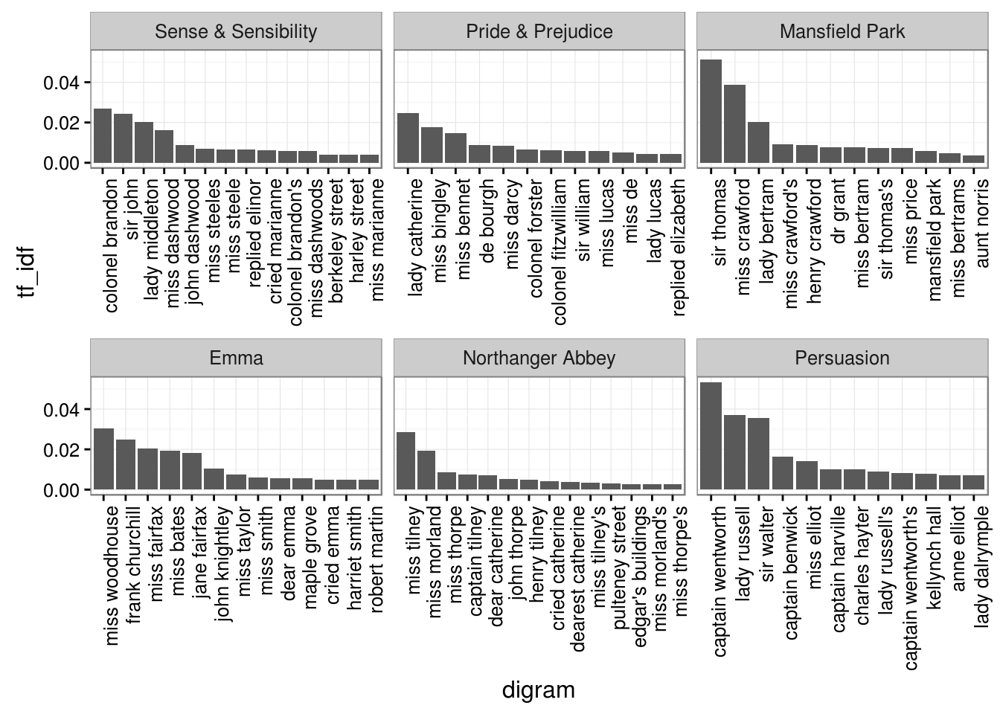
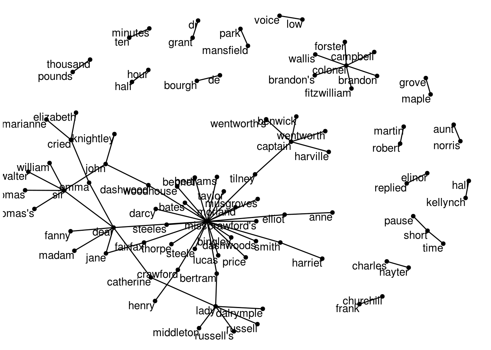
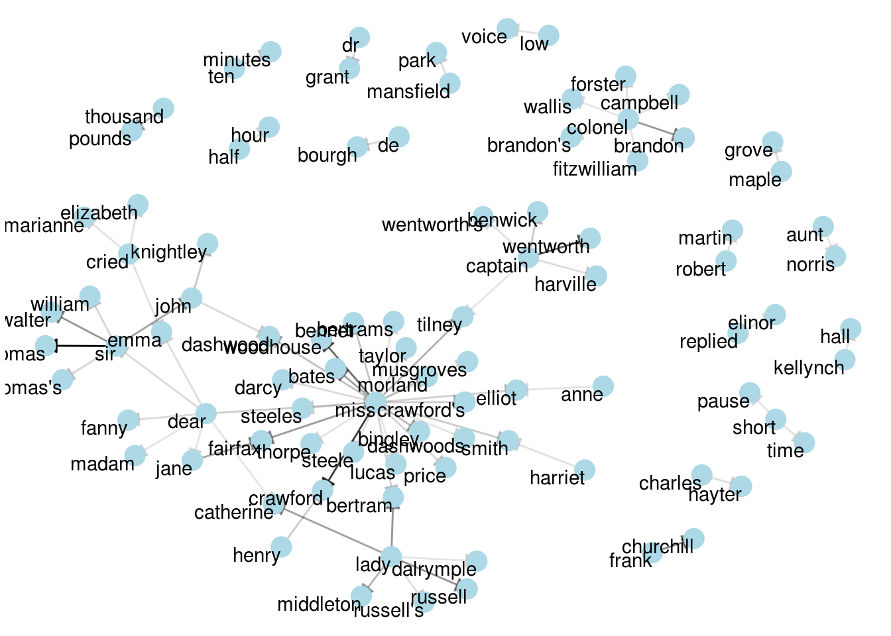
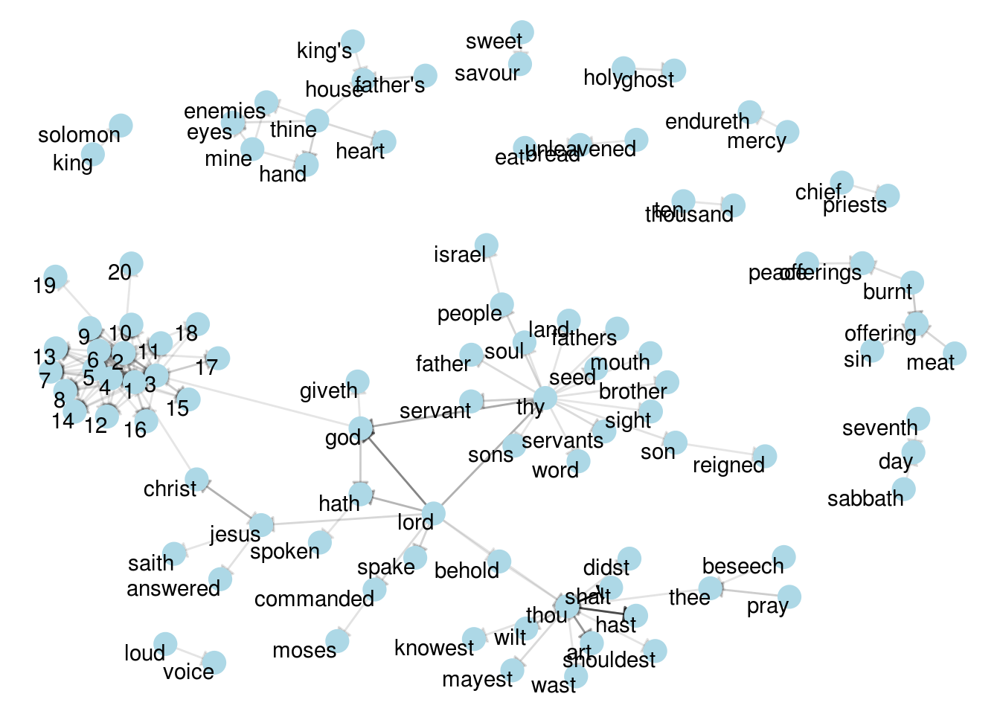
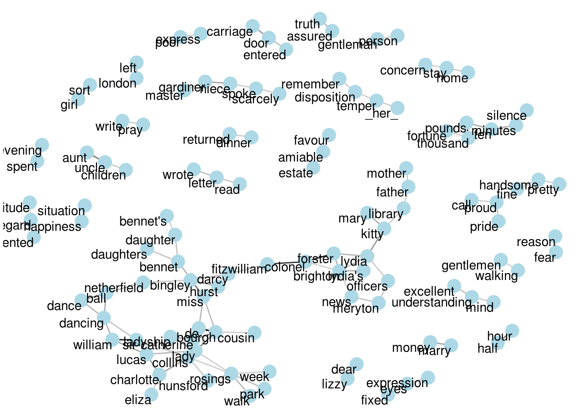

# Working with combinations of words using n-grams and widyr {#ngrams}


## Tokenizing by n-gram

We've been using the `unnest_tokens` function to tokenize by word, or sometimes by sentence or paragraph. But we can also tokenize into consecutive sequences of words, called **n-grams**.


```r
library(dplyr)
library(tidytext)
library(janeaustenr)

# Set n = 2 to divide into pairs of words
austen_digrams <- austen_books() %>%
  unnest_tokens(digram, text, token = "ngrams", n = 2)

austen_digrams
```

```
## # A tibble: 725,048 x 2
##                   book          digram
##                 <fctr>           <chr>
## 1  Sense & Sensibility       sense and
## 2  Sense & Sensibility and sensibility
## 3  Sense & Sensibility  sensibility by
## 4  Sense & Sensibility         by jane
## 5  Sense & Sensibility     jane austen
## 6  Sense & Sensibility     austen 1811
## 7  Sense & Sensibility    1811 chapter
## 8  Sense & Sensibility       chapter 1
## 9  Sense & Sensibility           1 the
## 10 Sense & Sensibility      the family
## # ... with 725,038 more rows
```

This is still tidy: it's one-row-per-token, but now each token represents a digram. Notice that these digrams are overlapping: "sense and" is one token, "and sensibility" is another.

### Counting and filtering n-grams

We can examine the most common digrams using `count`:


```r
austen_digrams %>%
  count(digram, sort = TRUE)
```

```
## # A tibble: 211,237 x 2
##      digram     n
##       <chr> <int>
## 1    of the  3017
## 2     to be  2787
## 3    in the  2368
## 4    it was  1781
## 5      i am  1545
## 6   she had  1472
## 7    of her  1445
## 8    to the  1387
## 9   she was  1377
## 10 had been  1299
## # ... with 211,227 more rows
```

As expected, a lot of them are pairs of common (relatively uninteresting) words. This is a useful time to use tidyr's `separate()`, which splits a column into multiple based on a delimiter. This lets us separate it into two columns, "word1" and "word2", which we can remove stop-words from individually:


```r
library(tidyr)

digrams_separated <- austen_digrams %>%
  separate(digram, c("word1", "word2"), sep = " ")

digrams_filtered <- digrams_separated %>%
  filter(!word1 %in% stop_words$word) %>%
  filter(!word2 %in% stop_words$word)

digrams_filtered
```

```
## # A tibble: 44,784 x 3
##                   book       word1        word2
##                 <fctr>       <chr>        <chr>
## 1  Sense & Sensibility        jane       austen
## 2  Sense & Sensibility      austen         1811
## 3  Sense & Sensibility        1811      chapter
## 4  Sense & Sensibility     chapter            1
## 5  Sense & Sensibility     norland         park
## 6  Sense & Sensibility surrounding acquaintance
## 7  Sense & Sensibility        late        owner
## 8  Sense & Sensibility    advanced          age
## 9  Sense & Sensibility    constant    companion
## 10 Sense & Sensibility    happened          ten
## # ... with 44,774 more rows
```

We can now count the most common pairs of words:


```r
digrams_filtered %>% 
  count(word1, word2, sort = TRUE)
```

```
## Source: local data frame [33,421 x 3]
## Groups: word1 [6,711]
## 
##      word1     word2     n
##      <chr>     <chr> <int>
## 1      sir    thomas   287
## 2     miss  crawford   215
## 3  captain wentworth   170
## 4     miss woodhouse   162
## 5    frank churchill   132
## 6     lady   russell   118
## 7     lady   bertram   114
## 8      sir    walter   113
## 9     miss   fairfax   109
## 10 colonel   brandon   108
## # ... with 33,411 more rows
```

We can see that names (whether first and last or with a salutation) are the most common pairs in Jane Austen books.

We may want to work with the recombined words. tidyr's `unite()` is the opposite of `separate()`, and lets us recombine the columns into one.


```r
digrams_united <- digrams_filtered %>%
  unite(digram, word1, word2, sep = " ")

digrams_united
```

```
## # A tibble: 44,784 x 2
##                   book                   digram
## *               <fctr>                    <chr>
## 1  Sense & Sensibility              jane austen
## 2  Sense & Sensibility              austen 1811
## 3  Sense & Sensibility             1811 chapter
## 4  Sense & Sensibility                chapter 1
## 5  Sense & Sensibility             norland park
## 6  Sense & Sensibility surrounding acquaintance
## 7  Sense & Sensibility               late owner
## 8  Sense & Sensibility             advanced age
## 9  Sense & Sensibility       constant companion
## 10 Sense & Sensibility             happened ten
## # ... with 44,774 more rows
```

You could also easily work with trigrams (sequences of 3 words) by setting `n = 3`:


```r
austen_books() %>%
  unnest_tokens(trigram, text, token = "ngrams", n = 3) %>%
  separate(trigram, c("word1", "word2", "word3"), sep = " ") %>%
  filter(!word1 %in% stop_words$word,
         !word2 %in% stop_words$word,
         !word3 %in% stop_words$word) %>%
  count(word1, word2, word3, sort = TRUE)
```

```
## Source: local data frame [8,757 x 4]
## Groups: word1, word2 [7,462]
## 
##        word1     word2     word3     n
##        <chr>     <chr>     <chr> <int>
## 1       dear      miss woodhouse    23
## 2       miss        de    bourgh    18
## 3       lady catherine        de    14
## 4  catherine        de    bourgh    13
## 5       poor      miss    taylor    11
## 6        sir    walter    elliot    11
## 7        ten  thousand    pounds    11
## 8       dear       sir    thomas    10
## 9     twenty  thousand    pounds     8
## 10   replied      miss  crawford     7
## # ... with 8,747 more rows
```

### Analyzing digrams

A digram can be treated like a term just as we treated a word. For example, we can look at TF-IDF of digrams:


```r
digram_tf_idf <- digrams_united %>%
  count(book, digram) %>%
  bind_tf_idf(digram, book, n) %>%
  arrange(desc(tf_idf))

digram_tf_idf
```

```
## Source: local data frame [36,217 x 6]
## Groups: book [6]
## 
##                   book            digram     n         tf      idf     tf_idf
##                 <fctr>             <chr> <int>      <dbl>    <dbl>      <dbl>
## 1           Persuasion captain wentworth   170 0.02985599 1.791759 0.05349475
## 2       Mansfield Park        sir thomas   287 0.02873160 1.791759 0.05148012
## 3       Mansfield Park     miss crawford   215 0.02152368 1.791759 0.03856525
## 4           Persuasion      lady russell   118 0.02072357 1.791759 0.03713165
## 5           Persuasion        sir walter   113 0.01984545 1.791759 0.03555828
## 6                 Emma    miss woodhouse   162 0.01700966 1.791759 0.03047722
## 7     Northanger Abbey       miss tilney    82 0.01594400 1.791759 0.02856782
## 8  Sense & Sensibility   colonel brandon   108 0.01502086 1.791759 0.02691377
## 9                 Emma   frank churchill   132 0.01385972 1.791759 0.02483329
## 10   Pride & Prejudice    lady catherine   100 0.01380453 1.791759 0.02473439
## # ... with 36,207 more rows
```

This can be visualized within each book, just as we did for words:



Much as we discovered in [Chapter 4](#tfidf), the units that distinguish each Austen book are almost exclusively names.

### Using digrams to provide context in sentiment analysis

Our sentiment analysis approch in [Chapter 3](#sentiment) simply counted the appearance of positive or negative words, according to a reference lexicon. One of the problems with this approach is that a word's context can matter nearly as much as its presence. For example, the words "happy" and "like" will be counted as positive, even in a sentence like "I'm not **happy** and I don't **like** it!"


```r
digrams_separated %>%
  filter(word1 == "not") %>%
  count(word2, sort = TRUE)
```

```
## # A tibble: 1,246 x 2
##    word2     n
##    <chr> <int>
## 1     be   610
## 2     to   355
## 3   have   327
## 4   know   252
## 5      a   189
## 6  think   176
## 7   been   160
## 8    the   147
## 9     at   129
## 10    in   118
## # ... with 1,236 more rows
```

We can use `word2` to TODO

Let's use the AFINN lexicon for sentiment analysis, which gives a sentiment score for each word:


```r
AFINN <- sentiments %>%
  filter(lexicon == "AFINN") %>%
  select(word, score)

AFINN
```

```
## # A tibble: 2,476 x 2
##          word score
##         <chr> <int>
## 1     abandon    -2
## 2   abandoned    -2
## 3    abandons    -2
## 4    abducted    -2
## 5   abduction    -2
## 6  abductions    -2
## 7       abhor    -3
## 8    abhorred    -3
## 9   abhorrent    -3
## 10     abhors    -3
## # ... with 2,466 more rows
```


```r
not_words <- digrams_separated %>%
  filter(word1 == "not") %>%
  inner_join(AFINN, by = c(word2 = "word")) %>%
  count(word2, score, sort = TRUE) %>%
  ungroup()

not_words
```

```
## # A tibble: 245 x 3
##      word2 score     n
##      <chr> <int> <int>
## 1     like     2    99
## 2     help     2    82
## 3     want     1    45
## 4     wish     1    39
## 5    allow     1    36
## 6     care     2    23
## 7    sorry    -1    21
## 8    leave    -1    18
## 9  pretend    -1    18
## 10   worth     2    17
## # ... with 235 more rows
```

It's worth asking which words contributed the most in the "wrong" direction. To compute that, we can multiply their score by the number of times they appear (so that a word with a sentiment score of +3 occurring 10 times has as much impact as a word with a sentiment score of +1 occurring 30 times).


```r
not_words %>%
  mutate(contribution = n * score) %>%
  arrange(desc(abs(contribution))) %>%
  head(20) %>%
  mutate(word2 = reorder(word2, contribution)) %>%
  ggplot(aes(word2, n * score, fill = n * score > 0)) +
  geom_bar(stat = "identity", show.legend = FALSE) +
  xlab("Words preceded by \"not\"") +
  ylab("Sentiment score * # of occurrences") +
  coord_flip()
```


The digrams "not like" and "not help" were overwhelmingly the largest causes of misidentification, making the text seem much more positive than it is. But we can see phrases like "not afraid" and "not fail" sometimes suggest text is more negative than it is.

"Not" isn't the only word that provides context. We could make a vector of words that we suspect , and use the same joining and counting approach to examine all of them:


```r
negation_words <- c("not", "no", "never", "without")

negated_words <- digrams_separated %>%
  filter(word1 %in% negation_words) %>%
  inner_join(AFINN, by = c(word2 = "word")) %>%
  count(word1, word2, score, sort = TRUE) %>%
  ungroup()

negated_words
```

```
## # A tibble: 531 x 4
##    word1 word2 score     n
##    <chr> <chr> <int> <int>
## 1     no doubt    -1   102
## 2    not  like     2    99
## 3    not  help     2    82
## 4     no    no    -1    60
## 5    not  want     1    45
## 6    not  wish     1    39
## 7    not allow     1    36
## 8    not  care     2    23
## 9     no  harm    -2    22
## 10   not sorry    -1    21
## # ... with 521 more rows
```


```r
negated_words %>%
  mutate(contribution = n * score) %>%
  mutate(word2 = reorder(word2, contribution)) %>%
  group_by(word1) %>%
  top_n(10, abs(contribution)) %>%
  ggplot(aes(contribution, word2, fill = n * score > 0)) +
  geom_barh(stat = "identity", show.legend = FALSE) +
  facet_wrap(~ word1, scales = "free") +
  ylab("Words preceded by \"not\"") +
  xlab("Sentiment score * # of occurrences")
```


## Visualizing digrams as a network with the ggraph package

TODO

### Creating a network with igraph

Now that we have our TODO


```r
digram_counts <- digrams_filtered %>% 
  count(word1, word2, sort = TRUE)

digram_counts
```

```
## Source: local data frame [33,421 x 3]
## Groups: word1 [6,711]
## 
##      word1     word2     n
##      <chr>     <chr> <int>
## 1      sir    thomas   287
## 2     miss  crawford   215
## 3  captain wentworth   170
## 4     miss woodhouse   162
## 5    frank churchill   132
## 6     lady   russell   118
## 7     lady   bertram   114
## 8      sir    walter   113
## 9     miss   fairfax   109
## 10 colonel   brandon   108
## # ... with 33,411 more rows
```

Here we'll be referring to a "graph" not in the sense of a visualization, but as a . A graph can be created from a tidy object because a graph has three variables:

* **from**: the node an edge is coming from
* **to**: the node an edge is going towards
* **weight** A numeric value associated with each edge


```r
library(igraph)

digram_graph <- digram_counts %>%
  filter(n > 20) %>%
  graph_from_data_frame()

digram_graph
```

```
## IGRAPH DN-- 91 77 -- 
## + attr: name (v/c), n (e/n)
## + edges (vertex names):
##  [1] sir     ->thomas     miss    ->crawford   captain ->wentworth  miss    ->woodhouse 
##  [5] frank   ->churchill  lady    ->russell    lady    ->bertram    sir     ->walter    
##  [9] miss    ->fairfax    colonel ->brandon    miss    ->bates      lady    ->catherine 
## [13] sir     ->john       jane    ->fairfax    miss    ->tilney     lady    ->middleton 
## [17] miss    ->bingley    thousand->pounds     miss    ->dashwood   miss    ->bennet    
## [21] john    ->knightley  miss    ->morland    captain ->benwick    dear    ->miss      
## [25] miss    ->smith      miss    ->crawford's henry   ->crawford   miss    ->elliot    
## [29] dr      ->grant      miss    ->bertram    sir     ->thomas's   ten     ->minutes   
## + ... omitted several edges
```

The igraph package has many powerful functions for manipulating and analyzing networks.

TODO: examples of igraph package

### Visualizing a network with ggraph

igraph has plotting functions built in, but they're not what the package is designed to do. Many others have developed visualization methods for graphs. But we like the ggraph package, because it implements it in terms of the grammar of graphics.


```r
library(ggraph)

set.seed(2016)

ggraph(digram_graph, layout = "fr") +
  geom_edge_link() +
  geom_node_point()
```


This gives an idea by adding the three ...


```r
set.seed(2016)

ggraph(digram_graph, layout = "fr") +
  geom_edge_link() +
  geom_node_point() +
  geom_node_text(aes(label = name), vjust = 1, hjust = 1) +
  theme_void()
```



We can see the graph start to take shape.

* We add the `edge_alpha` aesthetic to the link layer to make links transparent based on how common or rare the digram is
* We add directionality with an arrow
* We tinker with the options to the node layer to make the points more attractive (larger, and blue)


```r
set.seed(2016)

a <- grid::arrow(type = "closed", length = unit(.1, "inches"))

ggraph(digram_graph, layout = "fr") +
  geom_edge_link(aes(edge_alpha = n), show.legend = FALSE, arrow = a) +
  geom_node_point(color = "lightblue", size = 5) +
  geom_node_text(aes(label = name), vjust = 1, hjust = 1) +
  theme_void()
```



It may take a little more experimentation with your plots to get these graphs to work, but in the end we can visualize a lot this way.

### Visualizing digrams in other texts

We went to a good amount of work setting up this 


```r
count_digrams <- function(dataset) {
  dataset %>%
    unnest_tokens(digram, text, token = "ngrams", n = 2) %>%
    separate(digram, c("word1", "word2"), sep = " ") %>%
    filter(!word1 %in% stop_words$word) %>%
    filter(!word2 %in% stop_words$word) %>%
    count(word1, word2, sort = TRUE)
}

visualize_digrams <- function(digrams) {
  set.seed(2016)
  
  digrams %>%
    graph_from_data_frame() %>%
    ggraph(layout = "fr") +
    geom_edge_link(aes(edge_alpha = n), show.legend = FALSE, arrow = a) +
    geom_node_point(color = "lightblue", size = 5) +
    geom_node_text(aes(label = name), vjust = 1, hjust = 1) +
    theme_void()
}
```

We could visualize pairs in the King James Bible:

At that point, we could visualize digrams in other works, such as the King James Version of the Bible:


```r
library(gutenbergr)
kjv <- gutenberg_download(10)
```


```r
kjv_digrams <- kjv %>%
  count_digrams()

kjv_digrams
```

```
## Source: local data frame [47,551 x 3]
## Groups: word1 [7,265]
## 
##    word1    word2     n
##    <chr>    <chr> <int>
## 1   thou    shalt  1250
## 2   thou     hast   768
## 3   lord      god   546
## 4    thy      god   356
## 5   thou      art   320
## 6   lord      thy   316
## 7   lord     hath   291
## 8  shalt     thou   258
## 9  jesus   christ   196
## 10 burnt offering   184
## # ... with 47,541 more rows
```


```r
kjv_digrams %>%
  filter(n > 40) %>%
  visualize_digrams()
```



## Counting and correlating pairs of words with the widyr package

We've previously analyzed 


```r
austen_section_words <- austen_books() %>%
  filter(book == "Pride & Prejudice") %>%
  mutate(section = row_number() %/% 10) %>%
  unnest_tokens(word, text) %>%
  anti_join(stop_words, by = "word")
```


One example of the widyr pattern is the `pairwise_count` function. The prefix "pairwise" means it will result in one row for each pair of words in the `word` variable. This lets us count common pairs of words co-appearing within the same section:


```r
library(widyr)

word_pairs <- austen_section_words %>%
  pairwise_count(word, section, sort = TRUE)

word_pairs
```

```
## # A tibble: 796,030 x 3
##        item1     item2     n
##        <chr>     <chr> <dbl>
## 1  elizabeth     darcy   144
## 2      darcy elizabeth   144
## 3  elizabeth      miss   110
## 4       miss elizabeth   110
## 5       jane elizabeth   106
## 6  elizabeth      jane   106
## 7      darcy      miss    92
## 8       miss     darcy    92
## 9    bingley elizabeth    91
## 10 elizabeth   bingley    91
## # ... with 796,020 more rows
```

For example, we discover that the most common pair of words in a section is "Elizabeth" and "Darcy" (the two main characters).


```r
word_pairs %>%
  filter(item1 == "darcy")
```

```
## # A tibble: 2,930 x 3
##    item1     item2     n
##    <chr>     <chr> <dbl>
## 1  darcy elizabeth   144
## 2  darcy      miss    92
## 3  darcy   bingley    86
## 4  darcy      jane    46
## 5  darcy    sister    45
## 6  darcy    bennet    45
## 7  darcy      time    41
## 8  darcy      lady    38
## 9  darcy   wickham    37
## 10 darcy    friend    37
## # ... with 2,920 more rows
```

### Pairwise correlation

Pairs like "Elizabeth" and "Darcy" are the most common co-occurring words, but that's not particularly meaningful since **they're also the most common words.** We instead want to examine *correlation* among words, which is how often they appear together relative to how often they appear separately.

TODO: formula for Pearson correlation, explanation of phi coefficient

The `pairwise_cor()` function in widyr lets us perform a Pearson correlation across words.


```r
library(widyr)

# We need to filter for at least relatively common words first
word_cors <- austen_section_words %>%
  group_by(word) %>%
  filter(n() >= 20) %>%
  pairwise_cor(word, section, sort = TRUE)

word_cors
```

```
## # A tibble: 154,842 x 3
##        item1     item2 correlation
##        <chr>     <chr>       <dbl>
## 1         de    bourgh   0.9508510
## 2     bourgh        de   0.9508510
## 3   thousand    pounds   0.7005850
## 4     pounds  thousand   0.7005850
## 5        sir   william   0.6644804
## 6    william       sir   0.6644804
## 7       lady catherine   0.6633289
## 8  catherine      lady   0.6633289
## 9    colonel   forster   0.6221042
## 10   forster   colonel   0.6221042
## # ... with 154,832 more rows
```

We could find the words most correlated with Elizabeth:


```r
word_cors %>%
  filter(item1 == "darcy")
```

```
## # A tibble: 393 x 3
##    item1       item2 correlation
##    <chr>       <chr>       <dbl>
## 1  darcy        miss  0.17989385
## 2  darcy fitzwilliam  0.17899838
## 3  darcy     bingley  0.17878908
## 4  darcy       hurst  0.10658328
## 5  darcy   pemberley  0.09581220
## 6  darcy      friend  0.09281731
## 7  darcy      manner  0.09143830
## 8  darcy       eliza  0.08663187
## 9  darcy       proud  0.07751503
## 10 darcy        eyes  0.07700740
## # ... with 383 more rows
```

### Visualizing word correlations

Just as we used ggraph to visualize digrams, we can use it to visualize correlations and clusters among words that we've found through the widyr package.

This graph is an early placeholder, needs to be adjusted:


```r
word_cors %>%
  filter(correlation > .15) %>%
  graph_from_data_frame() %>%
  ggraph(layout = "fr") +
  geom_edge_link(aes(edge_alpha = correlation), show.legend = FALSE) +
  geom_node_point(color = "lightblue", size = 5) +
  geom_node_text(aes(label = name), vjust = 1, hjust = 1) +
  theme_void()
```



Note that unlike the digram analysis, the relationship here aren't directional.

This kind of correlation network is a very useful and flexible visualization, and we'll examine it further in later chapters.
