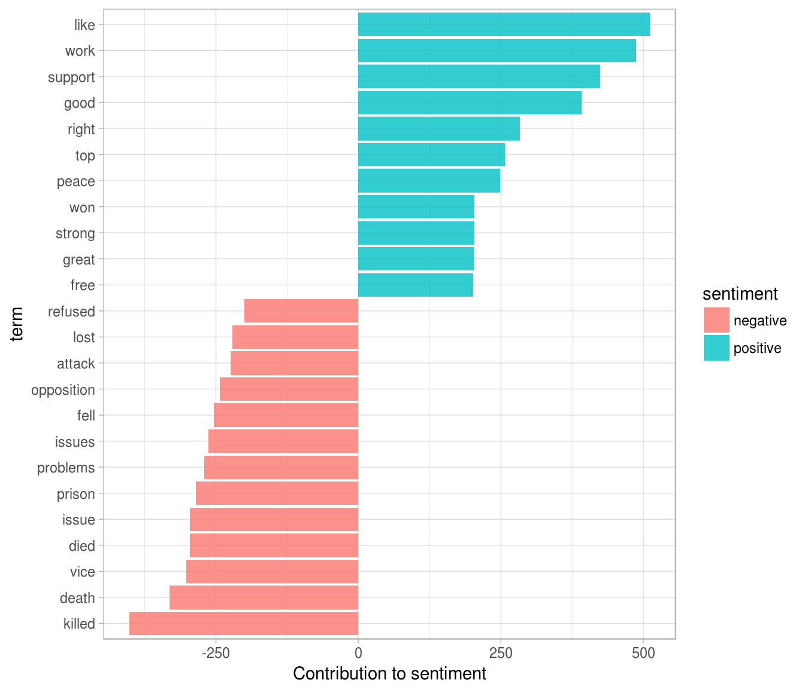
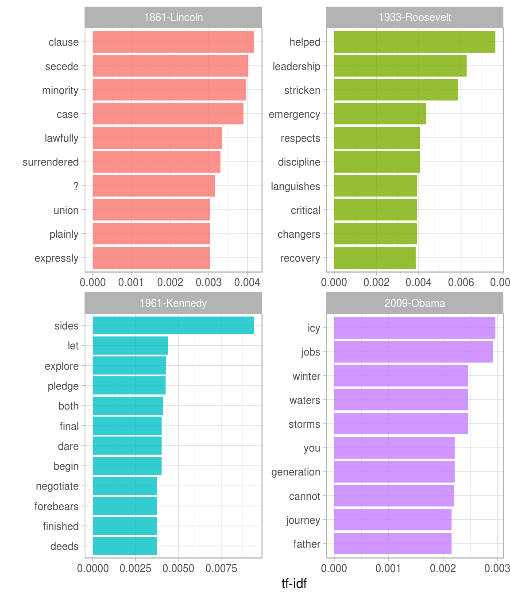
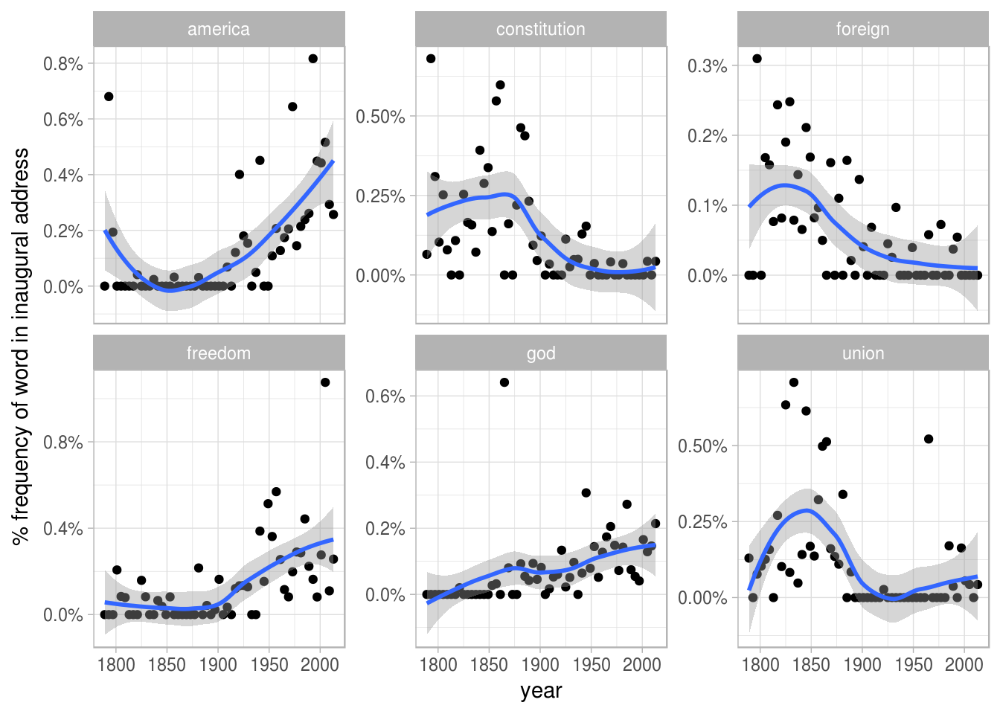
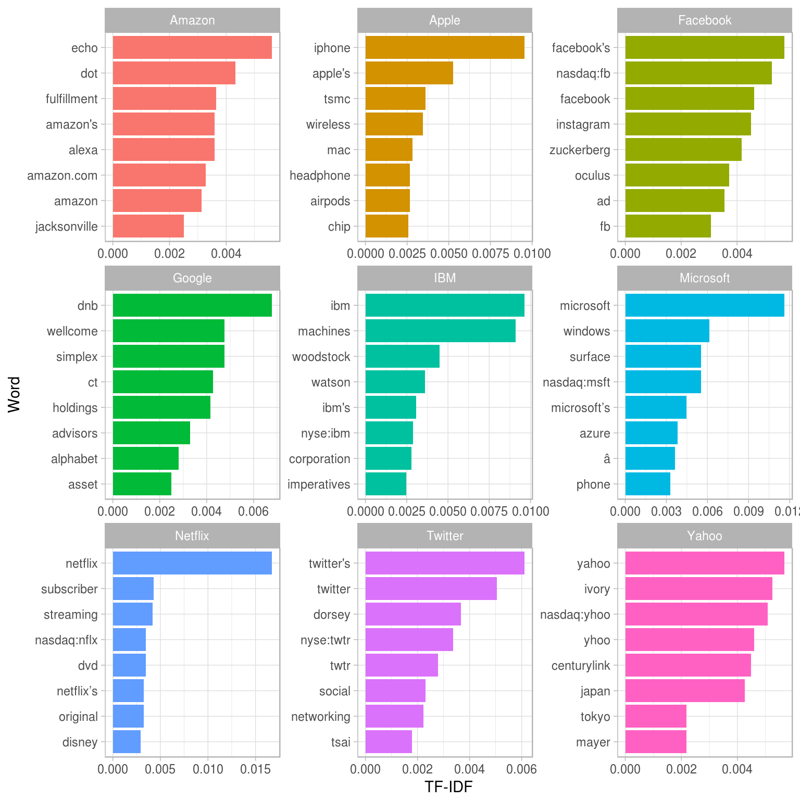
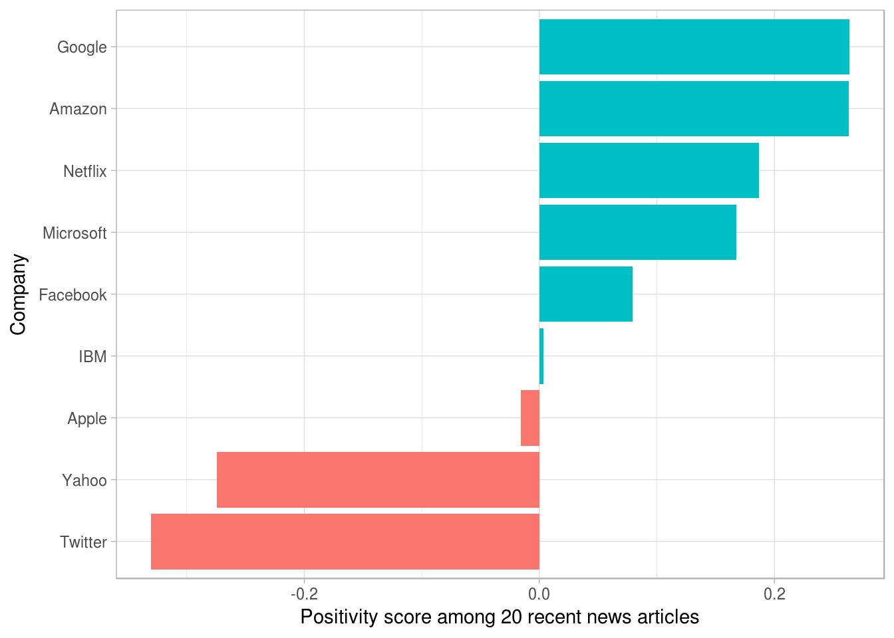

# Tidying and casting document-term matrices and corpus objects {#dtm}


In the previous chapters, we've been analyzing text arranged in the tidy text format: a table with one-token-per-document-per-row, such as is constructed by the `unnest_tokens()` function. This lets us use the popular suite of tidy tools such as dplyr, tidyr, and ggplot2 to explore and visualize text data. We've demonstrated that many informative text analyses can be performed using these tools.

However, most of the existing R tools for natural language processing, besides the tidytext package, aren't compatible with this format. The [CRAN Task View for Natural Language Processing](https://cran.r-project.org/web/views/NaturalLanguageProcessing.html) lists a large selection of packages that take other structures of input and provide non-tidy outputs. These packages are very useful in text mining applications, and many existing text datasets are structured according to these formats.

Computer scientist Hal Abelson has observed that "No matter how complex and polished the individual operations are, it is often the quality of the glue that most directly determines the power of the system" [@Friedman:2008:EPL:1378240]. In that spirit, this chapter will discuss the "glue" that connects the tidy text format with other important packages and data structures, allowing you to rely on both existing text mining packages and the suite of tidy tools to perform your analysis. In particular, we'll examine the process of tidying document-term matrices, as well as casting a tidy data frame into a sparse matrix.

## Tidying a document-term matrix {#tidy-dtm}

One of the most common structures that text mining packages work with is the [document-term matrix](https://en.wikipedia.org/wiki/Document-term_matrix) (or DTM). This is a matrix where:

* each row represents one document (such as a book or article),
* each column represents one term, and
* each value (typically) contains the number of appearances of that term in that document.

DTMs are usually implemented as sparse matrices, meaning the vast majority of values are 0. These objects can be treated as though they were matrices (for example, accessing particular rows and columns), but are stored in a more efficient format. We'll discuss several implementations of these matrices in this chapter.

DTM objects cannot be used directly with tidy tools, just as tidy data frames cannot be used as input for most text mining packages. Thus, the tidytext package provides two verbs that convert between the two formats.

* `tidy()` turns a document-term matrix into a tidy data frame. This verb comes from the broom package [@R-broom], which provides similar tidying functions for many statistical models and objects.
* `cast()` turns a tidy one-term-per-row data frame into a matrix. tidytext provides three variations of this verb, each converting to a different type of matrix: `cast_sparse()` (converting to a sparse matrix from the Matrix package), `cast_dtm()` (converting to a `DocumentTermMatrix` object from tm), and `cast_dfm()` (converting to a `dfm` object from quanteda).

### Tidying DocumentTermMatrix objects

Perhaps the most widely used implementation of DTMs in R is the `DocumentTermMatrix` class in the tm package. Many available text mining datasets are provided in this format. For example, consider the corpus of Associated Press newspaper articles included in the topicmodels package.


```r
library(tm)

data("AssociatedPress", package = "topicmodels")
AssociatedPress
```

```
## <<DocumentTermMatrix (documents: 2246, terms: 10473)>>
## Non-/sparse entries: 302031/23220327
## Sparsity           : 99%
## Maximal term length: 18
## Weighting          : term frequency (tf)
```

We see that this dataset contains  documents (each of them an AP article) and  terms (distinct words). Notice that this DTM is 99% sparse (99% of document-word pairs are zero). We could access the terms in the document with the `Terms()` function.


```r
terms <- Terms(AssociatedPress)
head(terms)
```

```
## [1] "aaron"      "abandon"    "abandoned"  "abandoning" "abbott"     "abboud"
```

If we wanted to analyze this data with tidy tools, we would first need to turn it into a data frame with one-token-per-document-per-row. The broom package introduced the `tidy()` verb, which takes a non-tidy object and turns it into a tidy data frame. The tidytext package implements this method for `DocumentTermMatrix` objects.


```r
library(dplyr)
library(tidytext)

ap_td <- tidy(AssociatedPress)
ap_td
```

```
## # A tibble: 302,031 × 3
##    document       term count
##       <int>      <chr> <dbl>
## 1         1     adding     1
## 2         1      adult     2
## 3         1        ago     1
## 4         1    alcohol     1
## 5         1  allegedly     1
## 6         1      allen     1
## 7         1 apparently     2
## 8         1   appeared     1
## 9         1   arrested     1
## 10        1    assault     1
## # ... with 302,021 more rows
```

Notice that we now have a tidy three-column `tbl_df`, with variables `document`, `term`, and `count`. This tidying operation is similar to the `melt()` function from the reshape2 package [@R-reshape2] for non-sparse matrices. Notice that only the non-zero values are included: document 1 includes terms such as "adding" and "adult", but not "aaron" or "abandon", which means the tidied version has no rows where `count` is zero.

As we've seen in previous chapters, this form is convenient for analysis with the dplyr, tidytext and ggplot2 packages. For example, you can perform sentiment analysis on these newspaper articles with the approach described in Chapter \@ref(sentiment).


```r
ap_sentiments <- ap_td %>%
  inner_join(get_sentiments("bing"), by = c(term = "word"))

ap_sentiments
```

```
## # A tibble: 30,094 × 4
##    document    term count sentiment
##       <int>   <chr> <dbl>     <chr>
## 1         1 assault     1  negative
## 2         1 complex     1  negative
## 3         1   death     1  negative
## 4         1    died     1  negative
## 5         1    good     2  positive
## 6         1 illness     1  negative
## 7         1  killed     2  negative
## 8         1    like     2  positive
## 9         1   liked     1  positive
## 10        1 miracle     1  positive
## # ... with 30,084 more rows
```

This would let us visualize which words from the AP articles most often contributed to positive or negative sentiment, seen in Figure \@ref(fig:apsentiments). We can see that the most common positive words include "like", "work", "support", and "good", while the most negative words include "killed", "death", and "vice". (The inclusion of "vice" as a negative term is probably a mistake on the algorithm's part, since it likely usually refers to "vice president").


```r
library(ggplot2)

ap_sentiments %>%
  count(sentiment, term, wt = count) %>%
  ungroup() %>%
  filter(n >= 200) %>%
  mutate(n = ifelse(sentiment == "negative", -n, n)) %>%
  mutate(term = reorder(term, n)) %>%
  ggplot(aes(term, n, fill = sentiment)) +
  geom_bar(stat = "identity") +
  ylab("Contribution to sentiment") +
  coord_flip()
```

<div class="figure">

<p class="caption">(\#fig:apsentiments)Words from AP articles with the greatest contribution to positive or negative sentiments, computed as the product of the word's AFINN sentiment score and its frequency.</p>
</div>

### Tidying dfm objects

Other text mining packages provide alternative implementations of document-term matrices, such as the `dfm` (document-feature matrix) class from the quanteda package [@R-quanteda]. For example, the quanteda package comes with a corpus of presidential inauguration speeches, which can be converted to a `dfm` using the appropriate function.


```r
library(methods)

data("data_corpus_inaugural", package = "quanteda")
inaug_dfm <- quanteda::dfm(data_corpus_inaugural)
```


```r
inaug_dfm
```

```
## Document-feature matrix of: 57 documents, 9,174 features (91.6% sparse).
```

The `tidy` method works on these document-feature matrices as well, turning them into a one-token-per-document-per-row table:


```r
inaug_td <- tidy(inaug_dfm)
inaug_td
```

```
## # A tibble: 44,178 × 3
##           document   term count
##              <chr>  <chr> <dbl>
## 1  1789-Washington fellow     3
## 2  1793-Washington fellow     1
## 3       1797-Adams fellow     3
## 4   1801-Jefferson fellow     7
## 5   1805-Jefferson fellow     8
## 6     1809-Madison fellow     1
## 7     1813-Madison fellow     1
## 8      1817-Monroe fellow     6
## 9      1821-Monroe fellow    10
## 10      1825-Adams fellow     3
## # ... with 44,168 more rows
```

We may be interested in finding the words most specific to each of the inaugural speeches. This could be quantified by calculating the tf-idf of each term-speech pair using the `bind_tf_idf()` function, as described in Chapter \@ref(tfidf).


```r
inaug_tf_idf <- inaug_td %>%
  bind_tf_idf(term, document, count) %>%
  arrange(desc(tf_idf))

inaug_tf_idf
```

```
## # A tibble: 44,178 × 6
##           document        term count          tf      idf     tf_idf
##              <chr>       <chr> <dbl>       <dbl>    <dbl>      <dbl>
## 1  1793-Washington      arrive     1 0.006802721 4.043051 0.02750375
## 2  1793-Washington upbraidings     1 0.006802721 4.043051 0.02750375
## 3  1793-Washington    violated     1 0.006802721 3.349904 0.02278846
## 4  1793-Washington   willingly     1 0.006802721 3.349904 0.02278846
## 5  1793-Washington   incurring     1 0.006802721 3.349904 0.02278846
## 6  1793-Washington    previous     1 0.006802721 2.944439 0.02003020
## 7  1793-Washington   knowingly     1 0.006802721 2.944439 0.02003020
## 8  1793-Washington injunctions     1 0.006802721 2.944439 0.02003020
## 9  1793-Washington   witnesses     1 0.006802721 2.944439 0.02003020
## 10 1793-Washington     besides     1 0.006802721 2.656757 0.01807318
## # ... with 44,168 more rows
```

We could use this data to pick four notable inaugural addresses (from Presidents Lincoln, Roosevelt, Kennedy, and Obama), and visualize the words most specific to each speech, as shown in Figure \@ref(fig:presidentspeeches).

<div class="figure">

<p class="caption">(\#fig:presidentspeeches)The terms with the highest tf-idf from each of four selected inaugural addresses. Note that quanteda's tokenizer includes the '?' punctuation mark as a term, though the texts we've tokenized ourselves with unnest_tokens do not.</p>
</div>

As another example of a visualization possible with tidy data, we could extract the year from each document's name, and compute the total number of words within each year.


```r
library(tidyr)

year_term_counts <- inaug_td %>%
  extract(document, "year", "(\\d+)", convert = TRUE) %>%
  complete(year, term, fill = list(count = 0)) %>%
  group_by(year) %>%
  mutate(year_total = sum(count))
```

This lets us pick several words and visualize how they changed in frequency over time, as shown in \@ref(fig:yearterm). We can see that over time, American presidents became less likely to refer to the country as the "Union" and more likely to refer to "America". They also became less likely to talk about the "constitution" and foreign" countries, and more likely to mention "freedom" and "God".


```r
year_term_counts %>%
  filter(term %in% c("god", "america", "foreign", "union", "constitution", "freedom")) %>%
  ggplot(aes(year, count / year_total)) +
  geom_point() +
  geom_smooth() +
  facet_wrap(~ term, scales = "free_y") +
  scale_y_continuous(labels = scales::percent_format()) +
  ylab("% frequency of word in inaugural address")
```

<div class="figure">

<p class="caption">(\#fig:yearterm)Changes in word frequency over time within Presidential inaugural addresses, for four selected terms</p>
</div>

These examples show how you can use tidytext, and the related suite of tidy tools, to analyze sources even if their origin was not in a tidy format.

## Casting tidy text data into a matrix {#cast-dtm}

Just as some existing text mining packages provide document-term matrices as sample data or output, some algorithms expect such matrices as input. Therefore, tidytext provides `cast_` verbs for converting from a tidy form to these matrices.

For example, we could take the tidied AP dataset and cast it back into a document-term matrix using the `cast_dtm()` function.


```r
ap_td %>%
  cast_dtm(document, term, count)
```

```
## <<DocumentTermMatrix (documents: 2246, terms: 10473)>>
## Non-/sparse entries: 302031/23220327
## Sparsity           : 99%
## Maximal term length: 18
## Weighting          : term frequency (tf)
```

Similarly, we could cast the table into a `dfm` object from quanteda's dfm with `cast_dfm()`.


```r
ap_td %>%
  cast_dfm(term, document, count)
```

```
## Document-feature matrix of: 10,473 documents, 2,246 features (98.7% sparse).
```

Some tools simply require a sparse matrix:


```r
library(Matrix)

# cast into a Matrix object
m <- ap_td %>%
  cast_sparse(document, term, count)

class(m)
```

```
## [1] "dgCMatrix"
## attr(,"package")
## [1] "Matrix"
```

```r
dim(m)
```

```
## [1]  2246 10473
```

This kind of conversion could easily be done from any of the tidy text structures we've used so far in this book. For example, we could create a DTM of Jane Austen's books in just a few lines of code.


```r
library(janeaustenr)

austen_dtm <- austen_books() %>%
  unnest_tokens(word, text) %>%
  count(book, word) %>%
  cast_dtm(book, word, n)

austen_dtm
```

```
## <<DocumentTermMatrix (documents: 6, terms: 14520)>>
## Non-/sparse entries: 40379/46741
## Sparsity           : 54%
## Maximal term length: 19
## Weighting          : term frequency (tf)
```

This casting process allows for reading, filtering, and processing to be done using dplyr and other tidy tools, after which the data can be converted into a document-term matrix for machine learning applications. In Chapter \@ref(topicmodeling), we'll examine some examples where a tidy-text dataset has to be converted into a DocumentTermMatrix for processing.

## Tidying corpus objects with metadata

Some data structures are designed to store document collections *before* tokenization, often called a "corpus". One common example is `Corpus` objects from the tm package. These store text alongside **metadata**, which may include an ID, date/time, title, or language for each document.

For example, the tm package comes with the `acq` corpus, containing 50 articles from the news service Reuters.


```r
data("acq")
acq
```

```
## <<VCorpus>>
## Metadata:  corpus specific: 0, document level (indexed): 0
## Content:  documents: 50
```

```r
# first document
acq[[1]]
```

```
## <<PlainTextDocument>>
## Metadata:  15
## Content:  chars: 1287
```

A corpus object is structured like a list, with each item containing both text and metadata (see the tm documentation for more on working with Corpus documents). This is a flexible storage method for documents, but doesn't lend itself to processing with tidy tools.

We can thus use the `tidy()` method to construct a table with one row per document, including the metadata (such as `id` and `datetimestamp`) as columns alongside the `text`.


```r
acq_td <- tidy(acq)
acq_td
```

```
## # A tibble: 50 × 16
##                       author       datetimestamp description
##                        <chr>              <dttm>       <chr>
## 1                       <NA> 1987-02-26 15:18:06            
## 2                       <NA> 1987-02-26 15:19:15            
## 3                       <NA> 1987-02-26 15:49:56            
## 4  By Cal Mankowski, Reuters 1987-02-26 15:51:17            
## 5                       <NA> 1987-02-26 16:08:33            
## 6                       <NA> 1987-02-26 16:32:37            
## 7      By Patti Domm, Reuter 1987-02-26 16:43:13            
## 8                       <NA> 1987-02-26 16:59:25            
## 9                       <NA> 1987-02-26 17:01:28            
## 10                      <NA> 1987-02-26 17:08:27            
##                                             heading    id language            origin topics
##                                               <chr> <chr>    <chr>             <chr>  <chr>
## 1   COMPUTER TERMINAL SYSTEMS <CPML> COMPLETES SALE    10       en Reuters-21578 XML    YES
## 2    OHIO MATTRESS <OMT> MAY HAVE LOWER 1ST QTR NET    12       en Reuters-21578 XML    YES
## 3     MCLEAN'S <MII> U.S. LINES SETS ASSET TRANSFER    44       en Reuters-21578 XML    YES
## 4    CHEMLAWN <CHEM> RISES ON HOPES FOR HIGHER BIDS    45       en Reuters-21578 XML    YES
## 5    <COFAB INC> BUYS GULFEX FOR UNDISCLOSED AMOUNT    68       en Reuters-21578 XML    YES
## 6          INVESTMENT FIRMS CUT CYCLOPS <CYL> STAKE    96       en Reuters-21578 XML    YES
## 7  AMERICAN EXPRESS <AXP> SEEN IN POSSIBLE SPINNOFF   110       en Reuters-21578 XML    YES
## 8   HONG KONG FIRM UPS WRATHER<WCO> STAKE TO 11 PCT   125       en Reuters-21578 XML    YES
## 9               LIEBERT CORP <LIEB> APPROVES MERGER   128       en Reuters-21578 XML    YES
## 10     GULF APPLIED TECHNOLOGIES <GATS> SELLS UNITS   134       en Reuters-21578 XML    YES
## # ... with 40 more rows, and 8 more variables: lewissplit <chr>, cgisplit <chr>, oldid <chr>,
## #   places <list>, people <lgl>, orgs <lgl>, exchanges <lgl>, text <chr>
```

This can then be used with `unnest_tokens()` to, for example, find the most common words across the 50 Reuters articles, or the ones most specific to each article.


```r
acq_tokens <- acq_td %>%
  select(-places) %>%
  unnest_tokens(word, text) %>%
  anti_join(stop_words, by = "word")

# most common words
acq_tokens %>%
  count(word, sort = TRUE)
```

```
## # A tibble: 1,566 × 2
##        word     n
##       <chr> <int>
## 1      dlrs   100
## 2       pct    70
## 3       mln    65
## 4   company    63
## 5    shares    52
## 6    reuter    50
## 7     stock    46
## 8     offer    34
## 9     share    34
## 10 american    28
## # ... with 1,556 more rows
```

```r
# tf-idf
acq_tokens %>%
  count(id, word) %>%
  bind_tf_idf(word, id, n) %>%
  arrange(desc(tf_idf))
```

```
## Source: local data frame [2,853 x 6]
## Groups: id [50]
## 
##       id     word     n         tf      idf    tf_idf
##    <chr>    <chr> <int>      <dbl>    <dbl>     <dbl>
## 1    186   groupe     2 0.13333333 3.912023 0.5216031
## 2    128  liebert     3 0.13043478 3.912023 0.5102639
## 3    474  esselte     5 0.10869565 3.912023 0.4252199
## 4    371  burdett     6 0.10344828 3.912023 0.4046920
## 5    442 hazleton     4 0.10256410 3.912023 0.4012331
## 6    199  circuit     5 0.10204082 3.912023 0.3991860
## 7    162 suffield     2 0.10000000 3.912023 0.3912023
## 8    498     west     3 0.10000000 3.912023 0.3912023
## 9    441      rmj     8 0.12121212 3.218876 0.3901668
## 10   467  nursery     3 0.09677419 3.912023 0.3785829
## # ... with 2,843 more rows
```

### Example: mining financial articles {#financial}

`Corpus` objects are a common output format for data ingesting packages, which means the `tidy()` function gives us access to a wide variety of text data. One example is [tm.plugin.webmining](https://cran.r-project.org/package=tm.plugin.webmining), which connects to online feeds to retrieve news articles based on a keyword. For instance, performing `WebCorpus(GoogleFinanceSource("NASDAQ:MSFT")))` allows us to retrieve the 20 most recent articles related to the Microsoft (MSFT) stock.

Here we'll retrieve recent articles relevant to nine major technology stocks: Microsoft, Apple, Google, Amazon, Facebook, Twitter, IBM, Yahoo, and Netflix. (These results were downloaded in January 2017, when this chapter was written, but you'll certainly find different results if you ran it for yourself).


```r
library(tm.plugin.webmining)
library(purrr)

company <- c("Microsoft", "Apple", "Google", "Amazon", "Facebook",
             "Twitter", "IBM", "Yahoo", "Netflix")
symbol <- c("MSFT", "AAPL", "GOOG", "AMZN", "FB", "TWTR", "IBM", "YHOO", "NFLX")

download_articles <- function(symbol) {
  WebCorpus(GoogleFinanceSource(paste0("NASDAQ:", symbol)))
}

stock_articles <- data_frame(company = company,
                             symbol = symbol) %>%
  mutate(corpus = map(symbol, download_articles))
```


```r
stock_articles
```

```
## # A tibble: 9 × 3
##     company symbol          corpus
##       <chr>  <chr>          <list>
## 1 Microsoft   MSFT <S3: WebCorpus>
## 2     Apple   AAPL <S3: WebCorpus>
## 3    Google   GOOG <S3: WebCorpus>
## 4    Amazon   AMZN <S3: WebCorpus>
## 5  Facebook     FB <S3: WebCorpus>
## 6   Twitter   TWTR <S3: WebCorpus>
## 7       IBM    IBM <S3: WebCorpus>
## 8     Yahoo   YHOO <S3: WebCorpus>
## 9   Netflix   NFLX <S3: WebCorpus>
```

Each of the items in the `corpus` list column is a `WebCorpus` object, which is a special case of a corpus like `acq`. We can thus turn each into a data frame using the `tidy()` function, unnest it with tidyr's `unnest()`, then tokenize the `text` column of the individual articles using `unnest_tokens`.


```r
stock_tokens <- stock_articles %>%
  unnest(map(corpus, tidy)) %>%
  unnest_tokens(word, text) %>%
  select(company, datetimestamp, word, id, heading)

stock_tokens
```

```
## # A tibble: 105,057 × 5
##      company       datetimestamp        word                                            id
##        <chr>              <dttm>       <chr>                                         <chr>
## 1  Microsoft 2017-01-17 12:07:24   microsoft tag:finance.google.com,cluster:52779347599411
## 2  Microsoft 2017-01-17 12:07:24 corporation tag:finance.google.com,cluster:52779347599411
## 3  Microsoft 2017-01-17 12:07:24        data tag:finance.google.com,cluster:52779347599411
## 4  Microsoft 2017-01-17 12:07:24     privacy tag:finance.google.com,cluster:52779347599411
## 5  Microsoft 2017-01-17 12:07:24       could tag:finance.google.com,cluster:52779347599411
## 6  Microsoft 2017-01-17 12:07:24        send tag:finance.google.com,cluster:52779347599411
## 7  Microsoft 2017-01-17 12:07:24        msft tag:finance.google.com,cluster:52779347599411
## 8  Microsoft 2017-01-17 12:07:24       stock tag:finance.google.com,cluster:52779347599411
## 9  Microsoft 2017-01-17 12:07:24     soaring tag:finance.google.com,cluster:52779347599411
## 10 Microsoft 2017-01-17 12:07:24          by tag:finance.google.com,cluster:52779347599411
## # ... with 105,047 more rows, and 1 more variables: heading <chr>
```

Here we see some of each article's metadata alongside the words used. We could use tf-idf to determine which words were most specific to each stock symbol.


```r
library(stringr)

stock_tf_idf <- stock_tokens %>%
  count(company, word) %>%
  filter(!str_detect(word, "\\d+")) %>%
  bind_tf_idf(word, company, n) %>%
  arrange(-tf_idf)
```

The top terms for each are visualized in Figure \@ref(fig:stocktfidf). As we'd expect the company's name and symbol are typically included, but so are several of their product offerings and executives, as well as companies they are making deals with (such as Disney with Netflix).

<div class="figure">

<p class="caption">(\#fig:stocktfidf)The 8 words with the highest tf-idf in recent articles specific to each company</p>
</div>

If we were interested in using recent news to analyze the market and make investment decisions, we'd likely want to use sentiment analysis to determine whether the news coverage was positive or negative. Before we run such an analysis, we should look at what words would contribute the most to positive and negative sentiments, as was shown in Chapter \@ref(most-positive-negative). For example, we could examine this within the AFINN lexicon (Figure \@ref(fig:stockafinn)).


```r
stock_tokens %>%
  anti_join(stop_words, by = "word") %>%
  count(word, id, sort = TRUE) %>%
  inner_join(get_sentiments("afinn"), by = "word") %>%
  summarize(contribution = sum(n * score)) %>%
  top_n(12, abs(contribution)) %>%
  mutate(word = reorder(word, contribution)) %>%
  ggplot(aes(word, contribution)) +
  geom_col() +
  coord_flip() +
  labs(y = "Frequency of word * AFINN score")
```

<div class="figure">

<p class="caption">(\#fig:stockafinn)The words with the largest contribution to sentiment scores in recent financial articles, according to the AFINN dictionary. The 'contribution' is the product of the word and the sentiment score.</p>
</div>

In the context of these financial articles, there are a few big red flags here. The words "share" and "shares" are counted as positive verbs by the AFINN lexicon ("Alice will **share** her cake with Bob"), but they're actually neutral nouns ("The stock price was $X per **share**") that could just as easily be in a positive sentence as a negative one. The word "fool" is even more deceptive: it refers to Motley Fool, a financial services company. In short, we can see that the AFINN sentiment lexicon is entirely unsuited to the context of financial data (as are the NRC and Bing).

Instead, we introduce another sentiment lexicon: the Loughran and McDonald dictionary of financial sentiment terms [@loughran2011liability]. This dictionary was developed based on analyses of financial reports, and intentionally avoids words like "share" and "fool", as well as subtler terms like "liability" and "risk" that may not have a negative meaning in a financial context.

The Loughran data divides words into six sentiments: "positive", "negative", "litigious", "uncertain", "constraining", and "superfluous". We could start by examining the most common words belonging to each sentiment within this text dataset.


```r
stock_tokens %>%
  count(word) %>%
  inner_join(get_sentiments("loughran"), by = "word") %>%
  group_by(sentiment) %>%
  top_n(5, n) %>%
  ungroup() %>%
  mutate(word = reorder(word, n)) %>%
  ggplot(aes(word, n)) +
  geom_col() +
  coord_flip() +
  facet_wrap(~ sentiment, scales = "free") +
  ylab("Frequency of this word in the recent financial articles")
```

<div class="figure">

<p class="caption">(\#fig:stockloughransentiments)The most common words in the financial news articles associated with each of the six sentiments in the Loughran and McDonald lexicon</p>
</div>

These assignments (Figure \@ref(fig:stockloughransentiments)) of words to sentiments look more reasonable: common positive words include "strong" and "better", but not "shares" or "growth", while negative words include "volatility" but not "fool". The other sentiments look reasonable as well: the most common "uncertainty" terms include "could" and "may".

Now that we know we can trust the dictionary to approximate the articles' sentiments, we can use our typical methods for counting the number of uses of each sentiment-associated word in each corpus.


```r
stock_sentiment_count <- stock_tokens %>%
  inner_join(get_sentiments("loughran"), by = "word") %>%
  count(sentiment, company) %>%
  spread(sentiment, n, fill = 0)

stock_sentiment_count
```

```
## # A tibble: 9 × 7
##     company constraining litigious negative positive superfluous uncertainty
## *     <chr>        <dbl>     <dbl>    <dbl>    <dbl>       <dbl>       <dbl>
## 1    Amazon            7         8       84      144           3          70
## 2     Apple            9        11      161      156           2         132
## 3  Facebook            4        32      128      150           4          81
## 4    Google            7         8       60      103           0          58
## 5       IBM            8        22      147      148           0         104
## 6 Microsoft            6        19       92      129           3         116
## 7   Netflix            4         7      111      162           0         106
## 8   Twitter            4        12      157       79           1          75
## 9     Yahoo            3        28      130       74           0          71
```

It might be interesting to examine which company has the most news with "litigious" or "uncertain" terms. But the simplest measure, much as it was for most analysis in Chapter \@ref(sentiment), is to see whether the news is more positive or negative. As a general quantitative measure of sentiment, we'll use "(positive - negative) / (positive + negative)" (Figure \@ref(fig:stockpositivity)).


```r
stock_sentiment_count %>%
  mutate(score = (positive - negative) / (positive + negative)) %>%
  mutate(company = reorder(company, score)) %>%
  ggplot(aes(company, score, fill = score > 0)) +
  geom_col(show.legend = FALSE) +
  coord_flip() +
  labs(x = "Company",
       y = "Positivity score among 20 recent news articles")
```

<div class="figure">

<p class="caption">(\#fig:stockpositivity)"Positivity" of the news coverage around each stock in January 2017, calculated as (positive - negative) / (positive + negative), based on uses of positive and negative words in 20 recent news articles about each company</p>
</div>

Based on this analysis, we'd say that in January 2017 most of the coverage of Yahoo and Twitter was strongly negative, while coverage of Google and Amazon was the most positive. A glance at current financial headlines suggest that it's on the right track. If you were interested in further analysis, you could use one of R's many quantitative finance packages to compare these articles to recent stock prices and other metrics.
