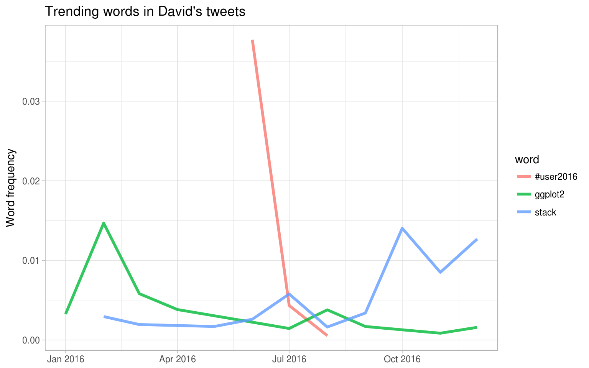

# Case study: comparing Twitter archives {#twitter}


One type of text that has risen to attention in recent years is text shared online via Twitter. In fact, several of the sentiment lexicons used in this book (and commonly used in general) were designed for use with and validated on tweets. Both of the authors of this book are on Twitter and are fairly regular users of it so in this case study, let's compare the entire Twitter archives of [Julia](https://twitter.com/juliasilge) and [David](https://twitter.com/drob).

## Getting the data and distribution of tweets

An individual can download their own Twitter archive by following [directions available on Twitter's website](https://support.twitter.com/articles/20170160). We each downloaded ours and will now open them up. Let's use the lubridate package to convert the string timestamps to date-time objects and initially take a look at our tweeting patterns overall.


```r
library(lubridate)
library(ggplot2)
library(dplyr)
library(readr)

tweets_julia <- read_csv("data/tweets_julia.csv")
tweets_dave <- read_csv("data/tweets_dave.csv")
tweets <- bind_rows(tweets_julia %>% 
                      mutate(person = "Julia"),
                    tweets_dave %>% 
                      mutate(person = "David")) %>%
  mutate(timestamp = ymd_hms(timestamp))

ggplot(tweets, aes(x = timestamp, fill = person)) +
  geom_histogram(alpha = 0.5, position = "identity", bins = 20)
```


David and Julia tweet at about the same rate currently and joined Twitter about a year apart from each other, but there were about 5 years where David was not active on Twitter and Julia was. In total, Julia has about 4 times as many tweets as David.

## Word frequencies

Let's use `unnest_tokens` to make a tidy dataframe of all the words in our tweets, and remove the common English stop words. There are certain conventions in how people use text on Twitter, so we will do a bit more work with our text here than, for example, we did with the narrative text from Project Gutenberg. 

First, we will remove tweets from this dataset that are retweets so that we only have tweets that we wrote ourselves. Next, the `mutate` line removes links and cleans out some characters that we don't want like ampersands and such. In the call to `unnest_tokens`, we unnest using a regex pattern, instead of just looking for single unigrams (words). This regex pattern is very useful for dealing with Twitter text; it retains hashtags and mentions of usernames with the `@` symbol. Because we have kept these types of symbols in the text, we can't use a simple `anti_join` to remove stop words. Instead, we can take the approach shown in the `filter` line that uses `str_detect` from the stringr library.


```r
library(tidytext)
library(stringr)

reg <- "([^A-Za-z_\\d#@']|'(?![A-Za-z_\\d#@]))"
tidy_tweets <- tweets %>% 
  filter(!str_detect(text, "^RT")) %>%
  mutate(text = str_replace_all(text, "https://t.co/[A-Za-z\\d]+|http://[A-Za-z\\d]+|&amp;|&lt;|&gt;|RT|https", "")) %>%
  unnest_tokens(word, text, token = "regex", pattern = reg) %>%
  filter(!word %in% stop_words$word,
         str_detect(word, "[a-z]"))
```

Now we can calculate word frequencies for each person. First, we group by person and count how many times each person used each word. Then we use `left_join` to add a column of the total number of words used by each person. (This is higher for Julia than David since she has more tweets than David.) Finally, we calculate a frequency for each person and word.


```r
frequency <- tidy_tweets %>% 
  group_by(person) %>% 
  count(word, sort = TRUE) %>% 
  left_join(tidy_tweets %>% 
              group_by(person) %>% 
              summarise(total = n())) %>%
  mutate(freq = n/total)

frequency
```

```
## Source: local data frame [20,736 x 5]
## Groups: person [2]
## 
##    person           word     n total        freq
##     <chr>          <chr> <int> <int>       <dbl>
## 1   Julia           time   584 74572 0.007831358
## 2   Julia    @selkie1970   570 74572 0.007643620
## 3   Julia       @skedman   531 74572 0.007120635
## 4   Julia            day   467 74572 0.006262404
## 5   Julia           baby   408 74572 0.005471222
## 6   David @hadleywickham   315 20161 0.015624225
## 7   Julia           love   304 74572 0.004076597
## 8   Julia   @haleynburke   299 74572 0.004009548
## 9   Julia          house   289 74572 0.003875449
## 10  Julia        morning   278 74572 0.003727941
## # ... with 20,726 more rows
```

This is a nice, tidy data frame but we would actually like to plot those frequencies on the x- and y-axes of a plot, so we will need to use `spread` from tidyr make a differently shaped dataframe.


```r
library(tidyr)

frequency <- frequency %>% 
  select(person, word, freq) %>% 
  spread(person, freq) %>%
  arrange(Julia, David)

frequency
```

```
## # A tibble: 17,640 × 3
##                word        David        Julia
##               <chr>        <dbl>        <dbl>
## 1                's 4.960071e-05 1.340986e-05
## 2  @accidental__art 4.960071e-05 1.340986e-05
## 3       @alice_data 4.960071e-05 1.340986e-05
## 4        @alistaire 4.960071e-05 1.340986e-05
## 5       @corynissen 4.960071e-05 1.340986e-05
## 6     @jennybryan's 4.960071e-05 1.340986e-05
## 7           @jsvine 4.960071e-05 1.340986e-05
## 8     @lizasperling 4.960071e-05 1.340986e-05
## 9        @ognyanova 4.960071e-05 1.340986e-05
## 10       @rbloggers 4.960071e-05 1.340986e-05
## # ... with 17,630 more rows
```

Now this is ready for us to plot. Let's use `geom_jitter` so that we don't see the discreteness at the low end of frequency as much.


```r
library(scales)

ggplot(frequency, aes(Julia, David)) +
  geom_jitter(alpha = 0.1, size = 2.5, width = 0.25, height = 0.25) +
  geom_text(aes(label = word), check_overlap = TRUE, vjust = 1.5) +
  scale_x_log10(labels = percent_format()) +
  scale_y_log10(labels = percent_format()) +
  geom_abline(color = "red")
```


Words near the red line in this plot are used with about equal frequencies by David and Julia, while words far away from the line are used much more by one person compared to the other. Words, hashtags, and usernames that appear in this plot are ones that we have both used at least once in tweets.

This may not even need to be pointed out, but David and Julia have used their Twitter accounts rather differently over the course of the past several years. David has used his Twitter account almost exclusively for professional purposes since he became more active, while Julia used it for entirely personal purposes until late 2015 and still uses it more personally than David. We see these differences immediately in this plot exploring word frequencies, and they will continue to be obvious in the rest of this chapter. 

## Comparing word usage 

We just made a plot comparing raw word frequencies over our whole Twitter histories; now let's find which words are more or less likely to come from each person's account using the log odds ratio. First, let's restrict the analysis moving forward to tweets from David and Julia sent during 2016. David was consistently active on Twitter for all of 2016 and this was about when Julia transitioned into data science as a career.


```r
tidy_tweets <- tidy_tweets %>%
  filter(timestamp >= as.Date("2016-01-01"),
         timestamp < as.Date("2017-01-01"))
```

Next, let's use `str_detect` to remove Twitter usernames from the `word` column, because otherwise, the results here are dominated only by people who Julia or David know and the other does not. After removing these, we count how many times each person uses each word and keep only the words used more than 10 times. After a `spread` operation, we can calculate the log odds ratio for each word, using


$$\text{log odds ratio} = \ln{\left(\frac{\left[\frac{n+1}{\text{total}+1}\right]_\text{David}}{\left[\frac{n+1}{\text{total}+1}\right]_\text{Julia}}\right)}$$

where $n$ is the number of times the word in question is used by each person and the total indicates the total words for each person.


```r
word_ratios <- tidy_tweets %>%
  filter(!str_detect(word, "^@")) %>%
  count(word, person) %>%
  filter(sum(n) >= 10) %>%
  spread(person, n, fill = 0) %>%
  ungroup() %>%
  mutate_each(funs((. + 1) / sum(. + 1)), -word) %>%
  mutate(logratio = log(David / Julia)) %>%
  arrange(desc(logratio))
```

What are some words that have been about equally likely to come from David or Julia's account during 2016?


```r
word_ratios %>% 
  arrange(abs(logratio))
```

```
## # A tibble: 377 × 4
##          word       David       Julia    logratio
##         <chr>       <dbl>       <dbl>       <dbl>
## 1         map 0.002321655 0.002314815 0.002950476
## 2       email 0.002110595 0.002083333 0.013000812
## 3        file 0.002110595 0.002083333 0.013000812
## 4       names 0.003799071 0.003703704 0.025423332
## 5     account 0.001688476 0.001620370 0.041171689
## 6         api 0.001688476 0.001620370 0.041171689
## 7    function 0.003376952 0.003240741 0.041171689
## 8  population 0.001688476 0.001620370 0.041171689
## 9         sad 0.001688476 0.001620370 0.041171689
## 10      words 0.003376952 0.003240741 0.041171689
## # ... with 367 more rows
```

We are about equally likely to tweet about maps, email, APIs, and functions.

Which words are most likely to be from Julia's account or from David's account? Let's just take the top 15 most distinctive words for each account and plot them.


```r
word_ratios %>%
  group_by(logratio < 0) %>%
  top_n(15, abs(logratio)) %>%
  ungroup() %>%
  mutate(word = reorder(word, logratio)) %>%
  ggplot(aes(word, logratio, fill = logratio < 0)) +
  geom_bar(alpha = 0.8, stat = "identity") +
  coord_flip() +
  ylab("log odds ratio (David/Julia)") +
  scale_fill_discrete(name = "", labels = c("David", "Julia"))
```


So David has tweeted about specific conferences he has gone to, genes, Stack Overflow, and matrices while Julia tweeted about Utah, physics, Census data, Christmas, and her family.

## Changes in word use

The section above looked at overall word use, but now let's ask a different question. Which words' frequencies have changed the fastest in our Twitter feeds? Or to state this another way, which words have we tweeted about at a higher or lower rate as time has passed? To do this, we will define a new time variable in the dataframe that defines which unit of time each tweet was posted in. We can use `floor_date()` from lubridate to do this, with a unit of our choosing; using 1 month seems to work well for this year of tweets from both of us.

After we have the time bins defined, we count how many times each of us used each word in each time bin. After that, we add columns to the dataframe for the total number of words used in each time bin by each person and the total number of times each word was used by each person. We can then `filter` to only keep words used at least some minimum number of times (30, in this case).


```r
words_by_time <- tidy_tweets %>%
  filter(!str_detect(word, "^@")) %>%
  mutate(time_floor = floor_date(timestamp, unit = "1 month")) %>%
  count(time_floor, person, word) %>%
  ungroup() %>%
  group_by(person, time_floor) %>%
  mutate(time_total = sum(n)) %>%
  group_by(word) %>%
  mutate(word_total = sum(n)) %>%
  ungroup() %>%
  rename(count = n) %>%
  filter(word_total > 10)

words_by_time
```

```
## # A tibble: 3,603 × 6
##    time_floor person     word count time_total word_total
##        <dttm>  <chr>    <chr> <int>      <int>      <int>
## 1  2016-01-01  David  #rstats     2        307        324
## 2  2016-01-01  David    agree     1        307         15
## 3  2016-01-01  David       ah     1        307         30
## 4  2016-01-01  David approach     1        307         14
## 5  2016-01-01  David  article     1        307         18
## 6  2016-01-01  David      bad     1        307         33
## 7  2016-01-01  David     base     2        307         28
## 8  2016-01-01  David      bit     2        307         45
## 9  2016-01-01  David    black     1        307         15
## 10 2016-01-01  David     blog     1        307         60
## # ... with 3,593 more rows
```

Each row in this dataframe corresponds to one person using one word in a given time bin. The `count` column tells us how many times that person used that word in that time bin, the `time_total` column tells us how many words that person used during that time bin, and the `word_total` column tells us how many times that person used that word over the whole year. This is the data set we can use for modeling. 

We can use `nest` from tidyr to make a data frame with a list column that contains little miniature data frames for each word. Let's do that now and take a look at the resulting structure.


```r
nested_data <- words_by_time %>%
  nest(-word, -person) 

nested_data
```

```
## # A tibble: 626 × 3
##    person     word              data
##     <chr>    <chr>            <list>
## 1   David  #rstats <tibble [12 × 4]>
## 2   David    agree  <tibble [9 × 4]>
## 3   David       ah  <tibble [7 × 4]>
## 4   David approach  <tibble [8 × 4]>
## 5   David  article  <tibble [6 × 4]>
## 6   David      bad  <tibble [9 × 4]>
## 7   David     base  <tibble [9 × 4]>
## 8   David      bit <tibble [10 × 4]>
## 9   David    black  <tibble [3 × 4]>
## 10  David     blog <tibble [12 × 4]>
## # ... with 616 more rows
```

This data frame has one row for each person-word combination; the `data` column is a list column that contains data frames, one for each combination of person and word. Let's use `map` from the purrr library to apply our modeling procedure to each of those little data frames inside our big data frame. This is count data so let’s use `glm` with `family = "binomial"` for modeling. We can think about this modeling procedure answering a question like, "Was a given word mentioned in a given time bin? Yes or no? How does the count of word mentions depend on time?"


```r
library(purrr)

nested_models <- nested_data %>%
  mutate(models = map(data, ~ glm(cbind(count, time_total) ~ time_floor, ., 
                                  family = "binomial")))

nested_models
```

```
## # A tibble: 626 × 4
##    person     word              data    models
##     <chr>    <chr>            <list>    <list>
## 1   David  #rstats <tibble [12 × 4]> <S3: glm>
## 2   David    agree  <tibble [9 × 4]> <S3: glm>
## 3   David       ah  <tibble [7 × 4]> <S3: glm>
## 4   David approach  <tibble [8 × 4]> <S3: glm>
## 5   David  article  <tibble [6 × 4]> <S3: glm>
## 6   David      bad  <tibble [9 × 4]> <S3: glm>
## 7   David     base  <tibble [9 × 4]> <S3: glm>
## 8   David      bit <tibble [10 × 4]> <S3: glm>
## 9   David    black  <tibble [3 × 4]> <S3: glm>
## 10  David     blog <tibble [12 × 4]> <S3: glm>
## # ... with 616 more rows
```

Now notice that we have a new column for the modeling results; it is another list column and contains `glm` objects. The next step is to use `map` and `tidy` from the broom package to pull out the slopes for each of these models and find the important ones. We are comparing many slopes here and some of them are not statistically significant, so let's apply an adjustment to the p-values for multiple comparisons.


```r
library(broom)

slopes <- nested_models %>%
  unnest(map(models, tidy)) %>%
  filter(term == "time_floor") %>%
  mutate(adjusted.p.value = p.adjust(p.value, "BH"))
```

Now let's find the most important slopes. Which words have changed in frequency at a moderately significant level in our tweets?


```r
top_slopes <- slopes %>% 
  filter(adjusted.p.value < 0.1)

top_slopes
```

```
## # A tibble: 8 × 8
##   person      word       term      estimate    std.error statistic      p.value adjusted.p.value
##    <chr>     <chr>      <chr>         <dbl>        <dbl>     <dbl>        <dbl>            <dbl>
## 1  David      base time_floor -9.488145e-08 2.639677e-08 -3.594434 3.250970e-04     3.245551e-02
## 2  David   ggplot2 time_floor -8.262540e-08 1.969448e-08 -4.195359 2.724397e-05     8.159570e-03
## 3  Julia   #rstats time_floor -4.496395e-08 1.119780e-08 -4.015427 5.933815e-05     1.184785e-02
## 4  Julia      post time_floor -4.818545e-08 1.454440e-08 -3.312990 9.230419e-04     7.898602e-02
## 5  Julia      read time_floor -9.327168e-08 2.542485e-08 -3.668524 2.439548e-04     2.950037e-02
## 6  David  overflow time_floor  7.246835e-08 2.231653e-08  3.247294 1.165079e-03     8.723529e-02
## 7  David     stack time_floor  8.041202e-08 2.193375e-08  3.666132 2.462468e-04     2.950037e-02
## 8  David #user2016 time_floor -8.175896e-07 1.550152e-07 -5.274253 1.332976e-07     7.984525e-05
```

To visualize our results, we can plot these words' use for both David and Julia over this year of tweets.


```r
words_by_time %>%
  inner_join(top_slopes, by = c("word", "person")) %>%
  filter(person == "David") %>%
  ggplot(aes(time_floor, count/time_total, color = word)) +
  geom_line(alpha = 0.8, size = 1.3) +
  labs(x = NULL, y = "Word frequency",
       title = "Trending words in David's tweets")
```



David tweeted a lot about the UseR conference while he was there and then quickly stopped. He has tweeted more about Stack Overflow toward the end of the year and less about base graphics and ggplot2 as the year has progressed. (That's probably healthy.)

<blockquote class="twitter-tweet" data-lang="en"><p lang="en" dir="ltr">Me: I&#39;m so sick of data science wars. <a href="https://twitter.com/hashtag/rstats?src=hash">#rstats</a> vs Python, frequentist vs Bayesian...<br><br>Them: base vs ggplot2...<br><br>Me: WHY WHICH SIDE ARE YOU ON</p>&mdash; David Robinson (@drob) <a href="https://twitter.com/drob/status/712639593703542785">March 23, 2016</a></blockquote>
<script async src="https://platform.twitter.com/widgets.js" charset="utf-8"></script>


```r
words_by_time %>%
  inner_join(top_slopes, by = c("word", "person")) %>%
  filter(person == "Julia") %>%
  ggplot(aes(time_floor, count/time_total, color = word)) +
  geom_line(alpha = 0.8, size = 1.3) +
  labs(x = NULL, y = "Word frequency",
       title = "Trending words in Julia's tweets")
```


All the significant slopes for Julia are negative. This means she has not tweeted at a higher rate using any specific words, but instead using a variety of different words; her tweets earlier in the year contained these words at higher rates. Words she uses when publicizing a new blog post like the #rstats hashtag and "post" have gone down in frequency, and she has tweeted less about reading.

## Favorites and retweets

Another important characteristic of tweets is how many times they are favorited or retweeted. Let's explore which words are more likely to be retweeted or favorited for Julia's and David's tweets. When a user downloads their own Twitter archive, favorites and retweets are not included, so we constructed another dataset of the author's tweets that includes this information. We accessed our own tweets via the Twitter API and downloaded about 3200 tweets for each person. In both cases, that is about the last 18 months worth of Twitter activity. This corresponds to a period of increasing activity and increasing numbers of followers for both of us.


```r
tweets_julia <- read_csv("data/juliasilge_tweets.csv")
tweets_dave <- read_csv("data/drob_tweets.csv")
tweets <- bind_rows(tweets_julia %>% 
                      mutate(person = "Julia"),
                    tweets_dave %>% 
                      mutate(person = "David")) %>%
  mutate(created_at = ymd_hms(created_at))
```

Now that we have this second, smaller set of only recent tweets, let's use `unnest_tokens` to transform these tweets to a tidy data set. (Let's again remove any retweets from this data set so we only look at tweets that David and Julia have posted directly.)


```r
tidy_tweets <- tweets %>% 
  filter(!str_detect(text, "^RT")) %>%
  mutate(text = str_replace_all(text, "https://t.co/[A-Za-z\\d]+|http://[A-Za-z\\d]+|&amp;|&lt;|&gt;|RT|https", "")) %>%
  unnest_tokens(word, text, token = "regex", pattern = reg) %>%
  anti_join(stop_words)

tidy_tweets
```

```
## # A tibble: 30,725 × 7
##              id          created_at             source retweets favorites person        word
##           <dbl>              <dttm>              <chr>    <int>     <int>  <chr>       <chr>
## 1  8.043967e+17 2016-12-01 18:48:07 Twitter Web Client        4         6  David         j's
## 2  8.043611e+17 2016-12-01 16:26:39 Twitter Web Client        8        12  David   bangalore
## 3  8.043611e+17 2016-12-01 16:26:39 Twitter Web Client        8        12  David      london
## 4  8.043435e+17 2016-12-01 15:16:48 Twitter for iPhone        0         1  David @rodneyfort
## 5  8.043120e+17 2016-12-01 13:11:37 Twitter for iPhone        0         1  Julia         sho
## 6  8.040632e+17 2016-11-30 20:43:03 Twitter Web Client        0         2  David       arbor
## 7  8.040632e+17 2016-11-30 20:43:03 Twitter Web Client        0         2  David       arbor
## 8  8.040632e+17 2016-11-30 20:43:03 Twitter Web Client        0         2  David         ann
## 9  8.040632e+17 2016-11-30 20:43:03 Twitter Web Client        0         2  David         ann
## 10 8.040582e+17 2016-11-30 20:23:14 Twitter Web Client       30        41  David          sf
## # ... with 30,715 more rows
```

To start with, let's look at retweets. Let's find the total number of retweets for each person.


```r
totals <- tidy_tweets %>% 
  group_by(person, id) %>% 
  summarise(rts = sum(retweets)) %>% 
  group_by(person) %>% 
  summarise(total_rts = sum(rts))

totals
```

```
## # A tibble: 2 × 2
##   person total_rts
##    <chr>     <int>
## 1  David    111863
## 2  Julia     12906
```

Now let's find the median number of retweets for each word and person; we probably want to count each tweet/word combination only once, so we will use `group_by` and `summarise` twice, one right after the other. Next, we can join this to the data frame of retweet totals.


```r
word_by_rts <- tidy_tweets %>% 
  group_by(id, word, person) %>% 
  summarise(rts = first(retweets)) %>% 
  group_by(person, word) %>% 
  summarise(retweets = median(rts)) %>%
  left_join(totals) %>%
  filter(retweets != 0) %>%
  ungroup()

word_by_rts %>% 
  arrange(desc(retweets))
```

```
## # A tibble: 2,422 × 4
##    person         word retweets total_rts
##     <chr>        <chr>    <dbl>     <int>
## 1   David      angrier   1757.0    111863
## 2   David     confirms    878.5    111863
## 3   David       writes    878.5    111863
## 4   David        voted    611.0    111863
## 5   David       county    534.0    111863
## 6   David      teacher    390.5    111863
## 7   David      command    344.0    111863
## 8   David       revert    344.0    111863
## 9   David  dimensional    320.5    111863
## 10  David eigenvectors    320.5    111863
## # ... with 2,412 more rows
```

At the top of this sorted data frame, we see David's tweet about [his blog post on Donald Trump's own tweets](http://varianceexplained.org/r/trump-tweets/) that went viral. A search tells us that this is the only time David has ever used the word "angrier" in his tweets, so that word has an extremely high median retweet rate.

<blockquote class="twitter-tweet" data-lang="en"><p lang="en" dir="ltr">New post: Analysis of Trump tweets confirms he writes only the angrier Android half <a href="https://t.co/HRr4yj30hx">https://t.co/HRr4yj30hx</a> <a href="https://twitter.com/hashtag/rstats?src=hash">#rstats</a> <a href="https://t.co/cmwdNeYSE7">pic.twitter.com/cmwdNeYSE7</a></p>&mdash; David Robinson (@drob) <a href="https://twitter.com/drob/status/763048283531055104">August 9, 2016</a></blockquote>
<script async src="https://platform.twitter.com/widgets.js" charset="utf-8"></script>

Now we can plot the words that have contributed the most to each of our retweets.


```r
word_by_rts %>%
  mutate(ratio = retweets / total_rts) %>%  
  group_by(person) %>%
  top_n(10, ratio) %>%
  arrange(ratio) %>%
  mutate(word = factor(word, unique(word))) %>%
  ungroup() %>%
  ggplot(aes(word, ratio, fill = person)) +
  geom_bar(stat = "identity", alpha = 0.8, show.legend = FALSE) +
  facet_wrap(~ person, scales = "free", ncol = 2) +
  coord_flip() +
  scale_y_continuous(labels = percent_format()) +
  labs(x = NULL, 
       y = "proportion of total RTs due to each word",
       title = "Words with highest median retweets")
```


We see more words from David's tweet about his Trump blog post, and words from Julia making announcements about blog posts and new package releases. These are some pretty good tweets; we can see why people retweeted them.

<blockquote class="twitter-tweet" data-lang="en"><p lang="en" dir="ltr">NEW POST: Mapping ghost sightings in Kentucky using Leaflet 👻👻👻 <a href="https://twitter.com/hashtag/rstats?src=hash">#rstats</a> <a href="https://t.co/rRFTSsaKWQ">https://t.co/rRFTSsaKWQ</a> <a href="https://t.co/codPf3gy6O">pic.twitter.com/codPf3gy6O</a></p>&mdash; Julia Silge (@juliasilge) <a href="https://twitter.com/juliasilge/status/761667180148641793">August 5, 2016</a></blockquote>
<script async src="https://platform.twitter.com/widgets.js" charset="utf-8"></script>

<blockquote class="twitter-tweet" data-lang="en"><p lang="en" dir="ltr">Me: Git makes it easy to revert your local changes<br><br>Them: Great! So what command do I use?<br><br>Me: I said it was easy not that I knew how</p>&mdash; David Robinson (@drob) <a href="https://twitter.com/drob/status/770706647585095680">August 30, 2016</a></blockquote>
<script async src="https://platform.twitter.com/widgets.js" charset="utf-8"></script>

We can follow a similar procedure to see which words led to more favorites. Are they different than the words that lead to more retweets?


```r
totals <- tidy_tweets %>% 
  group_by(person, id) %>% 
  summarise(favs = sum(favorites)) %>% 
  group_by(person) %>% 
  summarise(total_favs = sum(favs))

word_by_favs <- tidy_tweets %>% 
  group_by(id, word, person) %>% 
  summarise(favs = first(favorites)) %>% 
  group_by(person, word) %>% 
  summarise(favorites = median(favs)) %>%
  left_join(totals) %>%
  filter(favorites != 0) %>%
  ungroup()
```


```r
word_by_favs %>%
  mutate(ratio = favorites / total_favs) %>%  
  group_by(person) %>%
  top_n(10, ratio) %>%
  arrange(ratio) %>%
  mutate(word = factor(word, unique(word))) %>%
  ungroup() %>%
  ggplot(aes(word, ratio, fill = person)) +
  geom_bar(stat = "identity", alpha = 0.8, show.legend = FALSE) +
  facet_wrap(~ person, scales = "free", ncol = 2) +
  coord_flip() +
  scale_y_continuous(labels = percent_format()) +
  labs(x = NULL, 
       y = "proportion of total favorites due to each word",
       title = "Words with highest median favorites")
```


We see some minor differences, especially near the bottom of the top 10 list, but these are largely the same words as for favorites. In general, the same words that lead to retweets lead to favorites. There are some exceptions, though.

<blockquote class="twitter-tweet" data-lang="en"><p lang="en" dir="ltr">🎶 I am writing a Shiny app for my joooooooob 🎶🎶 I am living the dreeeeeeeeeam... 🎶🎶 <a href="https://twitter.com/hashtag/rstats?src=hash">#rstats</a></p>&mdash; Julia Silge (@juliasilge) <a href="https://twitter.com/juliasilge/status/732645241610600448">May 17, 2016</a></blockquote>
<script async src="https://platform.twitter.com/widgets.js" charset="utf-8"></script>
