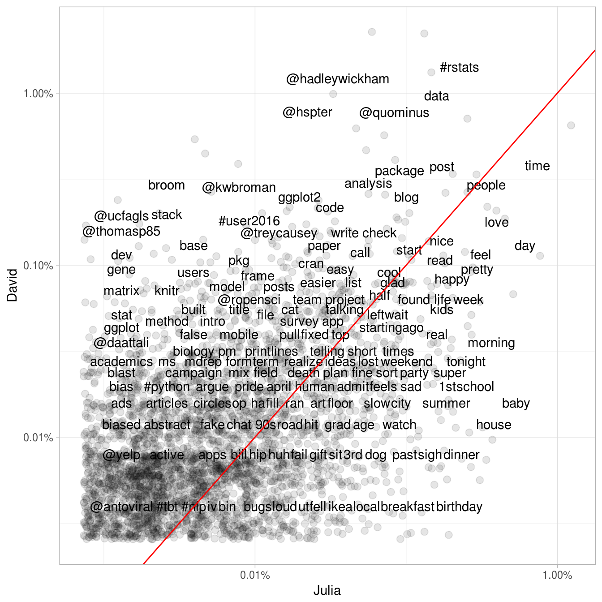
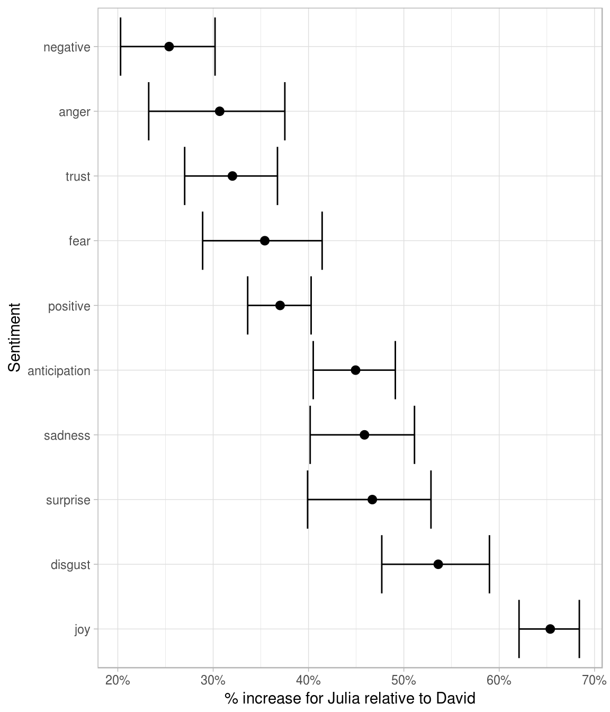
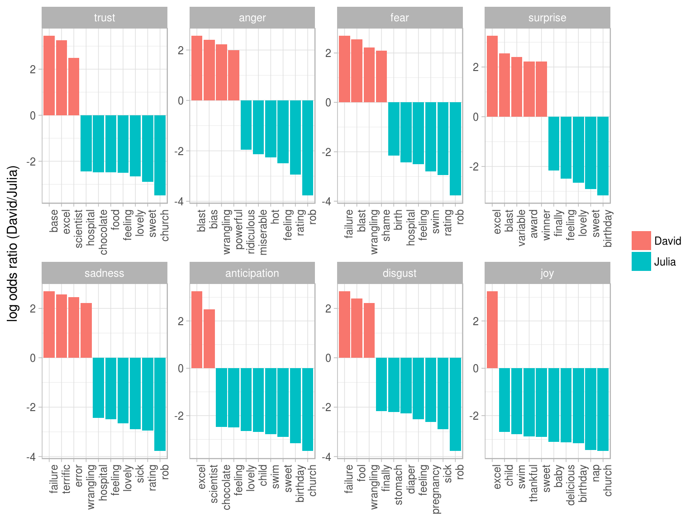
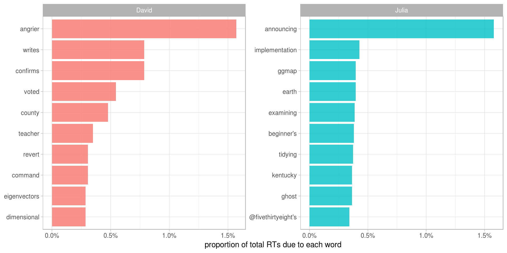

# Case study: comparing Twitter archives {#twitter}


One type of text that has received its share of attention in recent years is text shared online via Twitter. In fact, several of the sentiment lexicons used in this book (and commonly used in general) were designed for use with and validated on tweets. Both of the authors of this book are on Twitter and are fairly regular users of it so in this case study, let's compare the entire Twitter archives of [Julia](https://twitter.com/juliasilge) and [David](https://twitter.com/drob).

## Getting the data and distribution of tweets

An individual can download their own Twitter archive by following [directions available here](https://support.twitter.com/articles/20170160). We each downloaded ours and will now open them up. Let's use the lubridate package to convert the string timestamps to date-time objects and initially take a look at our tweeting patterns overall.


```r
library(lubridate)
library(ggplot2)
library(dplyr)
library(readr)

tweets_julia <- read_csv("data/tweets_julia.csv")
tweets_dave <- read_csv("data/tweets_dave.csv")
tweets <- bind_rows(tweets_julia %>% 
                      mutate(person = "Julia"),
                    tweets_dave %>% 
                      mutate(person = "David")) %>%
  mutate(timestamp = ymd_hms(timestamp))

ggplot(tweets, aes(x = timestamp, fill = person)) +
  geom_histogram(alpha = 0.5, position = "identity")
```


David and Julia tweet at about the same rate currently and joined Twitter about a year apart from each other, but there about 5 years where David was not active on Twitter and Julia was. In total, Julia has about 4 times as many tweets as David.

## Word frequencies

Let's use `unnest_tokens` to make a tidy dataframe of all the words in our tweets, and remove the common English stop words. There are certain conventions in how people use text on Twitter, so we will do a bit more work with our text here than, for example, we did with the narrative text from Project Gutenberg. The first `mutate` line below removes links and cleans out some characters that we don't want. In the call to `unnest_tokens`, we unnest using a regex pattern, instead of just looking for single unigrams (words). This regex pattern is very useful for dealing with Twitter text; it retains hashtags and mentions of usernames with the `@` symbol. Because we have kept these types of symbols in the text, we can't use a simple `anti_join` to remove stop words. Instead, we can take the approach shown in the `filter` line that uses `str_detect` from the stringr library.


```r
library(tidytext)
library(stringr)

reg <- "([^A-Za-z_\\d#@']|'(?![A-Za-z_\\d#@]))"
tidy_tweets <- tweets %>% 
  mutate(text = str_replace_all(text, "https://t.co/[A-Za-z\\d]+|http://[A-Za-z\\d]+|&amp;|&lt;|&gt;|RT", "")) %>%
  unnest_tokens(word, text, token = "regex", pattern = reg) %>%
  filter(!word %in% stop_words$word,
         str_detect(word, "[a-z]"))
```

Now we can calculate word frequencies for each person


```r
frequency <- tidy_tweets %>% 
  group_by(person) %>% 
  count(word, sort = TRUE) %>% 
  left_join(tidy_tweets %>% 
              group_by(person) %>% 
              summarise(total = n())) %>%
  mutate(freq = n/total)

frequency
```

```
## Source: local data frame [23,086 x 5]
## Groups: person [2]
## 
##    person           word     n total        freq
##     <chr>          <chr> <int> <int>       <dbl>
## 1   Julia           time   567 76504 0.007411377
## 2   Julia    @selkie1970   565 76504 0.007385235
## 3   Julia       @skedman   518 76504 0.006770888
## 4   Julia            day   470 76504 0.006143470
## 5   Julia           baby   410 76504 0.005359197
## 6   David        #rstats   359 22074 0.016263477
## 7   Julia     @doctormac   342 76504 0.004470354
## 8   David @hadleywickham   306 22074 0.013862463
## 9   Julia           love   303 76504 0.003960577
## 10  Julia   @haleynburke   291 76504 0.003803723
## # ... with 23,076 more rows
```

This is a lovely, tidy data frame but we would actually like to plot those frequencies on the x- and y-axes of a plot, so we will need to use an `inner_join` and make a different dataframe.


```r
frequency <- inner_join(frequency %>% 
                          filter(person == "Julia") %>% 
                          rename(Julia = freq),
                        frequency %>% 
                          filter(person == "David") %>% 
                          rename(David = freq),
                        by = "word") %>% 
  ungroup() %>% 
  select(word, Julia, David)

frequency
```

```
## # A tibble: 3,520 × 3
##       word       Julia        David
##      <chr>       <dbl>        <dbl>
## 1     time 0.007411377 0.0043490079
## 2      day 0.006143470 0.0014949715
## 3     baby 0.005359197 0.0001812087
## 4     love 0.003960577 0.0020385974
## 5    house 0.003790651 0.0001359065
## 6  morning 0.003659939 0.0004077195
## 7   people 0.003372373 0.0033523602
## 8     feel 0.003124020 0.0013137628
## 9   pretty 0.002954094 0.0010872520
## 10  school 0.002875667 0.0002265108
## # ... with 3,510 more rows
```

```r
library(scales)
ggplot(frequency, aes(Julia, David)) +
  geom_jitter(alpha = 0.1, size = 2.5, width = 0.25, height = 0.25) +
  geom_text(aes(label = word), check_overlap = TRUE, vjust = 1.5) +
  scale_x_log10(labels = percent_format()) +
  scale_y_log10(labels = percent_format()) +
  geom_abline(color = "red")
```




This may not even need to be pointed out, but David and Julia have used their Twitter accounts rather differently over the course of the past several years. David has used his Twitter account almost exclusively for professional purposes since he became more active, while Julia used it for entirely personal purposes until late 2015. We see these differences immediately in this plot exploring word frequencies, and they will continue to be obvious in the rest of this chapter. Words near the red line in this plot are used with about equal frequencies by David and Julia, while words far away from the line are used much more by one person compared to the other. Because of the inner join we did above, words, hashtags, and usernames that appear in this plot are ones that we have both used at least once.

## Comparing word usage 

We just made a plot comparing raw word frequencies, but now let's find which words are more or less likely to come from each person's account using the log odds ratio. First, let's use `str_detect` to remove Twitter usernames from the `word` column, because otherwise, the results here are dominated only by people who Julia or David know and the other does not. After removing these, we count how many times each person uses each word and keep only the words used more than 5 times. After a `spread` operation, we can calculate the log odds ratio for each word, using


$$\text{log odds ratio} = \ln{\left(\frac{\left[\frac{n+1}{\text{total}+1}\right]_\text{David}}{\left[\frac{n+1}{\text{total}+1}\right]_\text{Julia}}\right)}$$

where $n$ is the number of times the word in question is used by each person and the total indicates the total words for each person.


```r
library(tidyr)
word_ratios <- tidy_tweets %>%
  filter(!str_detect(word, "^@")) %>%
  count(word, person) %>%
  filter(sum(n) >= 5) %>%
  spread(person, n, fill = 0) %>%
  ungroup() %>%
  mutate_each(funs((. + 1) / sum(. + 1)), -word) %>%
  mutate(logratio = log(David / Julia)) %>%
  arrange(desc(logratio))
```

What are some words that are about equally likely to come from David or Julia's account?


```r
word_ratios %>% 
  arrange(abs(logratio))
```

```
## # A tibble: 3,483 × 4
##           word        David        Julia    logratio
##          <chr>        <dbl>        <dbl>       <dbl>
## 1        alive 0.0001932118 0.0001920358 0.006105552
## 2       fallen 0.0001932118 0.0001920358 0.006105552
## 3        focus 0.0001932118 0.0001920358 0.006105552
## 4    forgotten 0.0001932118 0.0001920358 0.006105552
## 5  information 0.0001932118 0.0001920358 0.006105552
## 6         nice 0.0023185419 0.0023044290 0.006105552
## 7     painting 0.0001932118 0.0001920358 0.006105552
## 8        phone 0.0007728473 0.0007681430 0.006105552
## 9       random 0.0001932118 0.0001920358 0.006105552
## 10      system 0.0003864236 0.0003840715 0.006105552
## # ... with 3,473 more rows
```

Which words are most likely to be from Julia's account or from David's account? Let's just take the top 15 most distinctive words for each account and plot them.


```r
word_ratios %>%
  group_by(logratio < 0) %>%
  top_n(15, abs(logratio)) %>%
  ungroup() %>%
  mutate(word = reorder(word, logratio)) %>%
  ggplot(aes(word, logratio, fill = logratio < 0)) +
  geom_bar(alpha = 0.8, stat = "identity") +
  coord_flip() +
  ylab("log odds ratio (David/Julia)") +
  scale_fill_discrete(name = "", labels = c("David", "Julia"))
```


So David has tweeted about bioinformatics and Stack Overflow while Julia has been tweeting about preschool, naps, and the snow.

## Sentiment analysis

David and Julia have tweeted using different words, reflecting the difference of a professional vs. a personal Twitter account over the bulk of our tweets, but what about the sentiment of each person's tweets? Let's look for similarities and differences in the emotional content of these tweets. 

First, let's find the total number of words from each person; Julia has a much larger total number of tweets than David.


```r
totals <- tidy_tweets %>%
  group_by(person) %>%
  summarise(total_words = n())

totals
```

```
## # A tibble: 2 × 2
##   person total_words
##    <chr>       <int>
## 1  David       22074
## 2  Julia       76504
```

Now let's measure the sentiment for each word in our tweet archives. First we use `inner_join` and the NRC sentiment lexicon to identify words that are associated with joy, anger, surprise, etc. Then we count how many of these words each person used. Next, we join the data frame with the total words so that we will be able to look at proportions.


```r
sentiment_by_person <- tidy_tweets %>%
  inner_join(get_sentiments("nrc")) %>%
  count(sentiment, person) %>%
  ungroup() %>%
  left_join(totals) %>%
  rename(words = n)

sentiment_by_person
```

```
## # A tibble: 20 × 4
##       sentiment person words total_words
##           <chr>  <chr> <int>       <int>
## 1         anger  David   447       22074
## 2         anger  Julia  2235       76504
## 3  anticipation  David   744       22074
## 4  anticipation  Julia  4683       76504
## 5       disgust  David   304       22074
## 6       disgust  Julia  2271       76504
## 7          fear  David   497       22074
## 8          fear  Julia  2667       76504
## 9           joy  David   520       22074
## 10          joy  Julia  5202       76504
## 11     negative  David  1078       22074
## 12     negative  Julia  5007       76504
## 13     positive  David  1650       22074
## 14     positive  Julia  9080       76504
## 15      sadness  David   447       22074
## 16      sadness  Julia  2862       76504
## 17     surprise  David   311       22074
## 18     surprise  Julia  2022       76504
## 19        trust  David   914       22074
## 20        trust  Julia  4660       76504
```

This is count data, so let's use a Poisson test to measure the difference between David's word use and Julia's. We want to test each sentiment separately, so first let's `nest` the data so that we have a list-column with the data for each sentiment. Then let's use `map` from the purrr library to apply the Poisson test to each little data frame individually.


```r
library(purrr)

sentiment_differences <- sentiment_by_person %>% 
  nest(-sentiment) %>%
  mutate(tests = map(data, ~ poisson.test(.$words, .$total_words)))

sentiment_differences
```

```
## # A tibble: 10 × 3
##       sentiment             data       tests
##           <chr>           <list>      <list>
## 1         anger <tibble [2 × 3]> <S3: htest>
## 2  anticipation <tibble [2 × 3]> <S3: htest>
## 3       disgust <tibble [2 × 3]> <S3: htest>
## 4          fear <tibble [2 × 3]> <S3: htest>
## 5           joy <tibble [2 × 3]> <S3: htest>
## 6      negative <tibble [2 × 3]> <S3: htest>
## 7      positive <tibble [2 × 3]> <S3: htest>
## 8       sadness <tibble [2 × 3]> <S3: htest>
## 9      surprise <tibble [2 × 3]> <S3: htest>
## 10        trust <tibble [2 × 3]> <S3: htest>
```

Now we can use `tidy` from the broom library and `unnest` to get back to a data frame without list-columns.


```r
library(broom)

sentiment_differences <- sentiment_differences %>% 
  unnest(map(tests, tidy)) %>% 
  select(-data, -tests)

sentiment_differences
```

```
## # A tibble: 10 × 9
##       sentiment  estimate statistic       p.value parameter  conf.low conf.high
##           <chr>     <dbl>     <dbl>         <dbl>     <dbl>     <dbl>     <dbl>
## 1         anger 0.6931594       447  2.231075e-13  600.5647 0.6248241 0.7675962
## 2  anticipation 0.5506199       744  4.746477e-59 1215.2366 0.5089522 0.5950353
## 3       disgust 0.4639376       304  1.948674e-43  576.6048 0.4102417 0.5231585
## 4          fear 0.6458572       497  7.419529e-21  708.4962 0.5857010 0.7110327
## 5           joy 0.3464464       520 8.526864e-156 1281.2943 0.3159762 0.3792032
## 6      negative 0.7461812      1078  2.789775e-19 1362.5788 0.6980139 0.7971034
## 7      positive 0.6297979      1650  5.922101e-74 2402.7067 0.5972567 0.6637915
## 8       sadness 0.5413037       447  2.145804e-38  740.9652 0.4888538 0.5982540
## 9      surprise 0.5330677       311  1.091952e-28  522.4152 0.4715559 0.6009547
## 10        trust 0.6797722       914  1.103873e-28 1248.1535 0.6325550 0.7298829
## # ... with 2 more variables: method <fctr>, alternative <fctr>
```

We have measured the differences in sentiment between our two Twitter feeds; now let's plot them!


```r
library(scales)

sentiment_differences %>%
  ungroup() %>%
  mutate(sentiment = reorder(sentiment, estimate)) %>%
  mutate_each(funs(1 - .), estimate, conf.low, conf.high) %>%
  ggplot(aes(estimate, sentiment)) +
  geom_point(size = 2.5) +
  geom_errorbarh(aes(xmin = conf.low, xmax = conf.high)) +
  scale_x_continuous(labels = percent_format()) +
  labs(x = "% increase for Julia relative to David",
       y = "Sentiment")
```



We see here that Julia uses about 65% more words related to joy and about 55% more words related to disgust than David; in fact, she uses more of *all* words associated with sentiments, both negative and positive. David's tweets are more neutral in sentiment while Julia's involve more dramatic word choices that communicate more emotions. This, again, reflects the different ways we have used our Twitter accounts.

## Words that contribute to sentiment in tweets

Which specific words are driving this difference in sentiment between Julia's and David's accounts? Let's go back to the data frame that contains the odds ratios for each word. We can use the same `inner_join` with the NRC sentiment lexicon to identify the words that are associated with emotions like joy, disgust, and so forth; these are exactly the words that are driving the differences in measured sentiment between our two accounts. Now let's find the words with the largest odds ratios. When we did a similar operation above, we took the `top_n` for each individual person to see the words that were more likely to come from each Twitter feed, but now we will take the `top_n` for each sentiment to see which word choices are the cause of the marked difference in sentiment.


```r
word_ratios %>%
  inner_join(get_sentiments("nrc")) %>%
  filter(!sentiment %in% c("positive", "negative")) %>%
  mutate(sentiment = reorder(sentiment, -logratio),
         word = reorder(word, -logratio)) %>%
  group_by(sentiment) %>%
  top_n(10, abs(logratio)) %>%
  ungroup() %>%
  ggplot(aes(word, logratio, fill = logratio < 0)) +
  facet_wrap(~ sentiment, scales = "free", nrow = 2) +
  geom_bar(stat = "identity") +
  theme(axis.text.x = element_text(angle = 90, hjust = 1)) +
  labs(y = "log odds ratio (David/Julia)",
       x = NULL) +
  scale_fill_discrete(name = "", labels = c("David", "Julia"))
```



We see here that Julia's tweets have such a higher joy score because she has tweeted about things like birthdays, babies, and things that are delicious and sweet (probably sweet babies even!). Her disgust score is higher because she has tweeted about pregnancy, diapers, and being sick with stomach bugs. We see that there are some misidentifications visible in this plot; David's only joy word should actually be Excel, the Microsoft product (not excel, the verb) and he uses "wrangling" in the sense of "data wrangling", which is not fraught with disgust, anger, or fear (or is it?!). These misidentifications due to domain-specific word use mean that the difference between Julia and David for joy, digust, and some others should actually be even larger.

## Favorites and retweets

Another important characteristic of tweets is how many times they are favorited or retweeted. Let's explore which words are more likely to be retweeted or favorited for Julia's and David's tweets. When a user downloads their own Twitter archive, favorites and retweets are not included, so we constructed another dataset of the author's tweets that includes this information. We accessed our own tweets via the Twitter API and downloaded about 3200 tweets for each person. In both cases, that is about the last 18 months worth of Twitter activity. This corresponds to a period of increasing activity and increasing numbers of followers for both of us.


```r
tweets_julia <- read_csv("data/juliasilge_tweets.csv")
tweets_dave <- read_csv("data/drob_tweets.csv")
tweets <- bind_rows(tweets_julia %>% 
                      mutate(person = "Julia"),
                    tweets_dave %>% 
                      mutate(person = "David")) %>%
  mutate(created_at = ymd_hms(created_at))
```

Now that we have this second, smaller set of only recent tweets, let's use `unnest_tokens` to transform these tweets to a tidy data set.


```r
tidy_tweets <- tweets %>% 
  filter(!str_detect(text, "^RT")) %>%
  mutate(text = str_replace_all(text, "https://t.co/[A-Za-z\\d]+|http://[A-Za-z\\d]+|&amp;|&lt;|&gt;|RT", "")) %>%
  unnest_tokens(word, text, token = "regex", pattern = reg) %>%
  anti_join(stop_words)

tidy_tweets
```

```
## # A tibble: 30,725 × 7
##              id          created_at             source retweets favorites person        word
##           <dbl>              <dttm>              <chr>    <int>     <int>  <chr>       <chr>
## 1  8.043967e+17 2016-12-01 18:48:07 Twitter Web Client        4         6  David         j's
## 2  8.043611e+17 2016-12-01 16:26:39 Twitter Web Client        8        12  David   bangalore
## 3  8.043611e+17 2016-12-01 16:26:39 Twitter Web Client        8        12  David      london
## 4  8.043435e+17 2016-12-01 15:16:48 Twitter for iPhone        0         1  David @rodneyfort
## 5  8.043120e+17 2016-12-01 13:11:37 Twitter for iPhone        0         1  Julia         sho
## 6  8.040632e+17 2016-11-30 20:43:03 Twitter Web Client        0         2  David       arbor
## 7  8.040632e+17 2016-11-30 20:43:03 Twitter Web Client        0         2  David       arbor
## 8  8.040632e+17 2016-11-30 20:43:03 Twitter Web Client        0         2  David         ann
## 9  8.040632e+17 2016-11-30 20:43:03 Twitter Web Client        0         2  David         ann
## 10 8.040582e+17 2016-11-30 20:23:14 Twitter Web Client       30        41  David          sf
## # ... with 30,715 more rows
```

To start with, let's look at retweets. Let's find the total number of retweets for each person.


```r
totals <- tidy_tweets %>% 
  group_by(person, id) %>% 
  summarise(rts = sum(retweets)) %>% 
  group_by(person) %>% 
  summarise(total_rts = sum(rts))

totals
```

```
## # A tibble: 2 × 2
##   person total_rts
##    <chr>     <int>
## 1  David    111863
## 2  Julia     12906
```

Now let's find the number of retweets for each word and person (making sure to count each tweet only once) and join to this data frame of retweet totals.


```r
word_by_rts <- tidy_tweets %>% 
  group_by(id, word, person) %>% 
  summarise(rts = sum(retweets)) %>% 
  group_by(person, word) %>% 
  summarise(retweets = sum(rts)) %>%
  left_join(totals) %>%
  filter(retweets != 0) %>%
  ungroup()

word_by_rts %>% 
  arrange(desc(retweets))
```

```
## # A tibble: 3,519 × 4
##    person     word retweets total_rts
##     <chr>    <chr>    <int>     <int>
## 1   David  #rstats     6833    111863
## 2   David    trump     3778    111863
## 3   David     post     2936    111863
## 4   David analysis     2732    111863
## 5   David   tweets     2067    111863
## 6   David  android     1820    111863
## 7   David overflow     1768    111863
## 8   David    stack     1768    111863
## 9   David  angrier     1757    111863
## 10  David confirms     1757    111863
## # ... with 3,509 more rows
```

Now we can plot the words that have contributed the most to each of our retweets.


```r
plot_rts <- word_by_rts %>%
  mutate(ratio = retweets / total_rts) %>%  
  group_by(person) %>%
  top_n(8, ratio) %>%
  ungroup() %>%
  arrange(person, ratio) %>%
  mutate(order = row_number())

ggplot(plot_rts, aes(order, ratio, fill = person)) +
  geom_bar(stat = "identity", alpha = 0.8, show.legend = FALSE) +
  facet_wrap(~ person, scales = "free", ncol = 2) +
  coord_flip() +
  scale_x_continuous(breaks = plot_rts$order, labels = plot_rts$word) +
  scale_y_continuous(labels = percent_format()) +
  labs(x = NULL, y = "proportion of total RTs due to each word")
```



