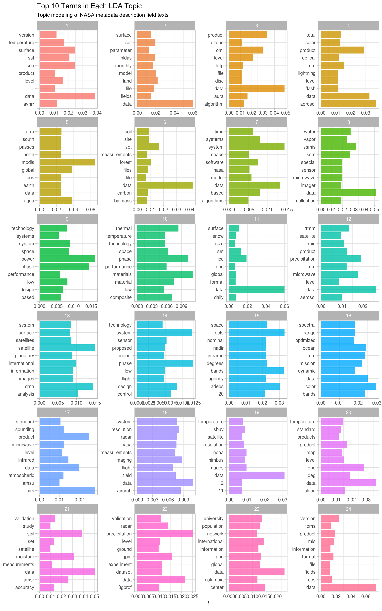

# Case study: mining NASA metadata {#nasa}


There are 32,000+ datasets at [NASA](https://www.nasa.gov/), and we can use the metadata for these datasets to understand the connections between them. What is metadata? Metadata is data that gives information about other data, in this case, data about what is in these numerous NASA datasets (but not the datasets themselves). It includes information like the title of the dataset, description fields, what organization(s) within NASA is responsible for the dataset, and so forth. NASA places a high priority on making its data accessible, even requiring all NASA-funded research to be [openly accessible online](https://www.nasa.gov/press-release/nasa-unveils-new-public-web-portal-for-research-results), and the metadata for all its datasets is [publicly available online in JSON format](https://data.nasa.gov/data.json). Let's take a look at this metadata and see what is there.

## Getting the metadata

First, let's download the JSON file and take a look at the names.


```r
library(jsonlite)
metadata <- fromJSON("https://data.nasa.gov/data.json")
names(metadata$dataset)
```


```
##  [1] "_id"                "@type"              "accessLevel"        "accrualPeriodicity"
##  [5] "bureauCode"         "contactPoint"       "description"        "distribution"      
##  [9] "identifier"         "issued"             "keyword"            "landingPage"       
## [13] "language"           "modified"           "programCode"        "publisher"         
## [17] "spatial"            "temporal"           "theme"              "title"             
## [21] "license"            "isPartOf"           "references"         "rights"            
## [25] "describedBy"
```

What kind of data is available here?


```r
sapply(metadata$dataset, class)
```

```
##                _id              @type        accessLevel accrualPeriodicity         bureauCode 
##       "data.frame"        "character"        "character"        "character"             "list" 
##       contactPoint        description       distribution         identifier             issued 
##       "data.frame"        "character"             "list"        "character"        "character" 
##            keyword        landingPage           language           modified        programCode 
##             "list"        "character"             "list"        "character"             "list" 
##          publisher            spatial           temporal              theme              title 
##       "data.frame"        "character"        "character"             "list"        "character" 
##            license           isPartOf         references             rights        describedBy 
##        "character"        "character"             "list"        "character"        "character"
```

It seems likely that the title, description, and keywords for each dataset may be most fruitful for drawing connections between datasets. It's a place to start anyway! Let's check them out.


```r
class(metadata$dataset$title)
```

```
## [1] "character"
```

```r
class(metadata$dataset$description)
```

```
## [1] "character"
```

```r
class(metadata$dataset$keyword)
```

```
## [1] "list"
```

## Wrangling and tidying the data

Let's set up tidy data frames for title, description, and keyword and keep the dataset ids.


```r
library(dplyr)

nasa_title <- data_frame(id = metadata$dataset$`_id`$`$oid`, 
                        title = metadata$dataset$title)
nasa_title
```

```
## # A tibble: 32,089 × 2
##                          id                                               title
##                       <chr>                                               <chr>
## 1  55942a57c63a7fe59b495a77             15 Minute Stream Flow Data: USGS (FIFE)
## 2  55942a57c63a7fe59b495a78             15 Minute Stream Flow Data: USGS (FIFE)
## 3  55942a58c63a7fe59b495a79             15 Minute Stream Flow Data: USGS (FIFE)
## 4  55942a58c63a7fe59b495a7a 2000 Pilot Environmental Sustainability Index (ESI)
## 5  55942a58c63a7fe59b495a7b 2000 Pilot Environmental Sustainability Index (ESI)
## 6  55942a58c63a7fe59b495a7c 2000 Pilot Environmental Sustainability Index (ESI)
## 7  55942a58c63a7fe59b495a7d       2001 Environmental Sustainability Index (ESI)
## 8  55942a58c63a7fe59b495a7e       2001 Environmental Sustainability Index (ESI)
## 9  55942a58c63a7fe59b495a7f       2001 Environmental Sustainability Index (ESI)
## 10 55942a58c63a7fe59b495a80       2001 Environmental Sustainability Index (ESI)
## # ... with 32,079 more rows
```


```r
nasa_desc <- data_frame(id = metadata$dataset$`_id`$`$oid`, 
                       desc = metadata$dataset$description)
nasa_desc
```

```
## # A tibble: 32,089 × 2
##                          id
##                       <chr>
## 1  55942a57c63a7fe59b495a77
## 2  55942a57c63a7fe59b495a78
## 3  55942a58c63a7fe59b495a79
## 4  55942a58c63a7fe59b495a7a
## 5  55942a58c63a7fe59b495a7b
## 6  55942a58c63a7fe59b495a7c
## 7  55942a58c63a7fe59b495a7d
## 8  55942a58c63a7fe59b495a7e
## 9  55942a58c63a7fe59b495a7f
## 10 55942a58c63a7fe59b495a80
## # ... with 32,079 more rows, and 1 more variables: desc <chr>
```

These are having a hard time printing out; let’s print out part of a few.


```r
nasa_desc %>% 
  select(desc) %>% 
  sample_n(5)
```

```
## # A tibble: 5 × 1
##                                                                                                    desc
##                                                                                                   <chr>
## 1  Plasma catalytic techniques are proposed for the extraction of oxygen from the abundant carbon dioxi
## 2 On August 17, 1996, the Japanese Space Agency (NASDA - National Space Development Agency)\nlaunched t
## 3  The Tropical Rainfall Measuring Mission (TRMM) is a joint U.S.-Japan satellite mission to monitor tr
## 4                          Field saturated hydraulic conductivity, using constant well head permeameter
## 5  The Advanced Microwave Precipitation Radiometer (AMPR) was deployed during the First Kwajelein Exper
```

Now we can do the keywords, which must be unnested since they are in a list-column.


```r
library(tidyr)

nasa_keyword <- data_frame(id = metadata$dataset$`_id`$`$oid`, 
                          keyword = metadata$dataset$keyword) %>%
  unnest(keyword)
nasa_keyword
```

```
## # A tibble: 126,814 × 2
##                          id       keyword
##                       <chr>         <chr>
## 1  55942a57c63a7fe59b495a77 EARTH SCIENCE
## 2  55942a57c63a7fe59b495a77   HYDROSPHERE
## 3  55942a57c63a7fe59b495a77 SURFACE WATER
## 4  55942a57c63a7fe59b495a78 EARTH SCIENCE
## 5  55942a57c63a7fe59b495a78   HYDROSPHERE
## 6  55942a57c63a7fe59b495a78 SURFACE WATER
## 7  55942a58c63a7fe59b495a79 EARTH SCIENCE
## 8  55942a58c63a7fe59b495a79   HYDROSPHERE
## 9  55942a58c63a7fe59b495a79 SURFACE WATER
## 10 55942a58c63a7fe59b495a7a EARTH SCIENCE
## # ... with 126,804 more rows
```

Now let's use tidytext's `unnest_tokens` for the title and description fields so we can do the text analysis. Let's also remove common English words.


```r
library(tidytext)

nasa_title <- nasa_title %>% 
  unnest_tokens(word, title) %>% 
  anti_join(stop_words)
nasa_desc <- nasa_desc %>% 
  unnest_tokens(word, desc) %>% 
  anti_join(stop_words)
```

## Some initial simple exploration

What are the most common words in the NASA dataset titles?


```r
nasa_title %>%
  count(word, sort = TRUE)
```

```
## # A tibble: 11,614 × 2
##       word     n
##      <chr> <int>
## 1  project  7735
## 2     data  3354
## 3        1  2841
## 4    level  2400
## 5   global  1809
## 6       v1  1478
## 7    daily  1397
## 8        3  1364
## 9     aura  1363
## 10      l2  1311
## # ... with 11,604 more rows
```

What about the descriptions?


```r
nasa_desc %>% 
  count(word, sort = TRUE)
```

```
## # A tibble: 35,940 × 2
##          word     n
##         <chr> <int>
## 1        data 68871
## 2       modis 24420
## 3      global 23028
## 4           2 16599
## 5           1 15770
## 6      system 15480
## 7     product 14780
## 8        aqua 14738
## 9       earth 14373
## 10 resolution 13879
## # ... with 35,930 more rows
```

It looks like we might want to remove digits and some "words" like "v1" from these dataframes before approaching something more meaningful like topic modeling.


```r
my_stopwords <- data_frame(word = c(as.character(1:10), 
                                   "v1", "v03", "l2", "l3", "v5.2.0", 
                                   "v003", "v004", "v005", "v006"))
nasa_title <- nasa_title %>% 
  anti_join(my_stopwords)
nasa_desc <- nasa_desc %>% 
  anti_join(my_stopwords)
```

What are the most common keywords?


```r
nasa_keyword %>% 
  group_by(keyword) %>% 
  count(sort = TRUE)
```

```
## # A tibble: 1,774 × 2
##                    keyword     n
##                      <chr> <int>
## 1            EARTH SCIENCE 14362
## 2                  Project  7452
## 3               ATMOSPHERE  7321
## 4              Ocean Color  7268
## 5             Ocean Optics  7268
## 6                   Oceans  7268
## 7                completed  6452
## 8  ATMOSPHERIC WATER VAPOR  3142
## 9                   OCEANS  2765
## 10            LAND SURFACE  2720
## # ... with 1,764 more rows
```

It is possible that "Project completed" may not be a useful set of keywords to keep around for some purposes, and we may want to change all of these to lower or upper case to get rid of duplicates like "OCEANS" and "Oceans". Let's do that, actually.


```r
nasa_keyword <- nasa_keyword %>% 
  mutate(keyword = toupper(keyword))
```

## Word co-ocurrences and correlations

Let's examine which words commonly occur together in the titles and descriptions of NASA datasets. We can then examine a word network in titles/descriptions; this may help us decide, for example, how many topics to look at in topic modeling.


```r
library(widyr)

title_words <- nasa_title %>% 
  pairwise_count(word, id, sort = TRUE)

title_words
```

```
## # A tibble: 313,774 × 3
##      item1   item2     n
##      <chr>   <chr> <dbl>
## 1  project  system   796
## 2   system project   796
## 3      eco     lba   683
## 4      lba     eco   683
## 5     aqua    airs   641
## 6     airs    aqua   641
## 7     aqua   level   623
## 8    level    aqua   623
## 9     airs   level   612
## 10   level    airs   612
## # ... with 313,764 more rows
```


```r
desc_words <- nasa_desc %>% 
  pairwise_count(word, id, sort = TRUE)

desc_words
```

```
## # A tibble: 21,779,288 × 3
##         item1      item2     n
##         <chr>      <chr> <dbl>
## 1      global       data  9864
## 2        data     global  9864
## 3  resolution       data  9302
## 4        data resolution  9302
## 5  resolution instrument  8189
## 6  instrument resolution  8189
## 7     surface       data  8180
## 8        data    surface  8180
## 9  resolution     global  8139
## 10     global resolution  8139
## # ... with 21,779,278 more rows
```

Let's plot networks of these co-occurring words.


```r
library(ggplot2)
library(igraph)
library(ggraph)

set.seed(1234)
title_words %>%
  filter(n >= 250) %>%
  graph_from_data_frame() %>%
  ggraph(layout = "fr") +
  geom_edge_link(aes(edge_alpha = n, edge_width = n)) +
  geom_node_point(color = "darkslategray4", size = 5) +
  geom_node_text(aes(label = name), repel = TRUE) +
  ggtitle("Word Network in NASA Dataset Titles") +
  theme_void()
```


This is a good start, although it looks like there may still a bit more cleaning to be done.

Let's look at the words in descriptions.


```r
set.seed(1234)
desc_words %>%
  filter(n >= 5000) %>%
  graph_from_data_frame() %>%
  ggraph(layout = "fr") +
  geom_edge_link(aes(edge_alpha = n, edge_width = n)) +
  geom_node_point(color = "indianred4", size = 5) +
  geom_node_text(aes(label = name), repel = TRUE) +
  ggtitle("Word Network in NASA Dataset Descriptions") +
  theme_void()
```


Here there are such *strong* connections between the top dozen or so words (words like "data", "resolution", and "instrument") that we may do better if we exclude these very highly connected words or use tf-idf (as described in detail in [Chapter 4](#tfidf)) as a metric. But for now, let's add a few more stop words and look at one more word network for the description fields. Notice how we use `bind_rows` to add more custom stop words to the words we are already using; this approach can be used in many instances.


```r
my_stopwords <- bind_rows(my_stopwords,
                         data_frame(word = c("data", "global", 
                                             "instrument", "resolution",
                                             "product", "level")))

set.seed(1234)
nasa_desc %>% 
  anti_join(my_stopwords) %>%
  pairwise_count(word, id, sort = TRUE) %>%
  filter(n >= 4600) %>%
  graph_from_data_frame() %>%
  ggraph(layout = "fr") +
  geom_edge_link(aes(edge_alpha = n, edge_width = n)) +
  geom_node_point(color = "indianred4", size = 5) +
  geom_node_text(aes(label = name), repel = TRUE) +
  ggtitle("Word Network in NASA Dataset Descriptions") +
  theme_void()
```


We still are not seeing clusters the way we did with the titles (the descriptions appear to use very similar words compared to each other), so using tf-idf may be a better way to go when approaching the description fields.

Let's make a network of the keywords to see which keywords commonly occur together in the same datasets.


```r
keyword_counts <- nasa_keyword %>% 
  pairwise_count(keyword, id, sort = TRUE)

keyword_counts
```

```
## # A tibble: 26,780 × 3
##            item1         item2     n
##            <chr>         <chr> <dbl>
## 1   OCEAN OPTICS        OCEANS  7324
## 2         OCEANS  OCEAN OPTICS  7324
## 3     ATMOSPHERE EARTH SCIENCE  7318
## 4  EARTH SCIENCE    ATMOSPHERE  7318
## 5    OCEAN COLOR        OCEANS  7270
## 6    OCEAN COLOR  OCEAN OPTICS  7270
## 7         OCEANS   OCEAN COLOR  7270
## 8   OCEAN OPTICS   OCEAN COLOR  7270
## 9      COMPLETED       PROJECT  6450
## 10       PROJECT     COMPLETED  6450
## # ... with 26,770 more rows
```

```r
set.seed(1234)
keyword_counts %>%
  filter(n >= 700) %>%
  graph_from_data_frame() %>%
  ggraph(layout = "fr") +
  geom_edge_link(aes(edge_alpha = n, edge_width = n)) +
  geom_node_point(color = "royalblue3", size = 5) +
  geom_node_text(aes(label = name), repel = TRUE) +
  ggtitle("Co-occurrence Network in NASA Dataset Keywords") +
  theme_void()
```


These are the most commonly co-occurring words, but also just the most common keywords in general. To more meaningfully examine which keywords are likely to appear together instead of separately, we need to find the correlation among the keywords as described in [Chapter 5](#ngrams).


```r
keyword_cors <- nasa_keyword %>% 
  group_by(keyword) %>%
  filter(n() >= 50) %>%
  pairwise_cor(keyword, id, sort = TRUE)

keyword_cors
```

```
## # A tibble: 15,750 × 3
##         item1      item2 correlation
##         <chr>      <chr>       <dbl>
## 1     SHARING  KNOWLEDGE   1.0000000
## 2   KNOWLEDGE    SHARING   1.0000000
## 3        AMES   DASHLINK   1.0000000
## 4    DASHLINK       AMES   1.0000000
## 5  EXPEDITION   SCHEDULE   1.0000000
## 6    SCHEDULE EXPEDITION   1.0000000
## 7      MODELS TURBULENCE   0.9971871
## 8  TURBULENCE     MODELS   0.9971871
## 9   KNOWLEDGE      APPEL   0.9967945
## 10    SHARING      APPEL   0.9967945
## # ... with 15,740 more rows
```

Notice that these keywords at the top of this sorted data frame have correlation coefficients equal to 1; they always occur together. This means these are redundant keywords and it may not make sense to continue to use both of these sets of pairs. Let's visualize the network of keyword correlations, just as we did for keyword co-occurences.


```r
set.seed(1234)
keyword_cors %>%
  filter(correlation > .6) %>%
  graph_from_data_frame() %>%
  ggraph(layout = "fr") +
  geom_edge_link(aes(edge_alpha = correlation, edge_width = correlation)) +
  geom_node_point(color = "royalblue3", size = 5) +
  geom_node_text(aes(label = name), repel = TRUE) +
  ggtitle("Correlation Network in NASA Dataset Keywords") +
  theme_void()
```


This network looks much different than the co-occurence network. The difference is that the co-occurrence network asks a question about which keyword pairs occur most often, and the correlation network asks a question about which keyword pairs occur more often together than with other keywords. Notice here the high number of small clusters of keywords; the network structure can be extracted from the `graph_from_data_frame()` function above.

## Calculating tf-idf for the description fields

As discussed in [Chapter 4](#tf-idf), we can use tf-idf, the term frequency times inverse document frequency, to identify words that are especially important to a document within a collection of documents. Let's apply that approach to the description fields of these NASA datasets. We will consider each description field a document, and the whole set of description fields the collection or corpus of documents. We have already used `unnest_tokens` above to make a tidy data frame of the words in the description fields, so now we can use `bind_tf_idf` to calculate tf-idf for each word.


```r
desc_tf_idf <- nasa_desc %>% 
  count(id, word, sort = TRUE) %>%
  ungroup() %>%
  bind_tf_idf(word, id, n)
```

What are the highest tf-idf words in the NASA description fields?


```r
desc_tf_idf %>% 
  arrange(-tf_idf)
```

```
## # A tibble: 1,847,770 × 6
##                          id                                          word     n    tf       idf
##                       <chr>                                         <chr> <int> <dbl>     <dbl>
## 1  55942a7cc63a7fe59b49774a                                           rdr     1     1 10.375052
## 2  55942ac9c63a7fe59b49b688 palsar_radiometric_terrain_corrected_high_res     1     1 10.375052
## 3  55942ac9c63a7fe59b49b689  palsar_radiometric_terrain_corrected_low_res     1     1 10.375052
## 4  55942a7bc63a7fe59b4976ca                                          lgrs     1     1  8.765615
## 5  55942a7bc63a7fe59b4976d2                                          lgrs     1     1  8.765615
## 6  55942a7bc63a7fe59b4976e3                                          lgrs     1     1  8.765615
## 7  55942a7dc63a7fe59b497820                                           mri     1     1  8.583293
## 8  55942ad8c63a7fe59b49cf6c                      template_proddescription     1     1  8.295611
## 9  55942ad8c63a7fe59b49cf6d                      template_proddescription     1     1  8.295611
## 10 55942ad8c63a7fe59b49cf6e                      template_proddescription     1     1  8.295611
## # ... with 1,847,760 more rows, and 1 more variables: tf_idf <dbl>
```

These are the most important words in the description fields as measured by tf-idf, meaning they are common but not too common. Notice we have run into an issue here; both $n$ and term frequency are equal to 1 for these terms, meaning that these were description fields that only had a single word in them. If a description field only contains one word, the tf-idf algorithm will think that is a really important word. Depending on our analytic goals, it might be a good idea to throw out all description fields that have fewer than 5 words or similar.

We now know which words in the descriptions have high tf-idf, and we also have labels for these descriptions in the keywords. Let’s do a full join of the keyword data frame and the data frame of description words with tf-idf, and then find the highest tf-idf words for a given keyword.


```r
desc_tf_idf <- full_join(desc_tf_idf, nasa_keyword, by = "id")
```

Let's plot some of the most important words, as measured by tf-idf, for a few example keywords used on NASA datasets. First, let's use dplyr operations to filter for the keywords we want to examine and take just the top 15 words for each keyword. Then, let's plot those words.


```r
desc_tf_idf %>% 
  filter(!near(tf, 1)) %>%
  filter(keyword %in% c("SOLAR ACTIVITY", "CLOUDS", 
                        "SEISMOLOGY", "ASTROPHYSICS",
                        "HUMAN HEALTH", "BUDGET")) %>%
  arrange(desc(tf_idf)) %>%
  group_by(keyword) %>%
  distinct(word, keyword, .keep_all = TRUE) %>%
  top_n(15, tf_idf) %>% 
  ungroup() %>%
  mutate(word = factor(word, levels = rev(unique(word)))) %>%
  ggplot(aes(word, tf_idf, fill = keyword)) +
  geom_bar(stat = "identity", alpha = 0.8, show.legend = FALSE) +
  facet_wrap(~keyword, ncol = 3, scales = "free") +
  coord_flip() +
  labs(title = "Highest tf-idf words in NASA Metadata Description Fields",
       subtitle = "Distribution of tf-idf for words from datasets labeled with select keywords",
       caption = "NASA metadata from https://data.nasa.gov/data.json",
       x = NULL, y = "tf-idf")
```


Using tf-idf has allowed us to identify important description words for each of these keywords. Datasets labeled with the keyword **SEISMOLOGY** have words like "earthquake", "risk", and "hazard" in their description, while those labeled with **HUMAN HEALTH** have descriptions characterized by words like "wellbeing", "vulnerability", and "children." Most of the combinations of letters that are not English words are certainly acronyms (like OMB for the Office of Management and Budget), and the examples of years and numbers are important for these topics. The tf-idf statistic has identified the kinds of words it is intended to, important words for individual documents within a collection of documents.

## Topic modeling

Let's try another approach to the question of what the NASA descriptions fields are about. We can use topic modeling as described in [Chapter 7](#topicmodeling) to model each document (description field) as a mixture of topics and each topic as a mixture of words. As in earlier chapters, we will use [latent Dirichlet allocation (LDA)](https://en.wikipedia.org/wiki/Latent_Dirichlet_allocation) for our topic modeling; there are other possible approaches for topic modeling.

To do the topic modeling as implemented here, we need to make a `DocumentTermMatrix`, a special kind of matrix from the tm package (of course, this is just a specific implementation of the general concept of a "document-term matrix"). Rows correspond to documents (description texts in our case) and columns correspond to terms (i.e., words); it is a sparse matrix and the values are word counts.

Let’s clean up the text a bit using stop words to remove some of the nonsense "words" leftover from HTML or other character encoding.


```r
my_stop_words <- bind_rows(stop_words, 
                           data_frame(word = c("nbsp", "amp", "gt", "lt",
                                               "timesnewromanpsmt", "font",
                                               "td", "li", "br", "tr", "quot",
                                               "st", "img", "src", "strong",
                                               as.character(1:10)), 
                                      lexicon = rep("custom", 25)))

word_counts <- nasa_desc %>%
    anti_join(my_stop_words) %>%
    count(id, word, sort = TRUE) %>%
    ungroup()

word_counts
```

```
## # A tibble: 1,842,559 × 3
##                          id     word     n
##                       <chr>    <chr> <int>
## 1  55942a8ec63a7fe59b4986ef     suit    82
## 2  55942a8ec63a7fe59b4986ef    space    69
## 3  56cf5b00a759fdadc44e564a     leak    40
## 4  56cf5b00a759fdadc44e564a     tree    39
## 5  55942a8ec63a7fe59b4986ef pressure    34
## 6  55942a8ec63a7fe59b4986ef   system    34
## 7  55942a89c63a7fe59b4982d9       em    32
## 8  55942a8ec63a7fe59b4986ef       al    32
## 9  55942a8ec63a7fe59b4986ef    human    31
## 10 56cf5b00a759fdadc44e55cd   sparse    31
## # ... with 1,842,549 more rows
```

This is the information we need, the number of times each word is used in each document, to make a `DocumentTermMatrix`. We can `cast` from our tidy text format to this non-tidy format as described in detail in [Chapter 6](#dtm).


```r
desc_dtm <- word_counts %>%
  cast_dtm(id, word, n)

desc_dtm
```

```
## <<DocumentTermMatrix (documents: 32003, terms: 35902)>>
## Non-/sparse entries: 1842559/1147129147
## Sparsity           : 100%
## Maximal term length: 166
## Weighting          : term frequency (tf)
```

We see that this dataset contains documents (each of them a NASA description field) and terms (words). Notice that this example document-term matrix is (nearly) 100% sparse.

Now let’s use the [topicmodels](https://cran.r-project.org/package=topicmodels) package to create an LDA model. How many topics will we tell the algorithm to make? This is a question much like in $k$-means clustering; we don’t really know ahead of time. We tried this modeling procedure using 8, 16, 24, 32, and 64 topics; we found that at 24 topics, documents were still getting sorted into topics cleanly but going much beyond that caused the distributions of $\gamma$, the probability that each document belongs in each topic, to look worrisome. We will show more details on this below.


```r
library(topicmodels)

desc_lda <- LDA(desc_dtm, k = 24, control = list(seed = 1234))
desc_lda
```


```
## A LDA_VEM topic model with 24 topics.
```

This is a stochastic algorithm that could have different results depending on where the algorithm starts, so we need to specify a `seed` for reproducibility.

Now that we have built the model, let's `tidy` the results of the model. The tidytext package includes a tidying method for LDA models from the topicmodels package.


```r
tidy_lda <- tidy(desc_lda)

tidy_lda
```

```
## # A tibble: 861,792 × 3
##    topic  term          beta
##    <int> <chr>         <dbl>
## 1      1  suit  1.504577e-62
## 2      2  suit  3.453300e-63
## 3      3  suit 6.482644e-100
## 4      4  suit  2.237356e-84
## 5      5  suit 5.824520e-112
## 6      6  suit  1.253670e-72
## 7      7  suit  1.327232e-03
## 8      8  suit 3.334593e-124
## 9      9  suit  3.649836e-09
## 10    10  suit  4.879224e-21
## # ... with 861,782 more rows
```

The column $\beta$ tells us the probability of that term being generated from that topic for that document. Notice that some of very, very low, and some are not so low.

What are the top 5 terms for each topic?


```r
top_terms <- tidy_lda %>%
  group_by(topic) %>%
  top_n(10, beta) %>%
  ungroup() %>%
  arrange(topic, -beta)

top_terms
```

```
## # A tibble: 240 × 3
##    topic        term       beta
##    <int>       <chr>      <dbl>
## 1      1        data 0.03849671
## 2      1         sea 0.02500301
## 3      1     surface 0.02457409
## 4      1         sst 0.02081033
## 5      1 temperature 0.01701900
## 6      1       level 0.01654994
## 7      1       avhrr 0.01221112
## 8      1     version 0.01176028
## 9      1     product 0.01103262
## 10     1          ir 0.01056180
## # ... with 230 more rows
```

Let’s look at this visually.


```r
ggplot(top_terms, aes(term, beta, fill = as.factor(topic))) +
    geom_bar(stat = "identity", show.legend = FALSE, alpha = 0.8) +
    coord_flip() +
    labs(title = "Top 10 Terms in Each LDA Topic",
         subtitle = "Topic modeling of NASA metadata description field texts",
         x = NULL, y = expression(beta)) +
    facet_wrap(~topic, ncol = 4, scales = "free")
```



We can see what a dominant word “data” is in these description texts. In addition, there are meaningful differences between these collections of terms, from terms about soil and biomass to terms about design, systems, and technology.

TODO: finish topic modeling

