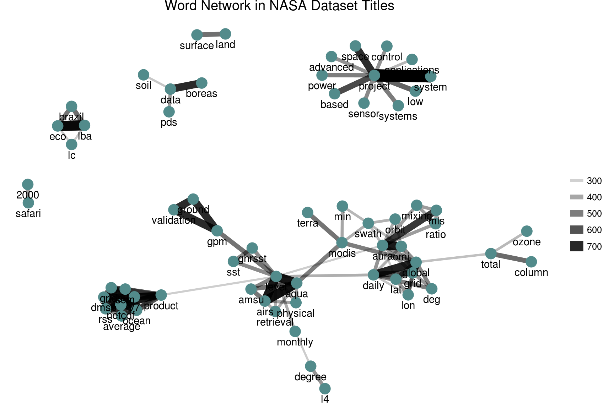
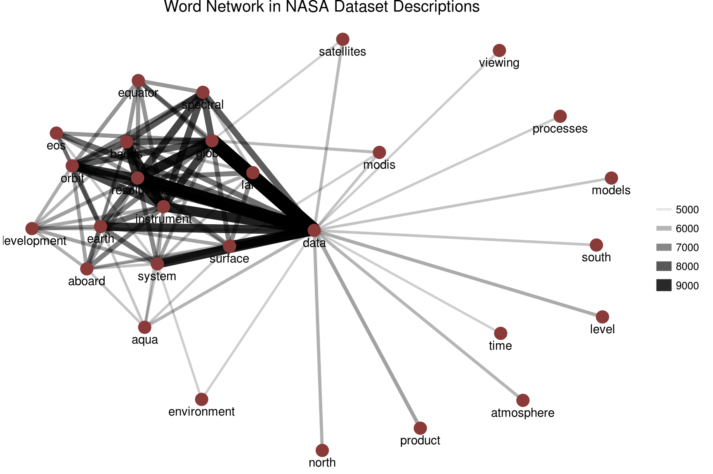
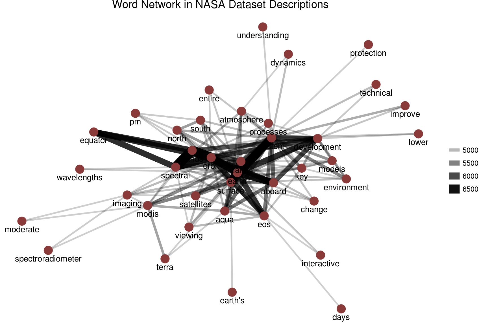

# Case study: mining NASA metadata {#nasa}


There are 32,000+ datasets at [NASA](https://www.nasa.gov/), and we can use the metadata for these datasets to understand the connections between them. What is metadata? Metadata is data that gives information about other data, in this case, data about what is in these numerous NASA datasets. It includes information like the title of the dataset, description fields, what organization(s) with NASA is responsible for the dataset, and so forth. NASA places a high priority on making its data accessible, even requiring all NASA-funded research to be [openly accessible online](https://www.nasa.gov/press-release/nasa-unveils-new-public-web-portal-for-research-results), and the metadata for all its datasets is [publicly available online in JSON format](https://data.nasa.gov/data.json). Let's take a look at this metadata and see what is there.

## Getting the metadata


```r
library(jsonlite)
metadata <- fromJSON("https://data.nasa.gov/data.json")
names(metadata$dataset)
```

```
##  [1] "_id"                "@type"              "accessLevel"        "accrualPeriodicity"
##  [5] "bureauCode"         "contactPoint"       "description"        "distribution"      
##  [9] "identifier"         "issued"             "keyword"            "landingPage"       
## [13] "language"           "modified"           "programCode"        "publisher"         
## [17] "spatial"            "temporal"           "theme"              "title"             
## [21] "license"            "isPartOf"           "references"         "rights"            
## [25] "describedBy"
```

What kind of data is available here?


```r
sapply(metadata$dataset, class)
```

```
##                _id              @type        accessLevel accrualPeriodicity         bureauCode 
##       "data.frame"        "character"        "character"        "character"             "list" 
##       contactPoint        description       distribution         identifier             issued 
##       "data.frame"        "character"             "list"        "character"        "character" 
##            keyword        landingPage           language           modified        programCode 
##             "list"        "character"             "list"        "character"             "list" 
##          publisher            spatial           temporal              theme              title 
##       "data.frame"        "character"        "character"             "list"        "character" 
##            license           isPartOf         references             rights        describedBy 
##        "character"        "character"             "list"        "character"        "character"
```

It has been suggested that the title, description, and keywords for each dataset will probably be most fruitful for drawing connections between datasets. Let's check them out.


```r
class(metadata$dataset$title)
```

```
## [1] "character"
```

```r
class(metadata$dataset$description)
```

```
## [1] "character"
```

```r
class(metadata$dataset$keyword)
```

```
## [1] "list"
```

## Wrangling and tidying the data

Let's set up dataframes for title, description, and keyword and keep the dataset ids.


```r
library(dplyr)
nasatitle <- data_frame(id = metadata$dataset$`_id`$`$oid`, title = metadata$dataset$title)
nasatitle
```

```
## # A tibble: 32,089 x 2
##                          id                                               title
##                       <chr>                                               <chr>
## 1  55942a57c63a7fe59b495a77             15 Minute Stream Flow Data: USGS (FIFE)
## 2  55942a57c63a7fe59b495a78             15 Minute Stream Flow Data: USGS (FIFE)
## 3  55942a58c63a7fe59b495a79             15 Minute Stream Flow Data: USGS (FIFE)
## 4  55942a58c63a7fe59b495a7a 2000 Pilot Environmental Sustainability Index (ESI)
## 5  55942a58c63a7fe59b495a7b 2000 Pilot Environmental Sustainability Index (ESI)
## 6  55942a58c63a7fe59b495a7c 2000 Pilot Environmental Sustainability Index (ESI)
## 7  55942a58c63a7fe59b495a7d       2001 Environmental Sustainability Index (ESI)
## 8  55942a58c63a7fe59b495a7e       2001 Environmental Sustainability Index (ESI)
## 9  55942a58c63a7fe59b495a7f       2001 Environmental Sustainability Index (ESI)
## 10 55942a58c63a7fe59b495a80       2001 Environmental Sustainability Index (ESI)
## # ... with 32,079 more rows
```


```r
nasadesc <- data_frame(id = metadata$dataset$`_id`$`$oid`, desc = metadata$dataset$description)
nasadesc
```

```
## # A tibble: 32,089 x 2
##                          id
##                       <chr>
## 1  55942a57c63a7fe59b495a77
## 2  55942a57c63a7fe59b495a78
## 3  55942a58c63a7fe59b495a79
## 4  55942a58c63a7fe59b495a7a
## 5  55942a58c63a7fe59b495a7b
## 6  55942a58c63a7fe59b495a7c
## 7  55942a58c63a7fe59b495a7d
## 8  55942a58c63a7fe59b495a7e
## 9  55942a58c63a7fe59b495a7f
## 10 55942a58c63a7fe59b495a80
## # ... with 32,079 more rows, and 1 more variables: desc <chr>
```


```r
library(tidyr)
nasakeyword <- data_frame(id = metadata$dataset$`_id`$`$oid`, 
                          keyword = metadata$dataset$keyword) %>%
        unnest(keyword)
nasakeyword
```

```
## # A tibble: 126,814 x 2
##                          id       keyword
##                       <chr>         <chr>
## 1  55942a57c63a7fe59b495a77 EARTH SCIENCE
## 2  55942a57c63a7fe59b495a77   HYDROSPHERE
## 3  55942a57c63a7fe59b495a77 SURFACE WATER
## 4  55942a57c63a7fe59b495a78 EARTH SCIENCE
## 5  55942a57c63a7fe59b495a78   HYDROSPHERE
## 6  55942a57c63a7fe59b495a78 SURFACE WATER
## 7  55942a58c63a7fe59b495a79 EARTH SCIENCE
## 8  55942a58c63a7fe59b495a79   HYDROSPHERE
## 9  55942a58c63a7fe59b495a79 SURFACE WATER
## 10 55942a58c63a7fe59b495a7a EARTH SCIENCE
## # ... with 126,804 more rows
```

Now let's do some unnesting/tidying of the title and description fields so we can do some NLP and text analysis. Let's also remove common English words.


```r
library(tidytext)
nasatitle <- nasatitle %>% unnest_tokens(word, title) %>% anti_join(stop_words)
nasadesc <- nasadesc %>% unnest_tokens(word, desc) %>% anti_join(stop_words)
```

## Some initial simple exploration

What are the most common words in the NASA dataset titles?


```r
nasatitle %>% count(word, sort = TRUE)
```

```
## # A tibble: 11,614 x 2
##       word     n
##      <chr> <int>
## 1  project  7735
## 2     data  3354
## 3        1  2841
## 4    level  2400
## 5   global  1809
## 6       v1  1478
## 7    daily  1397
## 8        3  1364
## 9     aura  1363
## 10      l2  1311
## # ... with 11,604 more rows
```

What about the descriptions?


```r
nasadesc %>% count(word, sort = TRUE)
```

```
## # A tibble: 35,936 x 2
##          word     n
##         <chr> <int>
## 1        data 68871
## 2       modis 24420
## 3      global 23028
## 4           2 16599
## 5           1 15770
## 6      system 15480
## 7     product 14780
## 8        aqua 14738
## 9       earth 14373
## 10 resolution 13879
## # ... with 35,926 more rows
```

It looks like we might want to remove digits and some "words" like "v1" from these dataframes before approaching something like topic modeling.


```r
mystopwords <- data_frame(word = c(as.character(1:10), 
                                   "v1", "v03", "l2", "l3", "v5.2.0", 
                                   "v003", "v004", "v005", "v006"))
nasatitle <- nasatitle %>% anti_join(mystopwords)
nasadesc <- nasadesc %>% anti_join(mystopwords)
```

What are the most common keywords?


```r
nasakeyword %>% group_by(keyword) %>% count(sort = TRUE)
```

```
## # A tibble: 1,774 x 2
##                    keyword     n
##                      <chr> <int>
## 1            EARTH SCIENCE 14362
## 2                  Project  7452
## 3               ATMOSPHERE  7321
## 4              Ocean Color  7268
## 5             Ocean Optics  7268
## 6                   Oceans  7268
## 7                completed  6452
## 8  ATMOSPHERIC WATER VAPOR  3142
## 9                   OCEANS  2765
## 10            LAND SURFACE  2720
## # ... with 1,764 more rows
```

Looks like "Project completed" may not be useful keywords to keep around for some purposes, and we may want to change all of these to lower or upper case to get rid of duplicates like "OCEANS" and "Oceans". Let's do that, actually.


```r
nasakeyword <- nasakeyword %>% mutate(keyword = toupper(keyword))
```

## Word co-ocurrences

Let's examine which words commonly occur together in the titles and descriptions of NASA datasets. We can then examine a word network in titles/descriptions and this may help us decide, for example, how many topics to look at in topic modeling.


```r
library(widyr)
titlewords <- nasatitle %>% pairwise_count(word, id, sort = TRUE)
titlewords
```

```
## # A tibble: 313,774 x 3
##      item1   item2     n
##      <chr>   <chr> <dbl>
## 1  project  system   796
## 2   system project   796
## 3      eco     lba   683
## 4      lba     eco   683
## 5     aqua    airs   641
## 6     airs    aqua   641
## 7     aqua   level   623
## 8    level    aqua   623
## 9     airs   level   612
## 10   level    airs   612
## # ... with 313,764 more rows
```


```r
descwords <- nasadesc %>% pairwise_count(word, id, sort = TRUE)
descwords
```

```
## # A tibble: 21,775,980 x 3
##         item1      item2     n
##         <chr>      <chr> <dbl>
## 1      global       data  9864
## 2        data     global  9864
## 3  resolution       data  9302
## 4        data resolution  9302
## 5  resolution instrument  8189
## 6  instrument resolution  8189
## 7     surface       data  8180
## 8        data    surface  8180
## 9  resolution     global  8139
## 10     global resolution  8139
## # ... with 21,775,970 more rows
```

Let's plot networks of these co-occurring words.


```r
library(ggplot2)
library(igraph)
library(ggraph)
library(ggplot2)

set.seed(1234)
titlewords %>%
        filter(n >= 250) %>%
        graph_from_data_frame() %>%
        ggraph(layout = "fr") +
        geom_edge_link(aes(edge_alpha = n, edge_width = n)) +
        geom_node_point(color = "darkslategray4", size = 5) +
        geom_node_text(aes(label = name), vjust = 1.8) +
        ggtitle("Word Network in NASA Dataset Titles") +
        theme_void()
```



This is a good start, although it looks like there may still a bit more cleaning to be done.

Let's look at the words in descriptions.


```r
set.seed(2016)
descwords %>%
        filter(n >= 5000) %>%
        graph_from_data_frame() %>%
        ggraph(layout = "fr") +
        geom_edge_link(aes(edge_alpha = n, edge_width = n)) +
        geom_node_point(color = "indianred4", size = 5) +
        geom_node_text(aes(label = name), vjust = 1.8) +
        ggtitle("Word Network in NASA Dataset Descriptions") +
        theme_void()
```



Here there are such *strong* connections between the top dozen or so words (words like "data", "resolution", and "instrument") that we may do better if we exclude these very highly connected words. Also, this makes me think that tf-idf will be a good option to explore. But for now, let's add a few more stop words and look at one more word network.


```r
mystopwords <- bind_rows(mystopwords,
                         data_frame(word = c("data", "global", 
                                             "instrument", "resolution",
                                             "product", "level")))

nasadesc <- nasadesc %>% anti_join(mystopwords)
descwords <- nasadesc %>% pairwise_count(word, id, sort = TRUE)
set.seed(1234)
descwords %>%
        filter(n >= 4600) %>%
        graph_from_data_frame() %>%
        ggraph(layout = "fr") +
        geom_edge_link(aes(edge_alpha = n, edge_width = n)) +
        geom_node_point(color = "indianred4", size = 5) +
        geom_node_text(aes(label = name), vjust = 1.8) +
        ggtitle("Word Network in NASA Dataset Descriptions") +
        theme_void()
```



We still are not seeing clusters the way we did with the titles (the descriptions appear to use very similar words compared to each other), so using tf-idf may be a better way to go when approaching the description fields.

TODO: tf-idf and topic modeling
