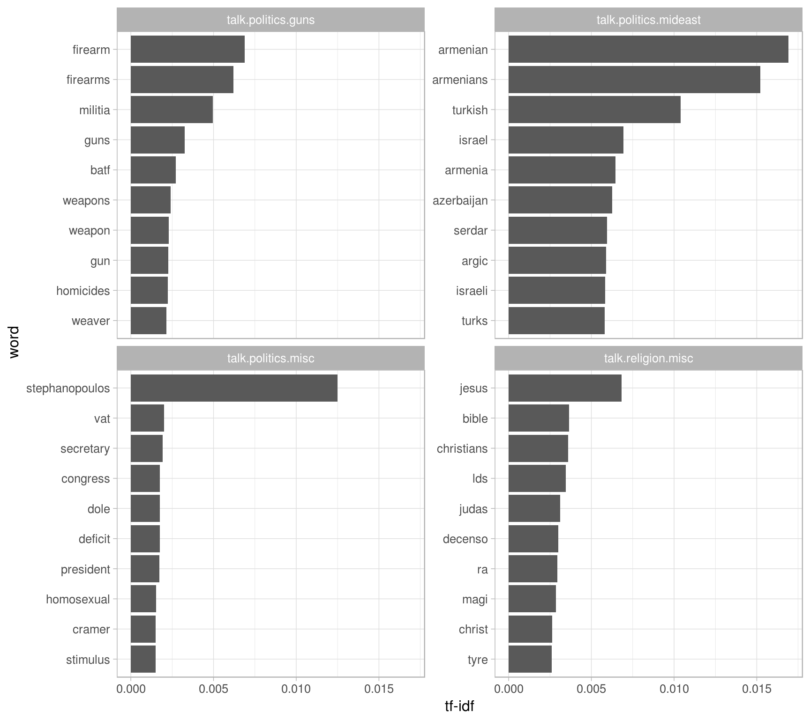
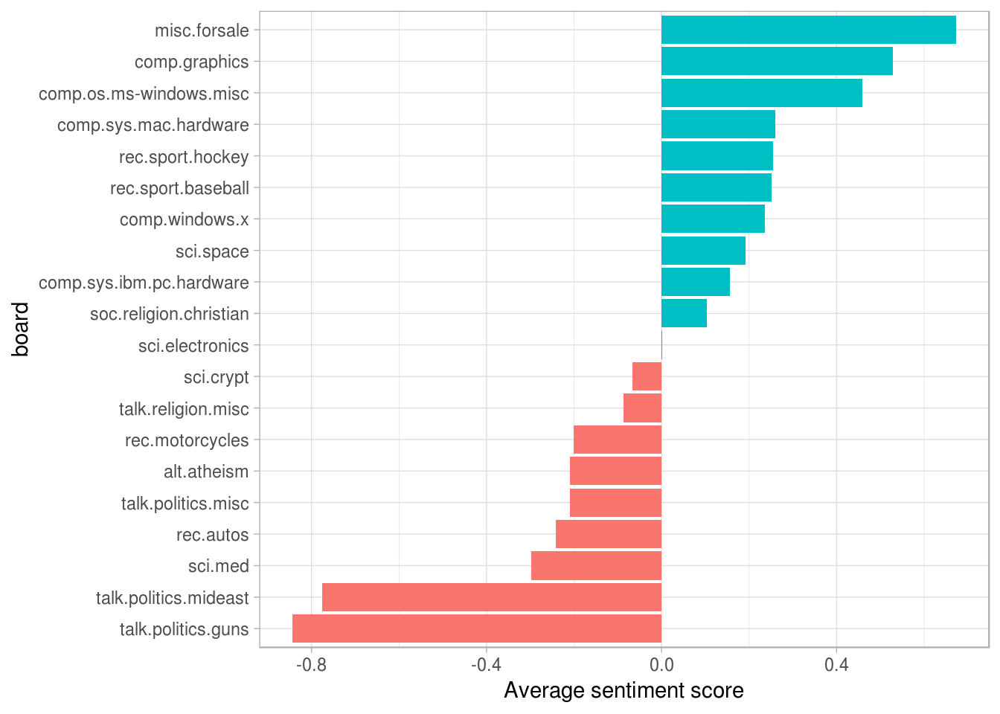
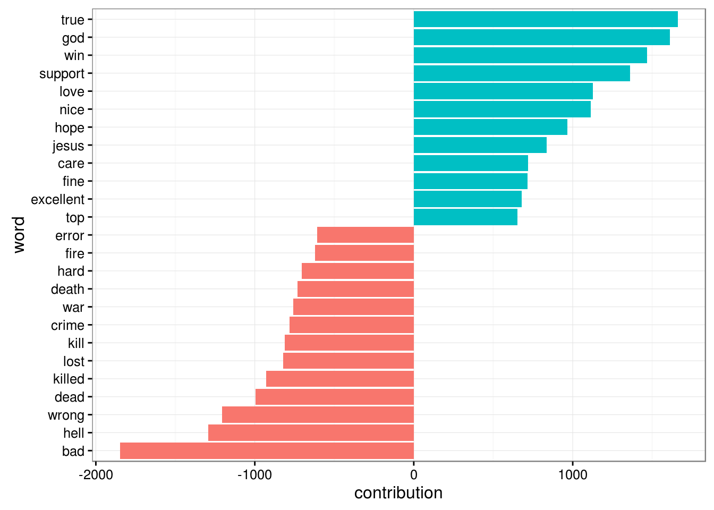

# Case Study: Analyzing Usenet Text


Here we'll use what we've learned in the book to perform a start-to-finish analysis of the Usenet 

## Setup

We'll start by reading in all the messages. (Note that this step takes several minutes).


```r
library(dplyr)
library(tidyr)
library(purrr)
library(readr)
library(stringr)
```


```r
training_folder <- "data/20news-bydate/20news-bydate-train/"

read_folder <- function(infolder) {
  print(infolder)
  data_frame(file = dir(infolder, full.names = TRUE)) %>%
    mutate(text = map(file, read_lines)) %>%
    transmute(id = basename(file), text) %>%
    unnest(text)
}

raw_text <- data_frame(folder = dir(training_folder, full.names = TRUE)) %>%
  unnest(map(folder, read_folder)) %>%
  transmute(board = basename(folder), id, text)
```


Each email has structure we need to remove. For starters:

* Every email has one or more headers (e.g. "from:", "in_reply_to:")
* Many have signatures, which (since they're constant for each user) we wouldn't want to examine alongside the content

We need to remove headers and signatures:


```r
# remove headers and signatures
cleaned_text <- raw_text %>%
  group_by(id) %>%
  filter(cumsum(text == "") > 0,
         cumsum(str_detect(text, "^--")) == 0) %>%
  ungroup()

# remove nested text (starting with ">") and lines that note the author
# of those
cleaned_text <- cleaned_text %>%
  filter(str_detect(text, "^[^>]+[A-Za-z\\d]") | text == "",
         !str_detect(text, "writes(:|\\.\\.\\.)$"),
         !str_detect(text, "^In article <"),
         !id %in% c(9704, 9985))
```


```r
library(tidytext)

usenet_words <- cleaned_text %>%
  unnest_tokens(word, text) %>%
  filter(str_detect(word, "^[a-z]"),
         str_detect(word, "[a-z]$"),
         !word %in% stop_words$word)
```

We could simply find the most common words:


```r
usenet_words %>%
  count(word, sort = TRUE)
```

```
## # A tibble: 63,937 x 2
##       word     n
##      <chr> <int>
## 1   people  3397
## 2     time  2569
## 3      god  1611
## 4   system  1571
## 5  subject  1312
## 6    lines  1188
## 7  program  1086
## 8  windows  1085
## 9      bit  1070
## 10   space  1062
## # ... with 63,927 more rows
```

Or we could look at the most common words by board:


```r
words_by_board <- usenet_words %>%
  count(board, word) %>%
  ungroup()
```


```r
words_by_board %>%
  group_by(board) %>%
  top_n(3)
```

```
## Source: local data frame [60 x 3]
## Groups: board [20]
## 
##                       board     word     n
##                       <chr>    <chr> <int>
## 1               alt.atheism      god   268
## 2               alt.atheism    jesus   129
## 3               alt.atheism   people   276
## 4             comp.graphics graphics   217
## 5             comp.graphics    image   169
## 6             comp.graphics  program   134
## 7   comp.os.ms-windows.misc      dos   194
## 8   comp.os.ms-windows.misc     file   232
## 9   comp.os.ms-windows.misc  windows   625
## 10 comp.sys.ibm.pc.hardware     card   237
## # ... with 50 more rows
```

### TF-IDF

We notice that some words are likely to be more common on particular boards. Let's try quantifying this using the TF-IDF metric we learned in Chapter 4.


```r
tf_idf <- words_by_board %>%
  bind_tf_idf(word, board, n) %>%
  arrange(desc(tf_idf))

tf_idf
```

```
## # A tibble: 166,528 x 6
##                       board           word     n          tf      idf     tf_idf
##                       <chr>          <chr> <int>       <dbl>    <dbl>      <dbl>
## 1  comp.sys.ibm.pc.hardware           scsi   483 0.018138801 1.203973 0.02183862
## 2           rec.motorcycles           bike   321 0.013750268 1.386294 0.01906192
## 3     talk.politics.mideast       armenian   440 0.007348275 2.302585 0.01692003
## 4                 sci.crypt     encryption   410 0.008311878 1.897120 0.01576863
## 5     talk.politics.mideast      armenians   396 0.006613447 2.302585 0.01522803
## 6          rec.sport.hockey            nhl   151 0.004291114 2.995732 0.01285503
## 7  comp.sys.ibm.pc.hardware            ide   208 0.007811326 1.609438 0.01257184
## 8        talk.politics.misc stephanopoulos   158 0.004175145 2.995732 0.01250762
## 9           rec.motorcycles          bikes    97 0.004155065 2.995732 0.01244746
## 10         rec.sport.hockey         hockey   265 0.007530762 1.609438 0.01212029
## # ... with 166,518 more rows
```

We can visualize this for a few select boards. For example, let's look at all the `sci.` boards:


```r
library(ggplot2)
theme_set(theme_bw())

tf_idf %>%
  filter(str_detect(board, "^sci\\.")) %>%
  group_by(board) %>%
  top_n(12, tf_idf) %>%
  mutate(word = reorder(word, -tf_idf)) %>%
  ggplot(aes(word, tf_idf)) +
  geom_bar(stat = "identity") +
  facet_wrap(~ board, scales = "free_x") +
  theme(axis.text.x = element_text(angle = 90, hjust = 1)) +
  ylab("TF-IDF")
```


We could use almost the same code (not shown) to compare the "rec." (recreation) or "talk." boards:



### Sentiment Analysis


```r
AFINN <- sentiments %>%
  filter(lexicon == "AFINN")

word_board_sentiments <- words_by_board %>%
  inner_join(AFINN, by = "word")

board_sentiments <- word_board_sentiments %>%
  group_by(board) %>%
  summarize(score = sum(score * n) / sum(n))

board_sentiments %>%
  mutate(board = reorder(board, score)) %>%
  ggplot(aes(board, score, fill = score > 0)) +
  geom_bar(stat = "identity", show.legend = FALSE) +
  coord_flip() +
  ylab("Average sentiment score")
```



### Looking by word

It's worth discovering *why* some topics ended up more positive then others. For that, we can examine the total positive and negative contributions of each word:


```r
contributions <- usenet_words %>%
  inner_join(AFINN, by = "word") %>%
  group_by(word) %>%
  summarize(occurences = n(),
            contribution = sum(score))

contributions
```

```
## # A tibble: 1,891 x 3
##         word occurences contribution
##        <chr>      <int>        <int>
## 1    abandon         12          -24
## 2  abandoned         18          -36
## 3   abandons          3           -6
## 4  abduction          1           -2
## 5      abhor          3           -9
## 6   abhorred          1           -3
## 7  abhorrent          2           -6
## 8  abilities         16           32
## 9    ability        160          320
## 10    aboard          8            8
## # ... with 1,881 more rows
```

We can visualize which words had the most effect:


```r
library(ggplot2)
theme_set(theme_bw())
```


```r
contributions %>%
  top_n(25, abs(contribution)) %>%
  mutate(word = reorder(word, contribution)) %>%
  ggplot(aes(word, contribution, fill = contribution > 0)) +
  geom_bar(stat = "identity", show.legend = FALSE) +
  coord_flip()
```



These words look generally reasonable as indicators of each message's sentiment, but we can spot possible problems with the approach. "True" could just as easily be a part of "not true" or a similar negative expression, and the words "God" and "Jesus" are apparently very common on Usenet but could easily be used in many contexts.

We may also care about which words contributed the most *within each board*. We can calculate each word's contribution to each board's sentiment score from our `word_board_sentiments` variable:


```r
top_sentiment_words <- word_board_sentiments %>%
  mutate(contribution = score * n / sum(n))

top_sentiment_words %>%
  group_by(board) %>%
  top_n(8, abs(contribution)) %>%
  ungroup() %>%
  mutate(board = reorder(board, contribution),
         word = reorder(word, contribution)) %>%
  ggplot(aes(word, contribution, fill = contribution > 0)) +
  geom_bar(stat = "identity", show.legend = FALSE) +
  facet_wrap(~ board, scales = "free") +
  theme(axis.text.x = element_text(angle = 90, hjust = 1))
```


We can also see how much sentiment is confounded with topic in this particular approach. An atheism board is likely to discuss "god" in detail even in a negative context, and we can see it makes the board look more positive. Similarly, the negative contribution of the word "gun" to the "talk.politics.guns" board would occur even if the board were positive.

#### Sentiment analysis by message

We can also try finding the most positive and negative *messages*:


```r
sentiment_messages <- usenet_words %>%
  inner_join(AFINN, by = "word") %>%
  group_by(board, id) %>%
  summarize(sentiment = mean(score),
            words = n()) %>%
  ungroup() %>%
  filter(words >= 5)
```

As a simple measure to reduce the role of randomness, we filtered out messages that had fewer than five words that contributed to sentiment.

What was the most positive messages?


```r
sentiment_messages %>%
  arrange(desc(sentiment))
```

```
## # A tibble: 3,385 x 4
##                      board     id sentiment words
##                      <chr>  <chr>     <dbl> <int>
## 1         rec.sport.hockey  53560  3.888889    18
## 2         rec.sport.hockey  53602  3.833333    30
## 3         rec.sport.hockey  53822  3.833333     6
## 4         rec.sport.hockey  53645  3.230769    13
## 5                rec.autos 102768  3.200000     5
## 6             misc.forsale  75965  3.000000     5
## 7             misc.forsale  76037  3.000000     5
## 8       rec.sport.baseball 104458  2.916667    12
## 9  comp.os.ms-windows.misc   9620  2.857143     7
## 10            misc.forsale  74787  2.833333     6
## # ... with 3,375 more rows
```

Let's check this by looking at the message?


```r
print_message <- function(message_id) {
  cleaned_text %>%
    filter(id == message_id) %>%
    filter(text != "") %>%
    .$text %>%
    cat(sep = "\n")
}

print_message(53560)
```

```
## Everybody.  Please send me your predictions for the Stanley Cup Playoffs!
## I want to see who people think will win.!!!!!!!
## Please Send them in this format, or something comparable:
## 1. Winner of Buffalo-Boston
## 2. Winner of Montreal-Quebec
## 3. Winner of Pittsburgh-New York
## 4. Winner of New Jersey-Washington
## 5. Winner of Chicago-(Minnesota/St.Louis)
## 6. Winner of Toronto-Detroit
## 7. Winner of Vancouver-Winnipeg
## 8. Winner of Calgary-Los Angeles
## 9. Winner of Adams Division (1-2 above)
## 10. Winner of Patrick Division (3-4 above)
## 11. Winner of Norris Division (5-6 above)
## 12. Winner of Smythe Division (7-8 above)
## 13. Winner of Wales Conference (9-10 above)
## 14. Winner of Campbell Conference (11-12 above)
## 15. Winner of Stanley Cup (13-14 above)
## I will summarize the predictions, and see who is the biggest
## INTERNET GURU PREDICTING GUY/GAL.
## Send entries to Richard Madison
## rrmadiso@napier.uwaterloo.ca
## PS:  I will send my entries to one of you folks so you know when I say
## I won, that I won!!!!!
## From: sknapp@iastate.edu (Steven M. Knapp)
## Subject: Re: Radar detector DETECTORS?
## Organization: Iowa State University, Ames, IA
## Lines: 16
## Yes some radar detectors are less detectable by radar detector
## detectors. ;-)
## Look in Car and Driver (last 6 months should do), they had a big
## review of the "better" detectors, and stealth was a factor.
## Steven M. Knapp                             Computer Engineering Student
## sknapp@iastate.edu                  President Cyclone Amateur Radio Club
## Iowa State University; Ames, IA; USA      Durham Center Operations Staff
```

Looks like it's because the message uses the word "winner" a lot! How about the most negative message? Turns out it's also from the hockey site, but has a very different attitude:


```r
sentiment_messages %>%
  arrange(sentiment)
```

```
## # A tibble: 3,385 x 4
##                    board     id sentiment words
##                    <chr>  <chr>     <dbl> <int>
## 1       rec.sport.hockey  53907 -3.000000     6
## 2        sci.electronics  53899 -3.000000     5
## 3              rec.autos 101627 -2.833333     6
## 4          comp.graphics  37948 -2.800000     5
## 5         comp.windows.x  67204 -2.700000    10
## 6     talk.politics.guns  53362 -2.666667     6
## 7            alt.atheism  51309 -2.600000     5
## 8  comp.sys.mac.hardware  51513 -2.600000     5
## 9              rec.autos 102883 -2.600000     5
## 10       rec.motorcycles  72052 -2.600000     5
## # ... with 3,375 more rows
```

```r
print_message(53907)
```

```
## Losers like us? You are the fucking moron who has never heard of the Western
## Business School, or the University of Western Ontario for that matter. Why 
## don't you pull your head out of your asshole and smell something other than
## shit for once so you can look on a map to see where UWO is! Back to hockey,
## the North Stars should be moved because for the past few years they have
## just been SHIT. A real team like Toronto would never be moved!!!
## Andrew--
```


### N-grams

We can also 


```r
usenet_digrams <- cleaned_text %>%
  unnest_tokens(digram, text, token = "ngrams", n = 2)
```


```r
usenet_digram_counts <- usenet_digrams %>%
  count(board, digram)
```


```r
digram_tf_idf <- usenet_digram_counts %>%
  bind_tf_idf(digram, board, n)
```


```r
negate_words <- c("not", "without", "no", "isn't", "can't", "don't",
                  "won't", "couldn't")

usenet_digram_counts %>%
  ungroup() %>%
  separate(digram, c("word1", "word2"), sep = " ") %>%
  filter(word1 %in% negate_words) %>%
  count(word1, word2, wt = n, sort = TRUE) %>%
  inner_join(AFINN, by = c(word2 = "word")) %>%
  mutate(contribution = score * nn) %>%
  top_n(10, abs(contribution)) %>%
  ungroup() %>%
  mutate(word2 = reorder(word2, contribution)) %>%
  ggplot(aes(word2, contribution, fill = contribution > 0)) +
  geom_bar(stat = "identity", show.legend = FALSE) +
  facet_wrap(~ word1, scales = "free", nrow = 2) +
  theme(axis.text.x = element_text(angle = 90, hjust = 1))
```


