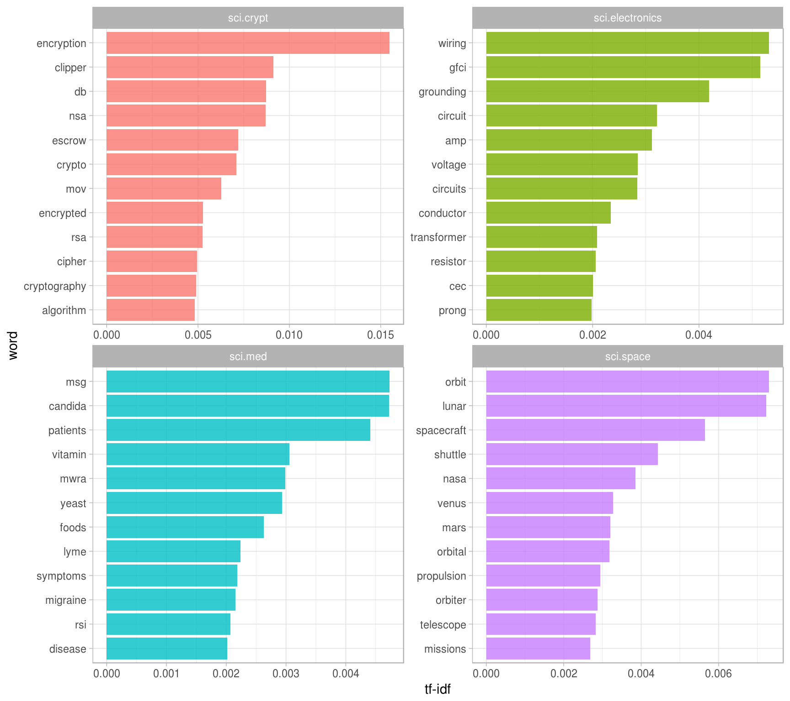
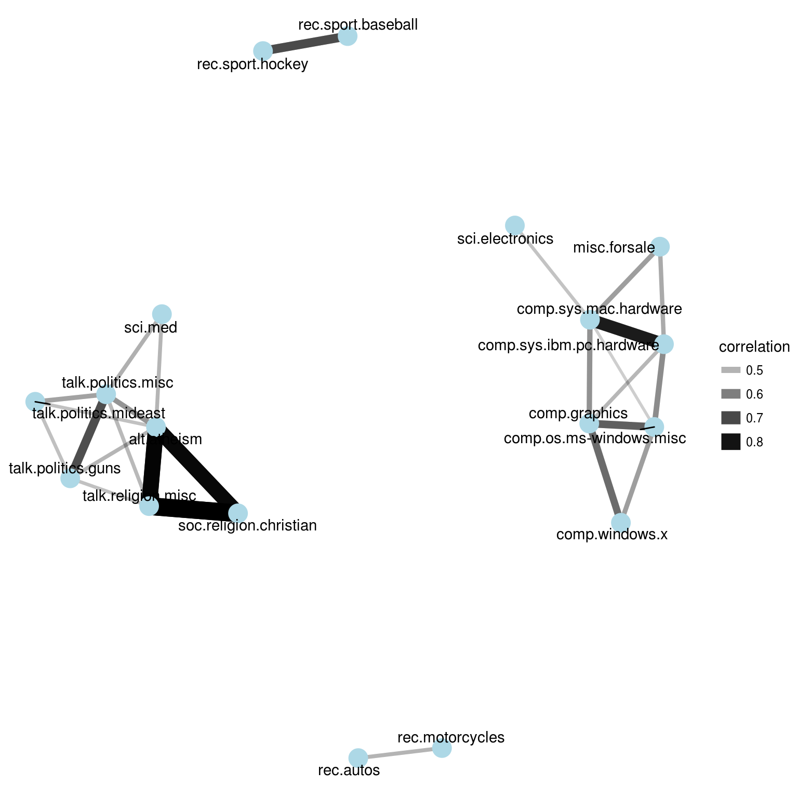
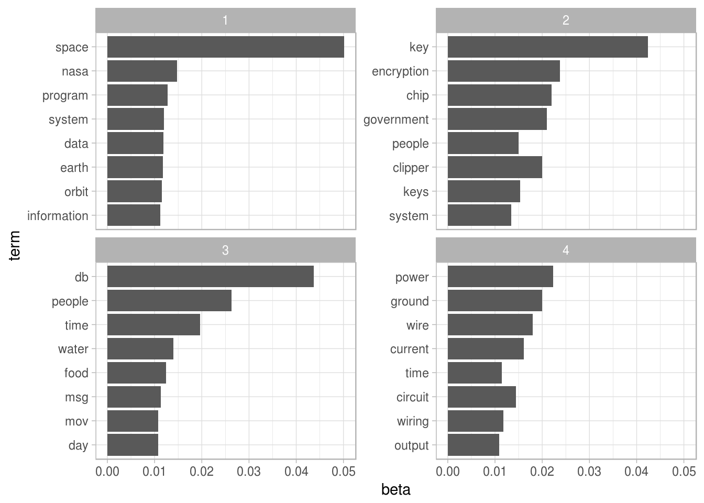
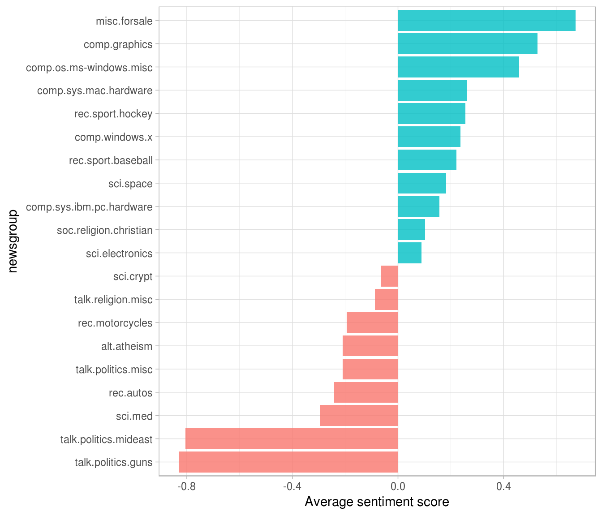
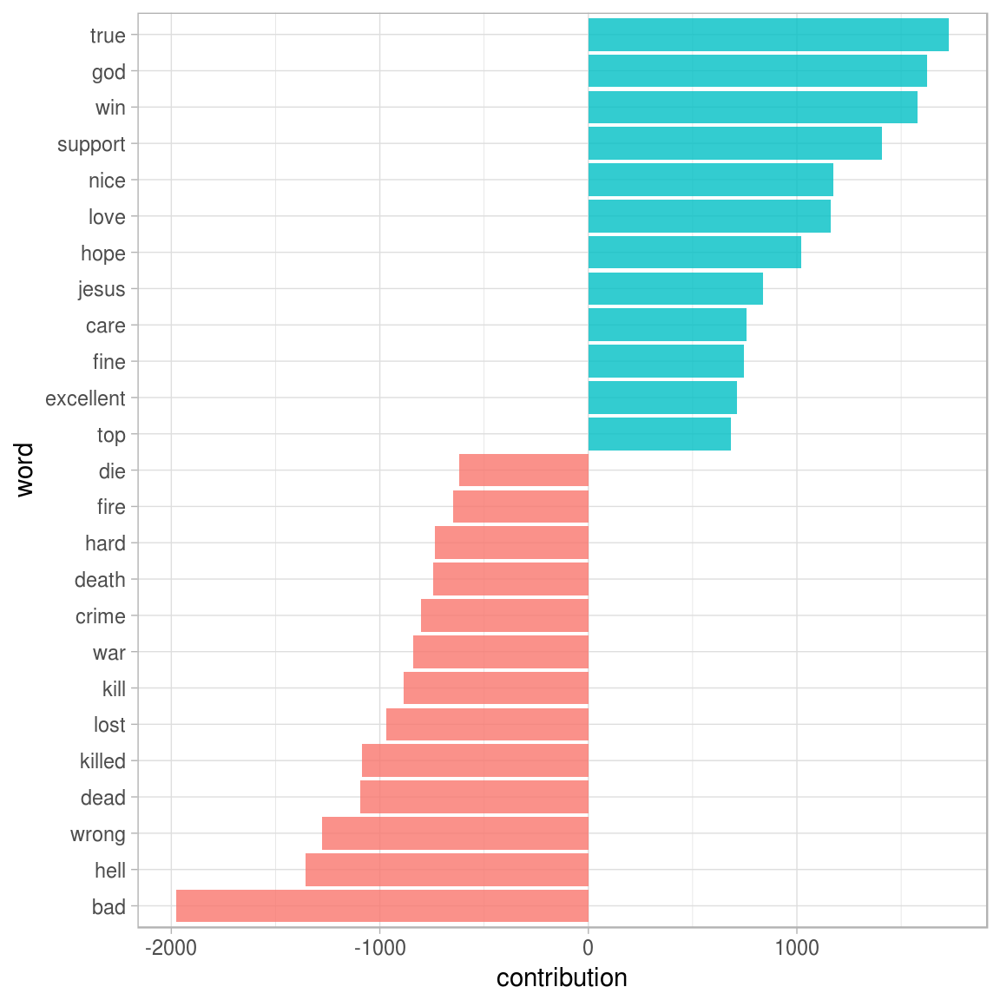
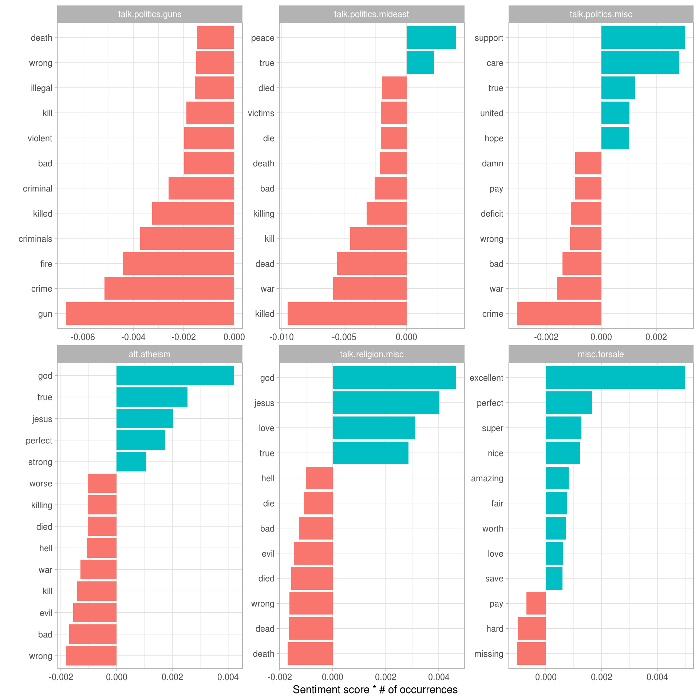
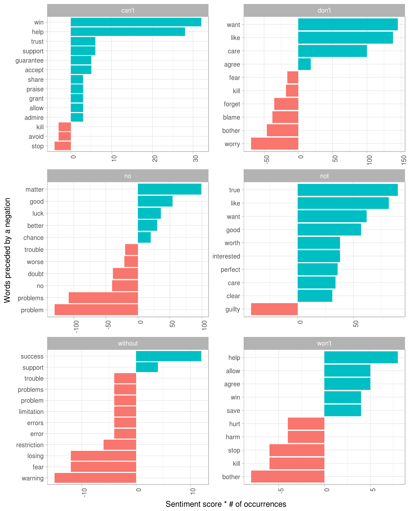

# Case study: analyzing usenet text {#usenet}


In our final chapter, we'll use what we've learned in this book to perform a start-to-finish analysis of a set of 20,000 messages sent to 20 Usenet bulletin boards in 1993. The Usenet bulletin boards in this data set include newsgroups for topics like politics, religion, cars, sports, and cryptography, and offer a rich set of text written by a variety of users. This data set is publicly available at [http://qwone.com/~jason/20Newsgroups/](http://qwone.com/~jason/20Newsgroups/) and has become popular for testing and exercises in text analysis and machine learning.

## Pre-processing

We'll start by reading in all the messages, which are organized in sub-folders, with one file for each message. Note that this step takes several minutes to read all the documents.


```r
library(dplyr)
library(tidyr)
library(purrr)
library(readr)
```


```r
training_folder <- "data/20news-bydate/20news-bydate-train/"

read_folder <- function(infolder) {
  message(infolder)
  data_frame(file = dir(infolder, full.names = TRUE)) %>%
    mutate(text = map(file, read_lines)) %>%
    transmute(id = basename(file), text) %>%
    unnest(text)
}

raw_text <- data_frame(folder = dir(training_folder, full.names = TRUE)) %>%
  unnest(map(folder, read_folder)) %>%
  transmute(newsgroup = basename(folder), id, text)
```


```r
raw_text
```

```
## # A tibble: 511,655 × 3
##      newsgroup    id                                                               text
##          <chr> <chr>                                                              <chr>
## 1  alt.atheism 49960                                 From: mathew <mathew@mantis.co.uk>
## 2  alt.atheism 49960                        Subject: Alt.Atheism FAQ: Atheist Resources
## 3  alt.atheism 49960    Summary: Books, addresses, music -- anything related to atheism
## 4  alt.atheism 49960 Keywords: FAQ, atheism, books, music, fiction, addresses, contacts
## 5  alt.atheism 49960                             Expires: Thu, 29 Apr 1993 11:57:19 GMT
## 6  alt.atheism 49960                                                Distribution: world
## 7  alt.atheism 49960                   Organization: Mantis Consultants, Cambridge. UK.
## 8  alt.atheism 49960                          Supersedes: <19930301143317@mantis.co.uk>
## 9  alt.atheism 49960                                                         Lines: 290
## 10 alt.atheism 49960                                                                   
## # ... with 511,645 more rows
```

Notice the `id` column, which identifies a unique message, and the `newsgroup` column, which describes which of the 20 newsgroups each message comes from. What newsgroups are included, and how many messages were posted in each (Figure \ref{fig:messagecounts})?


```r
library(ggplot2)

raw_text %>%
  group_by(newsgroup) %>%
  summarize(messages = n_distinct(id)) %>%
  ggplot(aes(newsgroup, messages)) +
  geom_col() +
  coord_flip()
```

<div class="figure">

<p class="caption">(\#fig:messagecounts)Number of messages from each newsgroup</p>
</div>

We can see that Usenet newsgroup names are named hierarchically, starting with a main topic such as "talk", "sci", or "rec", followed by further specifications.

### Pre-processing text

Most of the datasets we've examined in this book were pre-processed, meaning we didn't have to remove, for example, copyright notices from the Jane Austen novels. Here, each message has some structure and extra text that we don't want to include in our analysis. For example, every message has a header, containing field such as "from:" or "in_reply_to:" that describe the message. Some also have automated email signatures, which occur after a line like `--`.

This kind of pre-processing can be done within the dplyr package, using combination of `cumsum()` (cumulative sum) and `str_detect()` from stringr.


```r
library(stringr)

# must occur after the first occurrence of an empty line,
# and before the first occurrence of a line starting with --
cleaned_text <- raw_text %>%
  group_by(newsgroup, id) %>%
  filter(cumsum(text == "") > 0,
         cumsum(str_detect(text, "^--")) == 0) %>%
  ungroup()
```

Many lines also have nested text representing quotes from other users, typically starting with a line like "so-and-so writes..." These can be removed with a few regular expressions. (We also choose to manually remove two messages that contained a large amount of non-text content).


```r
cleaned_text <- cleaned_text %>%
  filter(str_detect(text, "^[^>]+[A-Za-z\\d]") | text == "",
         !str_detect(text, "writes(:|\\.\\.\\.)$"),
         !str_detect(text, "^In article <"),
         !id %in% c(9704, 9985))
```

At that point, we're ready to use `unnest_tokens` to split the dataset into tokens, while removing stop-words.


```r
library(tidytext)

usenet_words <- cleaned_text %>%
  unnest_tokens(word, text) %>%
  filter(str_detect(word, "[a-z']$"),
         !word %in% stop_words$word)
```

## Words within newsgroups

Now that we've removed the headers, signatures, and formatting, we can start exploring common words. For starters, we could find the most common words in the entire dataset, or within particular newsgroups.


```r
usenet_words %>%
  count(word, sort = TRUE)
```

```
## # A tibble: 68,137 × 2
##           word     n
##          <chr> <int>
## 1       people  3655
## 2         time  2705
## 3          god  1626
## 4       system  1595
## 5      program  1103
## 6          bit  1097
## 7  information  1094
## 8      windows  1088
## 9   government  1084
## 10       space  1072
## # ... with 68,127 more rows
```

```r
words_by_newsgroup <- usenet_words %>%
  count(newsgroup, word, sort = TRUE) %>%
  ungroup()

words_by_newsgroup
```

```
## # A tibble: 173,913 × 3
##                  newsgroup      word     n
##                      <chr>     <chr> <int>
## 1   soc.religion.christian       god   917
## 2                sci.space     space   840
## 3    talk.politics.mideast    people   728
## 4                sci.crypt       key   704
## 5  comp.os.ms-windows.misc   windows   625
## 6    talk.politics.mideast  armenian   582
## 7                sci.crypt        db   549
## 8    talk.politics.mideast   turkish   514
## 9                rec.autos       car   509
## 10   talk.politics.mideast armenians   509
## # ... with 173,903 more rows
```

### Term frequency and inverse document frequency: tf-idf

We'd expect the newsgroups to differ in terms of topic and content, and therefore for the frequency of words to differ between them. Let's try quantifying this using the tf-idf metric we learned about in Chapter \ref{tfidf}.


```r
tf_idf <- words_by_newsgroup %>%
  bind_tf_idf(word, newsgroup, n) %>%
  arrange(desc(tf_idf))

tf_idf
```

```
## # A tibble: 173,913 × 6
##                   newsgroup           word     n          tf      idf     tf_idf
##                       <chr>          <chr> <int>       <dbl>    <dbl>      <dbl>
## 1  comp.sys.ibm.pc.hardware           scsi   483 0.017616807 1.203973 0.02121016
## 2     talk.politics.mideast       armenian   582 0.008048902 2.302585 0.01853328
## 3           rec.motorcycles           bike   324 0.013898421 1.203973 0.01673332
## 4     talk.politics.mideast      armenians   509 0.007039332 2.302585 0.01620866
## 5                 sci.crypt     encryption   410 0.008160990 1.897120 0.01548238
## 6          rec.sport.hockey            nhl   157 0.004396651 2.995732 0.01317119
## 7        talk.politics.misc stephanopoulos   158 0.004162276 2.995732 0.01246906
## 8           rec.motorcycles          bikes    97 0.004160947 2.995732 0.01246508
## 9          rec.sport.hockey         hockey   270 0.007561119 1.609438 0.01216915
## 10           comp.windows.x          oname   136 0.003535498 2.995732 0.01059141
## # ... with 173,903 more rows
```

We can examine the top tf-idf for a few selected groups to extract words specific to those topics. For example, we could look at all the `sci.` boards, visualized in Figure \ref{fig:scitfidf}.


```r
library(ggplot2)

tf_idf %>%
  filter(str_detect(newsgroup, "^sci\\.")) %>%
  group_by(newsgroup) %>%
  top_n(12, tf_idf) %>%
  mutate(word = reorder(word, tf_idf)) %>%
  ggplot(aes(word, tf_idf, fill = newsgroup)) +
  geom_bar(alpha = 0.8, stat = "identity", show.legend = FALSE) +
  facet_wrap(~ newsgroup, scales = "free") +
  ylab("tf-idf") +
  coord_flip()
```

<div class="figure">

<p class="caption">(\#fig:scitfidf)The 12 terms with the highest tf-idf within each of the science-related newsgroups</p>
</div>

We see lots of characteristic words specific to particular newsgroup, such as "wiring" and "circuit" on the sci.electronics topic and "orbit" and "lunar" for the space newsgroup. You could use this same code to explore other topics.


What newsgroups tended to be similar to each other in text content? We could discover this by 


```r
library(widyr)

newsgroup_cors <- words_by_newsgroup %>%
  pairwise_cor(newsgroup, word, n, sort = TRUE)

newsgroup_cors
```

```
## # A tibble: 380 × 3
##                       item1                    item2 correlation
##                       <chr>                    <chr>       <dbl>
## 1        talk.religion.misc   soc.religion.christian   0.8347275
## 2    soc.religion.christian       talk.religion.misc   0.8347275
## 3               alt.atheism       talk.religion.misc   0.7793079
## 4        talk.religion.misc              alt.atheism   0.7793079
## 5               alt.atheism   soc.religion.christian   0.7510723
## 6    soc.religion.christian              alt.atheism   0.7510723
## 7     comp.sys.mac.hardware comp.sys.ibm.pc.hardware   0.6799043
## 8  comp.sys.ibm.pc.hardware    comp.sys.mac.hardware   0.6799043
## 9        rec.sport.baseball         rec.sport.hockey   0.5770378
## 10         rec.sport.hockey       rec.sport.baseball   0.5770378
## # ... with 370 more rows
```


```r
library(ggraph)
library(igraph)
set.seed(2017)

newsgroup_cors %>%
  filter(correlation > .4) %>%
  graph_from_data_frame() %>%
  ggraph(layout = "fr") +
  geom_edge_link(aes(alpha = correlation, width = correlation)) +
  geom_node_point(size = 6, color = "lightblue") +
  geom_node_text(aes(label = name), repel = TRUE) +
  theme_void()
```

<div class="figure">

<p class="caption">(\#fig:newsgroupcorsnetwork)A network of Usenet groups based on the correlation of word counts between them, including only connections with a correlation greater than .4</p>
</div>

It looks like there were four main clusters of newsgroups: computers/electronics, politics/religion, motor vehicles, and sports. This certainly makes sense in terms of clustering of topics. We could 


### Topic modeling

In Chapter \ref{topicmodels}, we used the latent Dirichlet allocation (LDA) algorithm to cluster a set of chapters into the books they originally came from. Could LDA do the same to sort out Usenet messages from different newsgroups?

Let's let it divide up the four science-related newsgroups. We first process it into a document-term matrix with `cast_dtm`, then fit the model with the `LDA()` function from the topicmodels package.


```r
# include only words that occur at least 50 times
word_sci_topics <- usenet_words %>%
  filter(str_detect(newsgroup, "^sci")) %>%
  group_by(word) %>%
  mutate(word_total = n()) %>%
  ungroup() %>%
  filter(word_total > 50)

# convert into a document-term matrix
sci_dtm <- word_sci_topics %>%
  unite(document, newsgroup, id) %>%
  count(document, word) %>%
  cast_dtm(document, word, n)
```


```r
library(topicmodels)
sci_lda <- LDA(sci_dtm, k = 4, control = list(seed = 2016))
```

What four topics did it extract, and did they match the four newsgroups? This approach will look familiar from Chapter \ref{topicmodels}: we visualize each topic based on the most frequent terms within it (Figure \ref{fig:usenettopicterms}).


```r
sci_lda %>%
  tidy() %>%
  group_by(topic) %>%
  top_n(8, beta) %>%
  ungroup() %>%
  mutate(term = reorder(term, beta)) %>%
  ggplot(aes(term, beta)) +
  geom_col() +
  facet_wrap(~ topic, scales = "free_y") +
  coord_flip()
```

<div class="figure">

<p class="caption">(\#fig:usenettopicterms)The top 8 words from each topic fit by LDA on the science-related newsgroups</p>
</div>

From the top words, we can start to suspect which topics may capture which newsgroups. Topic 1 certainly represents the sci.space newsgroup (thus the most common word being "space"), and topic 2 is likely drawn from cryptography. We can confirm this by seeing how many documents from each newsgroup appeared to be drawn from which topics (Figure \ref{fig:usenetassignments}).


```r
sci_lda %>%
  tidy(matrix = "gamma") %>%
  separate(document, c("newsgroup", "id"), sep = "_") %>%
  group_by(newsgroup, id) %>%
  top_n(1, gamma) %>%
  ungroup() %>%
  mutate(newsgroup = reorder(newsgroup, topic)) %>%
  count(newsgroup, topic) %>%
  ggplot(aes(topic, n)) +
  geom_col() +
  facet_wrap(~ newsgroup) +
  labs(x = "Topic",
       y = "# of messages where this was the highest % topic")
```


Much as we saw in the literature analysis, topic modeling was able to discover the distinct topics present in the text without needing to consult the labels.

## Sentiment analysis

We can use the sentiment analysis techniques we explored in Chapter \ref{sentiment} to examine how positive and negative words occurred in these Usenet posts. Which newsgroups appeared the most positive or negative overall?

We'll focus on the AFINN sentiment lexicon, which provides numeric positivity scores for each word, and visualize it with a bar plot (Figure \ref{fig:newsgroupsentiments}).


```r
AFINN <- get_sentiments("afinn")

newsgroup_sentiments <- words_by_newsgroup %>%
  inner_join(AFINN, by = "word") %>%
  group_by(newsgroup) %>%
  summarize(score = sum(score * n) / sum(n))

newsgroup_sentiments %>%
  mutate(newsgroup = reorder(newsgroup, score)) %>%
  ggplot(aes(newsgroup, score, fill = score > 0)) +
  geom_bar(alpha = 0.8, stat = "identity", show.legend = FALSE) +
  coord_flip() +
  ylab("Average sentiment score")
```

<div class="figure">

<p class="caption">(\#fig:newsgroupsentiments)Average AFINN score for posts within each newsgroup</p>
</div>

According to this analysis, the "misc.forsale" newsgroup was the most positive. This was most likely because 

### Sentiment analysis by word

It's worth looking deeper to understand *why* some newsgroups ended up more positive or negative than others. For that, we can examine the total positive and negative contributions of each word.


```r
contributions <- usenet_words %>%
  inner_join(AFINN, by = "word") %>%
  group_by(word) %>%
  summarize(occurences = n(),
            contribution = sum(score))

contributions
```

```
## # A tibble: 1,909 × 3
##         word occurences contribution
##        <chr>      <int>        <int>
## 1    abandon         13          -26
## 2  abandoned         19          -38
## 3   abandons          3           -6
## 4  abduction          2           -4
## 5      abhor          4          -12
## 6   abhorred          1           -3
## 7  abhorrent          2           -6
## 8  abilities         16           32
## 9    ability        177          354
## 10    aboard          8            8
## # ... with 1,899 more rows
```

Which words had the most effect on sentiment scores (Figure \ref{usenetcontributions})? 


```r
contributions %>%
  top_n(25, abs(contribution)) %>%
  mutate(word = reorder(word, contribution)) %>%
  ggplot(aes(word, contribution, fill = contribution > 0)) +
  geom_bar(alpha = 0.8, stat = "identity", show.legend = FALSE) +
  coord_flip()
```

<div class="figure">

<p class="caption">(\#fig:usenetcontributions)Words with the greatest contributions to positive/negative sentiment scores in the Usenet text</p>
</div>

These words look generally reasonable as indicators of each message's sentiment, but we can spot possible problems with the approach. "True" could just as easily be a part of "not true" or a similar negative expression, and the words "God" and "Jesus" are apparently very common on Usenet but could easily be used in many contexts, positive or negative.

We may also care about which words contributed the most *within each newsgroup*, so that we can see which newsgroups might be incorrectly estimated. We can calculate each word's contribution to each newsgroup's sentiment scorem and visualize the top few from each (Figure \ref{fig:newsgroupsentiment}).


```r
top_sentiment_words <- words_by_newsgroup %>%
  inner_join(AFINN, by = "word") %>%
  mutate(contribution = score * n / sum(n))

top_sentiment_words
```

```
## # A tibble: 13,063 × 5
##                 newsgroup   word     n score contribution
##                     <chr>  <chr> <int> <int>        <dbl>
## 1  soc.religion.christian    god   917     1  0.014418012
## 2  soc.religion.christian  jesus   440     1  0.006918130
## 3      talk.politics.guns    gun   425    -1 -0.006682285
## 4      talk.religion.misc    god   296     1  0.004654015
## 5             alt.atheism    god   268     1  0.004213770
## 6  soc.religion.christian  faith   257     1  0.004040817
## 7      talk.religion.misc  jesus   256     1  0.004025094
## 8   talk.politics.mideast killed   202    -3 -0.009528152
## 9   talk.politics.mideast    war   187    -2 -0.005880411
## 10 soc.religion.christian   true   179     2  0.005628842
## # ... with 13,053 more rows
```



We can see here how much sentiment is confounded with topic in this particular approach. An atheism newsgroup is likely to discuss "god" in detail even in a negative context, and we can see that it makes the newsgroup look more positive. Similarly, the negative contribution of the word "gun" to the "talk.politics.guns" group will occur even when the members are discussing guns positively. This helps remind us that sentiment analysis can be confounded by topic, and that we should always examine the influential words before interpreting it too deeply.

### Sentiment analysis by message

We can also try finding the most positive and negative individual messages, by grouping and summarizing by `id` rather than `newsgroup`.


```r
sentiment_messages <- usenet_words %>%
  inner_join(AFINN, by = "word") %>%
  group_by(newsgroup, id) %>%
  summarize(sentiment = mean(score),
            words = n()) %>%
  ungroup() %>%
  filter(words >= 5)
```

As a simple measure to reduce the role of randomness, we filtered out messages that had fewer than five words that contributed to sentiment. What were the most positive messages?


```r
sentiment_messages %>%
  arrange(desc(sentiment))
```

```
## # A tibble: 3,554 × 4
##                  newsgroup     id sentiment words
##                      <chr>  <chr>     <dbl> <int>
## 1         rec.sport.hockey  53560  3.888889    18
## 2         rec.sport.hockey  53602  3.833333    30
## 3         rec.sport.hockey  53822  3.833333     6
## 4         rec.sport.hockey  53645  3.230769    13
## 5                rec.autos 102768  3.200000     5
## 6             misc.forsale  75965  3.000000     5
## 7             misc.forsale  76037  3.000000     5
## 8       rec.sport.baseball 104458  3.000000    11
## 9         rec.sport.hockey  53571  3.000000     5
## 10 comp.os.ms-windows.misc   9620  2.857143     7
## # ... with 3,544 more rows
```

Let's check this by looking at the most positive message in the whole dataset. We may want to write a short function for printing a message given its ID.


```r
print_message <- function(group, message_id) {
  cleaned_text %>%
    filter(newsgroup == group, id == message_id) %>%
    filter(text != "") %>%
    .$text %>%
    cat(sep = "\n")
}

print_message("rec.sport.hockey", 53560)
```

```
## Everybody.  Please send me your predictions for the Stanley Cup Playoffs!
## I want to see who people think will win.!!!!!!!
## Please Send them in this format, or something comparable:
## 1. Winner of Buffalo-Boston
## 2. Winner of Montreal-Quebec
## 3. Winner of Pittsburgh-New York
## 4. Winner of New Jersey-Washington
## 5. Winner of Chicago-(Minnesota/St.Louis)
## 6. Winner of Toronto-Detroit
## 7. Winner of Vancouver-Winnipeg
## 8. Winner of Calgary-Los Angeles
## 9. Winner of Adams Division (1-2 above)
## 10. Winner of Patrick Division (3-4 above)
## 11. Winner of Norris Division (5-6 above)
## 12. Winner of Smythe Division (7-8 above)
## 13. Winner of Wales Conference (9-10 above)
## 14. Winner of Campbell Conference (11-12 above)
## 15. Winner of Stanley Cup (13-14 above)
## I will summarize the predictions, and see who is the biggest
## INTERNET GURU PREDICTING GUY/GAL.
## Send entries to Richard Madison
## rrmadiso@napier.uwaterloo.ca
## PS:  I will send my entries to one of you folks so you know when I say
## I won, that I won!!!!!
```

It looks like this message was chosen because it uses the word "winner" many, many times! How about the most negative message? Turns out it's also from the hockey site, but has a very different attitude.


```r
sentiment_messages %>%
  arrange(sentiment)
```

```
## # A tibble: 3,554 × 4
##                newsgroup     id sentiment words
##                    <chr>  <chr>     <dbl> <int>
## 1       rec.sport.hockey  53907 -3.000000     6
## 2        sci.electronics  53899 -3.000000     5
## 3  talk.politics.mideast  75918 -3.000000     7
## 4              rec.autos 101627 -2.833333     6
## 5          comp.graphics  37948 -2.800000     5
## 6         comp.windows.x  67204 -2.700000    10
## 7     talk.politics.guns  53362 -2.666667     6
## 8            alt.atheism  51309 -2.600000     5
## 9  comp.sys.mac.hardware  51513 -2.600000     5
## 10             rec.autos 102883 -2.600000     5
## # ... with 3,544 more rows
```

```r
print_message("rec.sport.hockey", 53907)
```

```
## Losers like us? You are the fucking moron who has never heard of the Western
## Business School, or the University of Western Ontario for that matter. Why 
## don't you pull your head out of your asshole and smell something other than
## shit for once so you can look on a map to see where UWO is! Back to hockey,
## the North Stars should be moved because for the past few years they have
## just been SHIT. A real team like Toronto would never be moved!!!
## Andrew--
```

Well, we can confidently say that the sentiment analysis worked.

### N-gram analysis

In Chapter \ref{ngrams}, we considered the effect of words such as "not" and "no" on sentiment analysis of Jane Austen novels, such as considering whether a phrase like "don't like" led to passages incorrectly being labeled as positive. The Usenet dataset is is a much larger corpus of more modern text, so we may be interested in how sentiment analysis may be reversed in this text.

We'd start by finding and counting all the bigrams in the Usenet posts.


```r
usenet_bigrams <- cleaned_text %>%
  unnest_tokens(bigram, text, token = "ngrams", n = 2)
```


```r
usenet_bigram_counts <- usenet_bigrams %>%
  count(newsgroup, bigram, sort = TRUE) %>%
  ungroup() %>%
  separate(bigram, c("word1", "word2"), sep = " ")
```

We could define a list of six words that we suspect are used in negation, such as "no", "not", and "without", and consider which words most often followed them (Figure \ref{fig:negatewords}).


```r
negate_words <- c("not", "without", "no", "can't", "don't", "won't")

usenet_bigram_counts %>%
  filter(word1 %in% negate_words) %>%
  count(word1, word2, wt = n, sort = TRUE) %>%
  inner_join(AFINN, by = c(word2 = "word")) %>%
  mutate(contribution = score * nn) %>%
  top_n(10, abs(contribution)) %>%
  ungroup() %>%
  mutate(word2 = reorder(paste(word2, word1, sep = "__"), contribution)) %>%
  ggplot(aes(word2, contribution, fill = contribution > 0)) +
  geom_bar(alpha = 0.8, stat = "identity", show.legend = FALSE) +
  facet_wrap(~ word1, scales = "free", nrow = 3) +
  scale_x_discrete(labels = function(x) gsub("__.+$", "", x)) +
  xlab("Words preceded by a negation") +
  ylab("Sentiment score * # of occurrences") +
  theme(axis.text.x = element_text(angle = 90, hjust = 1)) +
  coord_flip()
```



The words shown are the ones that contributed the most to the sentiment scores in the wrong direction. It looks like the largest sources of misidentifying a word as positive come from "dont want/like/care", and the most common in the other direction is "no problem".

In this analysis of Usenet messages we've incorporated almost every method described in this book, ranging from tf-idf to topic modeling, and from sentiment analysis to n-gram tokenization. Throughout the chapter, and indeed through all of our case studies, we've been able to rely on a small list of common tools for exploration and visualization. We hope that these examples show much all tidy text analyses have in common with each other, and indeed with all tidy data analyses.


```r
knitr::knit_exit()
```


